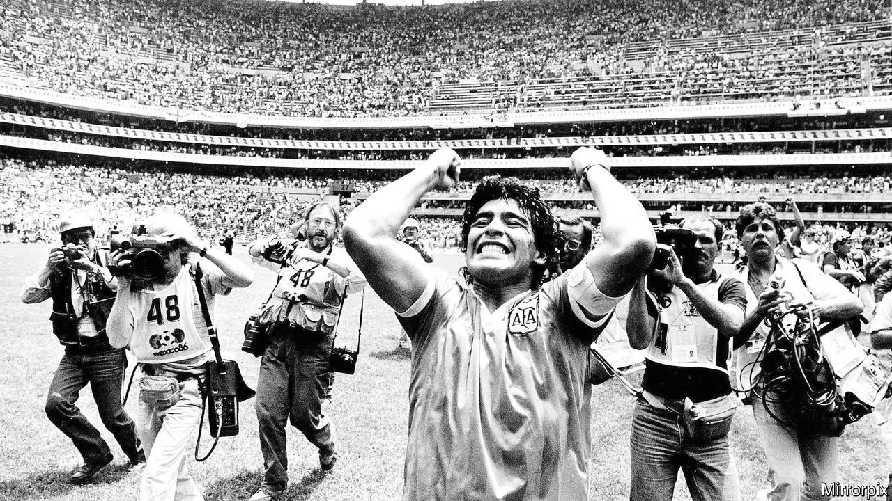

###### Divine and damned

# The blessed and cursed life of Diego Maradona 

##### One of Argentina’s, and the world’s, greatest footballers dies 

 

> Nov 28th 2020 

HE WILL LIVE forever on that sunny June afternoon in 1986 in the Aztec stadium in Mexico City. It was the quarter-final of the World Cup between Argentina and England. In the 55th minute Diego Armando Maradona collected the ball in the Argentine half and carved his way through the England defence as if it wasn’t there before striking a low hard shot. It was one of the greatest goals of all time. It came just four minutes after Maradona, with the match scoreless, had risen to meet a miscued clearance in the England penalty area and punched the ball into the net. He had scored, he said later, “a bit with the head and a bit with the hand of God”. With no video refereeing back then, the goal stood. It was, he said, a kind of revenge for Argentina’s defeat at English hands in the Falklands (Malvinas) war four years earlier.

Between them, those goals summed up Mr Maradona, who died of a heart attack aged 60 on November 25th. Blessed with divine talent, he had little respect for the rules in a life that offered riches but which was always a struggle. He embodied the idiosyncrasy of his country, as Clarín, an Argentine newspaper, noted: “Maradona is the two mirrors, that in which it’s a pleasure to regard ourselves and that which shames us.”


The son of a maid and a factory worker, he grew up in a tin-and-cardboard shack in Villa Fiorito, in the rustbelt suburbs of Buenos Aires. As an adult he stood five feet, five inches, but his stocky body and muscular legs gave him explosive power. His trademarks would be surging runs, the ball glued to his feet, and instinctive vision.

His professional career began when he was 15 at Argentinos Juniors, a historic but modest club. Success there took him to Boca Juniors and then to Barcelona and Napoli. But he found fame and fortune hard to handle. He craved affection. Nightclubbing in the company of freeloaders and gangsters led to cocaine addiction. There were many women, some of whom he beat, and enough children to form a football team.

The second half of Mr Maradona’s life was tragically grotesque. Obese and often in pain (referees were less protective in his day), he made pathetic attempts at comebacks. He failed as a manager, notably of Argentina’s national team. Made rich by capitalism, he saw no contradiction in friendships with anti-capitalists Fidel Castro and Hugo Chávez.

Whether Mr Maradona was the greatest-ever player, ahead of his compatriot, Leo Messi, or Brazil’s Pelé, is a debate there is no need to resolve. With his humble origins, Guaraní blood and mop of dark curls, for Argentines he was ever the pibe de oro, the golden boy. “You made us immensely happy,” said Alberto Fernández, Argentina’s president, as he declared three days of national mourning. ■

