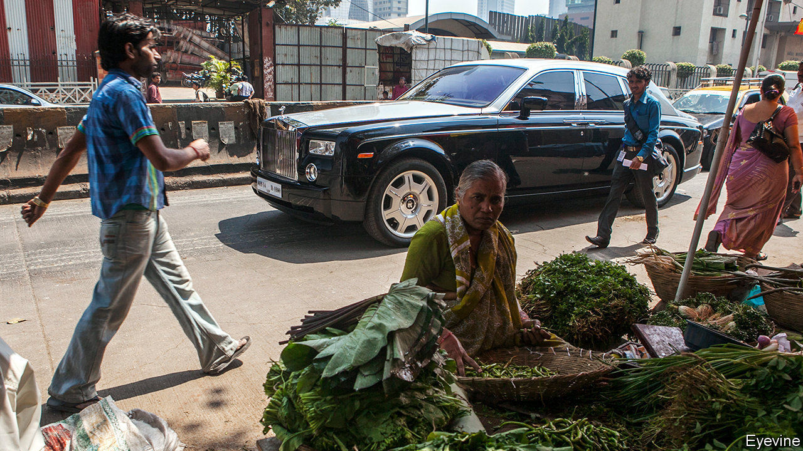
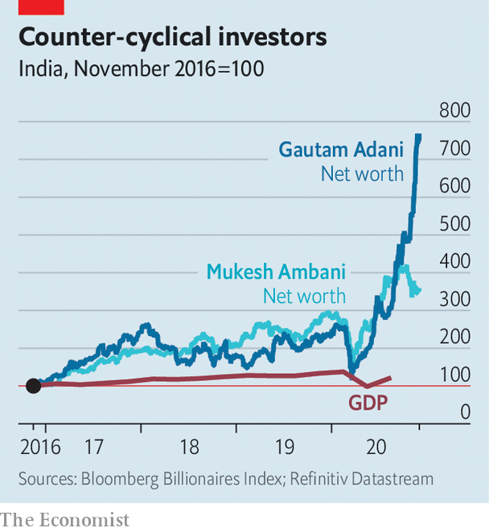

###### Compounding inequality

# India’s super-rich are getting much richer 

##### Even as the economy shrinks by a tenth 

 

> Dec 5th 2020 


SOME PEOPLE have almost all the luck. Over the past year, as India’s economy has shrunk by around a tenth and tens of millions of Indians have lost jobs or sunk into poverty, the fortunes of the country’s two richest people have swollen. Gautam Adani, whose conglomerate sprawls from ports to coal mines to food, has seen his personal wealth more than double, to some $32bn. Mukesh Ambani’s riches, which derive from oil refining, telecoms and retail, among other things, have grown by just 25%, albeit to an intimidating $75bn or so.


The share of wealth and income going to the top 1% has been rising rapidly in recent years in India, as it has been in many countries. Last year they hoovered up 21.4% of earnings, just ahead of their counterparts in Russia, according to the World Inequality Database. Credit Suisse, a bank, puts their share of India’s wealth at 39%, well ahead of the richest 1% of Americans or Chinese. Most alarmingly, in India some of the rich have become super-rich by using their heft to crush smaller competitors and thus corner multiple chunks of the economy. The tilt in fortunes has rewarded not so much technical innovation or productivity growth or the opening of new markets as the wielding of political influence and privileged access to capital to capture and protect existing markets.


Merely a decade ago, according to data compiled by Marcellus, an investment-advice firm, among listed firms in India the 20 most profitable generated less than a third of profits. They now account for 70%. A study by Krishna Kant, a journalist, reveals that between 2014 and 2018 competition within ten different industries, from aviation to tyres, deteriorated markedly.


Across Indian markets, only the shares of giant firms have gained consistently over the past decade, says Rohit Chandra of IIT Delhi, a university. International investors have noticed, and now bet increasingly not on promising new firms but on big old ones, which they expect to get even bigger. The government boasts that the five months from April to August saw a record $36bn in foreign investment, suggesting that its wise policies have sustained confidence during the covid-19 epidemic. What it trumpets less loudly is that more than half of that money, including hefty investments from Facebook and Google, poured into Mr Ambani’s hands alone.

 


It is easy to understand why. Things have a way of turning out as Mr Ambani wishes. Back in 2016, for instance, the tycoon used his massive earnings from petrochemicals to take a $25bn gamble, plunging into the maturing mobile-phone market. His timing was exquisite. Just as he rolled out a free service to lure customers, the government withdrew 86% of the country’s paper currency, leaving most of India strapped for cash and eager to find savings. Rival companies also found themselves burdened by lawsuits and crushing penalties for back taxes. Regulators ignored complaints. “If his firm were Chinese it would have been charged with dumping,” says one economist.


Mr Adani enjoys a similar Midas touch. In early 2019 his group, which controls around a quarter of India’s port capacity, ventured into a new field when the government tendered six 50-year airport-management contracts. Competing against established firms, Mr Adani nevertheless won all six. He has since bought two more, including a 74% share in Mumbai airport, India’s second-busiest. More recently, Mr Adani has counterbalanced big stakes in coal-fired power with lots of renewable energy, winning a $6bn government contract in June for various solar projects. The share price of Adani Green Energy, a subsidiary, has risen tenfold since March.


Some of India’s tycoons have prospered because they have learned not just to weather unpredictability, but to game the system. That system, alas, is failing India’s poor. Measures of malnutrition and stunting reveal an alarming backward slide over the past year. The unemployment rate shows some recovery from the worst of the covid shock, but that fails to capture the astonishing bleakness of India’s labour market. Before covid hit, barely 40% of adults were in paid work, according to the Centre for Monitoring the Indian Economy, a research firm. Now only 36% are. The rest, including legions of housewives, see no point in even looking for a job. ■

