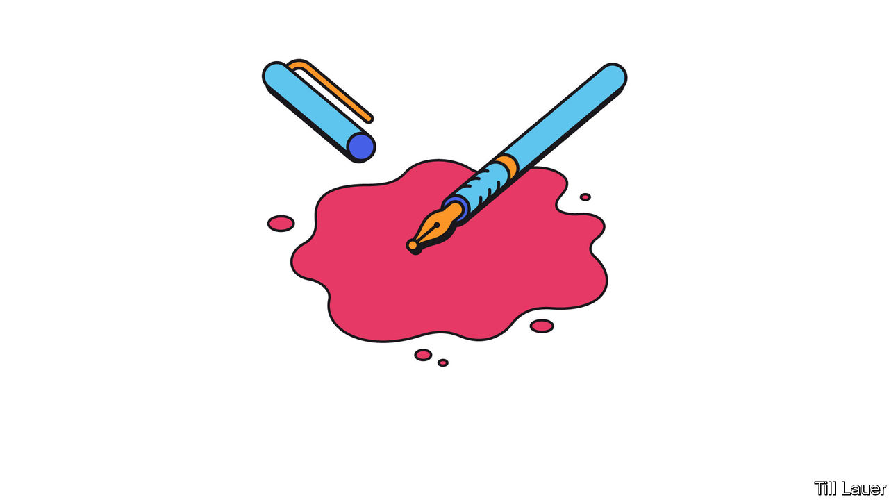

###### Banyan

# Remembering Mishima, a writer of genius who committed seppuku 

##### To add to the spectacle, he first staged a quixotic “coup” 

 

> Dec 3rd 2020 


BIRTH IS THE obvious place to start a life story, but how can Mishima Yukio’s not begin with death? That of Japan’s finest author of the 20th century was both spectacular and absurd.


On November 25th 1970, Mishima led members of his private army into the main military base in the centre of Tokyo and launched a “coup” patently intended to fail. The commander was taken hostage. In white headband and a uniform that a biographer, Damian Flanagan, describes as easily mistaken for a bell boy’s, Mishima stepped out onto a balcony and called upon the hundreds of members of the Self-Defence Forces (SDF) below to revolt and tear up Japan’s pacifist constitution. Imposed by American occupiers, it had diminished the standing of the emperor and forbidden a conventional army (and still does). “Aren’t you samurai? If you are samurai, why do you defend a constitution that rejects you?” The soldiers responded with cries of “Fuckwit!”


Back in the commandant’s office, Mishima, a stickler for timekeeping, removed his watch and prepared for seppuku, or ritual suicide. Kneeling, he pushed his short sword into the left side of his intestines and, grunting, moved it across. A first accomplice was to complete the suicide with a swift beheading but messed up—Mishima’s overdeveloped neck muscles from years of physical training did not help. A second delivered the final cut. Then the first disembowelled himself and was beheaded in turn. The front page of the evening edition of Asahi Shimbun showed the two heads on the carpet next to the scabbard of the long sword.


Many Japanese remember exactly where they were on hearing the news. Mishima was the author of 34 limpid novels, more than 70 plays and scores of lighter tales for a mass market. He was Japan’s first media supasuta (superstar). He acted in films and posed as a model. He had sought illumination in India a year before the Beatles. He had sharp sartorial sense and twinkling wit. He topped Heibon Punch magazine’s Mr Dandy awards.


Yet Mishima’s commemoration was long the preserve of right-wing fanatics. For all his cosmopolitanism, in his later years Mishima embraced the notion that a Japanese life should only be lived through worship of the emperor. His ideal, he told a hall of left-wing students at University of Tokyo in 1969 was how, before the second world war, the word “emperor” had once “prefaced all intentions”.


Mishima was born into a stifling household: his domineering grandmother cocooned him indoors and his father destroyed his writings. He came of age just before Japan’s defeat in 1945. His generation was taught to sacrifice the most beautiful thing they had—their lives—for the emperor. But when called up, puny Mishima failed his medical. Hirano Keiichiro, a novelist, says “survivor’s guilt” played a big part in his militarism.


Fused to it was his obsession with pleasure, pain and homoeroticism. In one of his greatest novels, “The Temple of the Golden Pavilion”, a monk burns a temple because it is too beautiful. Mishima, in turn, was building his body for a final sacrifice.


Yet Mishima’s life-defining death channelled the nihilism of Nietzsche more than anything essentially Japanese. The act mattered as much as the word. Mishima had no time for intellectuals who never left their towers, says Roger Pulvers, an author and translator. The uncovered footage of Mishima’s debate with the students, at the height of huge anti-American and anti-establishment protests, was recently made into a documentary, “Mishima: the Last Debate”. “If you’d mentioned ‘Emperor’ just once,” Mishima declares at one point, “I’d have joined your cause. Gladly.”


Younger Japanese have flocked to see the documentary. Mishima’s books are selling well too. That would have pleased him. But he would have been appalled at the prospect of people “placidly enjoying...lockdown thanks to Zoom, Netflix and Uber Eats, totally comfortable with the prospect of a future controlled by artificial intelligence and big data”, as Peter Tasker, a pundit based in Tokyo, puts it in Nikkei Asia, alluding to Nietzsche’s “last man”.


Many wonder how things might have been, had Mishima survived. In one novel, Oe Kenzaburo, a Nobel laureate, has Mishima released from prison after 30 years to become the leader of a 21st-century cult. If that is not as far-fetched as his actual death, then Mishima has made sure, as he knew he would, that he would always have the last word.

