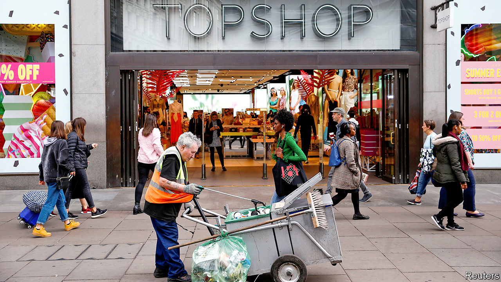

###### Covid-19 and employment

# The fates of Arcadia and Debenhams point to retail’s huge problem 

##### Retail jobs lost during the pandemic may not return 

 

> Dec 3rd 2020 


UNABLE TO COMPETE with the convenience of shopping online, the high street has been crumbling for years; and the covid-19 pandemic has accelerated the trend. Arcadia, a retailing conglomerate, announced that it would enter administration on November 30th. The next day Debenhams, a 207-year-old department store chain, which has been in administration since April, said it would start winding down its business. Some 25,000 jobs are at risk across the two companies. The real estate they occupy, some 15.5m square feet according to the Local Data Company, a research firm, risks falling fallow.


The retailing business employs 3m people and occupies vast swathes of property. The proportion of shopping done online has increased from 20% before the pandemic to 27% today, according to data compiled by the Royal Society for Arts. Whereas jobs in hospitality and leisure are likely to return as the virus subsides, the changes in retail are “a longer-term adjustment and the jobs won’t bounce back”, reckons Hannah Slaughter of the Resolution Foundation, a think-tank.


The full effects of the covid shock to retail are likely to arrive next summer. By then the government’s job-retention scheme, and its holiday on business rates, a commercial-property tax paid to local authorities, will have run out. The truth will be writ in retailers’ quarterly filings, which lag by three months. It will almost certainly mean a sharp rise in the number of unemployed retail workers, and the number of unoccupied commercial premises in town centres. Ms Slaughter notes that the long decline of retail over the past decade has been slow enough to manage itself from a policy perspective. The pandemic’s acceleration may require government help to minimise the pain.


Retail workers who lose their jobs as a result of covid-19—the British Retailers Consortium reckons they will number a quarter of a million by the summer—are more likely to find work in other sectors, such as care, which is short of labour. Ms Slaughter suggests that government work-coaches might focus more on this reallocation than they usually do.


Empty shops may be a harder problem to solve. A loosening of planning laws may encourage the repurposing of vacated shops for a trendier and more diverse range of businesses and allow a mix of retail and residential to revive town centres. But the results of an older retail bankruptcy suggest caution. A quarter of the property left empty by British Home Stores, which went bust in 2016, is still empty today. In the premises that have new tenants, the majority are other retailers paying knockdown rents, according to Ronald Nyakairu of the Local Data Company. In a few places, such as London, have they found new uses: one in Putney has become a swanky block of flats, while one on Oxford Street is an indoor golf course.


But for depressed town centres, left behind in myriad other ways, the hipsterfication of the cavernous corpses of shopping spaces looks an empty promise. Bringing vibrancy to those areas will be far more complicated. And for the retail workers there who have lost their jobs? A position at an Amazon logistics warehouse beckons. Those are being built apace.■


Editor’s note: Some of our covid-19 coverage is free for readers of The Economist Today, our daily . For more stories and our pandemic tracker, see our 

