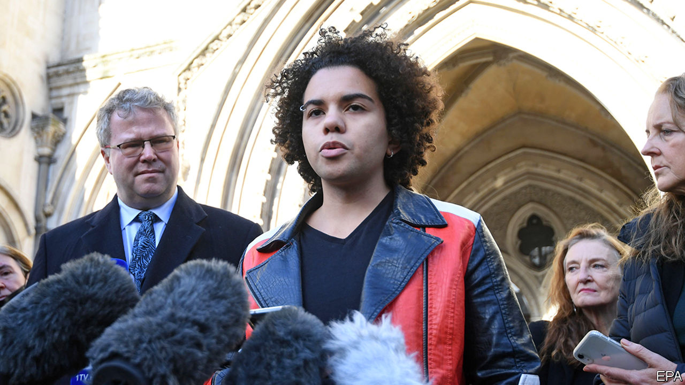

###### Keira Bell

# The judgment in Keira Bell’s case upsets trans groups 

##### It becomes harder to prescribe puberty blockers to children 

 

> Dec 1st 2020 


IN ANGLO-SAXON COUNTRIES, trans people have gained rights in the past few years. Those in Canada and some Australian states can be legally recognised as belonging to the gender of their choice, irrespective of whether they have had gender reassignment surgery. In America, the Equality Act, which Joe Biden has promised to sign, would have a similar effect. But in Britain there has been a push-back. In September, the government said it would not reform the Gender Recognition Act, which Theresa May, a former prime minister, had said she would change to allow gender self-identification. And now a High Court ruling has upset trans-rights activists.


On December 1st, three judges ruled that the youth gender-identity clinic at the Tavistock Hospital in London was not upholding the law, which requires that children have a mature understanding of the consequences of hormone treatment before consenting to it. The ruling was part of a judicial review brought by Keira Bell (pictured), a 23-year-old woman who identified as a boy when she was younger, and was given puberty blockers at 16, then testosterone, then a double mastectomy. She later detransitioned. Ms Bell argued that she was too young to understand the implications, and that the protocol for giving the drugs did not have an adequate scientific basis. The court agreed, calling the treatment “experimental”.


Last year 2,700 people were referred to the Tavistock’s youth gender-identity clinic. Around 40-50% of them were put onto puberty blockers. The clinic argued that the drugs are safe and reversible. Ms Bell’s lawyers produced a study showing that in 97% of cases they led on to further treatments such as cross-sex hormones and surgery. The court agreed that once on the pathway, “it is extremely rare for a child to get off it”.


The clinic said it would pause putting under-age patients onto puberty blockers. Most future cases will be referred to the courts. Trans campaign groups were aggrieved. The ruling was “shocking”, according to Nancy Kelley, head of Stonewall. “Hormone blockers,” she said, “play a vital role in helping to alleviate the distress many trans young people experience and offer much-needed time…to explore their identity. Denying this vital support is not a neutral act and can be deeply harmful.”


Some feminist lobby groups, who believe that there is a conflict between trans rights and women’s rights, are delighted. They maintain that mistaken beliefs about gender have led to children wrongly being put on the path to gender reassignment, as Ms Bell was, and that the court has cut through the ideology and got to the facts. Stephanie Davies-Arai of Transgender Trend, a campaigning group, points out that scientific studies that her group submitted to the court were accepted as evidence, while submissions from Stonewall and Mermaids, a trans support group, were denied because the evidence had either already been given or was irrelevant. The judgment is a victory for the trans activists’ opponents; but there are more legal battles due next year. ■

