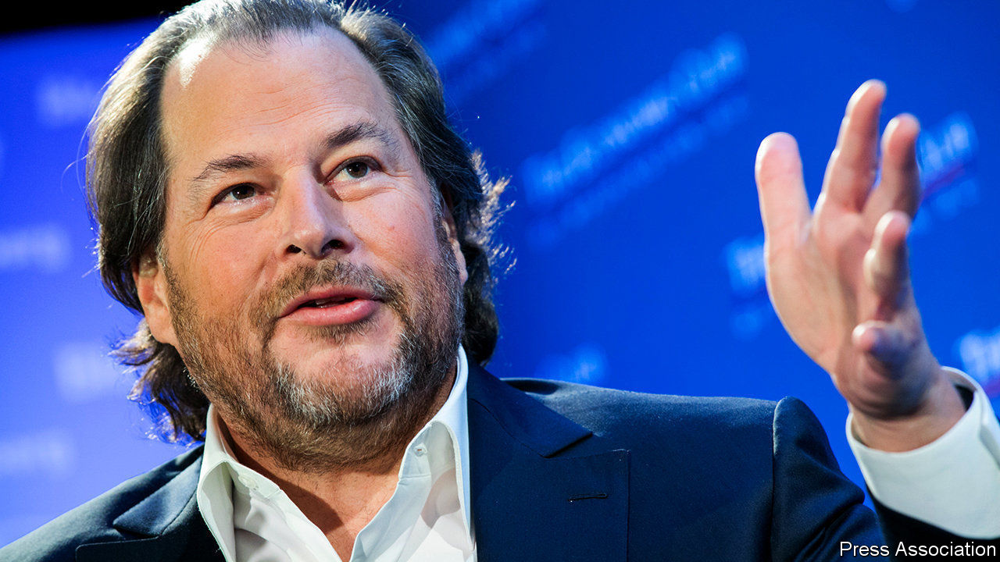
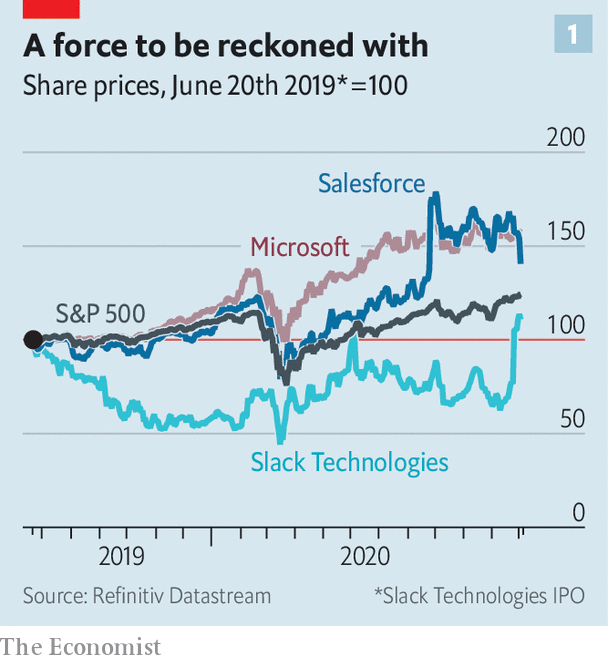
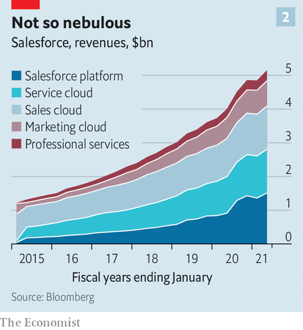

###### Business software

# Salesforce gets some Slack 

##### Marc Benioff has his sights set on tech’s big league 

 

> Dec 5th 2020 


MARC BENIOFF got the idea for the “ohana” corporate culture on a sabbatical in Hawaii. The term refers to a network of families bound together. He likes to think of Salesforce, the world’s third-biggest software firm, which he founded and runs, as just such a network. On December 1st Mr Benioff welcomed Slack, an instant-messaging tool, to his ohana. The $27.7bn deal is one of the biggest ever in the software industry.


Like many family alliances the tie-up is partly about power and feuds. Slack’s product has a cultlike following, which Salesforce wants to harness to build a tech platform that sells digital tools that no firm can do without. Stewart Butterfield, Slack’s co-founder, hailed it (hyperbolically) as “the most strategic combination in the history of software”. The feud is with Microsoft, whose advances Slack spurned four years ago. The deal makes Salesforce a far more formidable challenger to the giant.


Mr Benioff may be best known to the public for championing corporate “purpose” (and owning Time magazine). But in his own industry he wins kudos for disruptive innovation. In the 2000s the young Salesforce basically invented software-as-a-service (SaaS)—accessing programs remotely rather than installing them on office computers—particularly for managing customer relationships. Microsoft, Oracle, SAP and others had to follow suit. 


The explosive growth of SaaS has propelled Salesforce to ever greater heights. And to greater breadth: since 2016 it has spent over $25bn snapping up over a dozen firms to boost its computing chops. It bought Tableau, a data-analytics platform, and MuleSoft, which helps firms connect legacy IT systems to the cloud. 

 


Then came the pandemic. A boom in tech stocks lifted Salesforce’s market value from $144bn to $225bn this year. Slack, whose share price has lagged behind those of Zoom and other enablers of remote work, suddenly looked affordable. Mr Benioff is paying with a mix of cash and Salesforce stock. His firm’s valuation is still well behind Microsoft’s $1.6trn. But it may at last have a shot at tech’s top table. It already rules in customer-relationship software and thrives in other areas of business software, especially since acquiring Tableau. Aaron Levie, boss of Box, a cloud firm, describes Slack as “another dot on the graph” that plots Salesforce’s rise to become the world’s number-two business-software company (behind Microsoft). Perhaps, Mr Levie muses, “even the largest”. 


Such sentiments explain why for Microsoft the Slack deal is a red rag. Slack got the giant’s attention a few years ago when Mr Butterfield promised to wipe out email, which would threaten Outlook, Microsoft’s popular inbox, and its email server, Exchange. “If you are going to come at the king, you’d better not miss,” quips Charles Fitzgerald, a former executive at Microsoft who is now an angel investor. Back then Mr Butterfield did miss—and Microsoft shot back with a new product, Teams, combining messaging with videoconferencing and other functions. Slack has launched an antitrust complaint against it for offering Teams free of charge in its Office bundle, together with its popular word processor and Excel spreadsheets.


Teams is a big reason why Mr Butterfield is in an ohana-ish mood. Like Zoom, it has videoconferencing—and far more active users than Slack, which explains the latter’s lacklustre stockmarket performance. Salesforce will invest to reinvigorate it, presumably adding more video-meeting capability. Its sales machine will push Slack beyond early adopters into the corporate mainstream. 


 That will intensify Salesforce’s rivalry with Microsoft, with which it will compete in three main areas. With Slack it will directly take on Office, now that Teams has been folded into it. Slack also offers a gateway to 2,400 software tools, mostly created by independent companies, that compete with other Microsoft products. Salesforce and Slack could bundle all this software into a convenient alternative to Microsoft. Second, Salesforce competes with the giant in customer-relationship management, where it plans to make Slack the user interface, and other business functions.


Then there is the bigger battle over platforms. Both Salesforce and Microsoft aim to give businesspeople who do not themselves write software the tools to build customised programs—“with clicks not code”, as Salesforce puts it. Salesforce’s Developer 360 is punier than Microsoft’s Power Platform but is improving, thanks to MuleSoft and Einstein, a set of artificial-intelligence services. Slack could be a “Trojan horse” to hook customers of Salesforce’s own clients on more of the company’s applications, says George Gilbert of TechAlpha Partners, a consultancy.

 


Success is not in the bag for Salesforce. Mr Benioff may fail to turn his vision into reality. Even if Slack gets its video act together it would be late to videoconferencing, which has matured rapidly during the pandemic. Most large corporate clients already use Zoom, Teams or Cisco’s Webex software. And Salesforce might mistakenly end up sacrificing Slack’s growth while trying to bolster its own businesses.


 Moreover, Slack is not in and of itself enough to make Salesforce into a genuine rival to Microsoft. Mr Benioff would need to build (or buy) capabilities in document storage, cyber-security and more, reckons Mark Moerdler of Bernstein, a broker.


Wall Street is already wary of Salesforce’s big acquisitions; the firm’s share price dipped when news of the Slack deal surfaced. Still, SaaS holds vast potential, as Microsoft shareholders know well. And, as Mr Butterfield noted on the deal’s announcement, Mr Benioff has already started one revolution. Betting against this ohana is not for the faint-hearted.■

