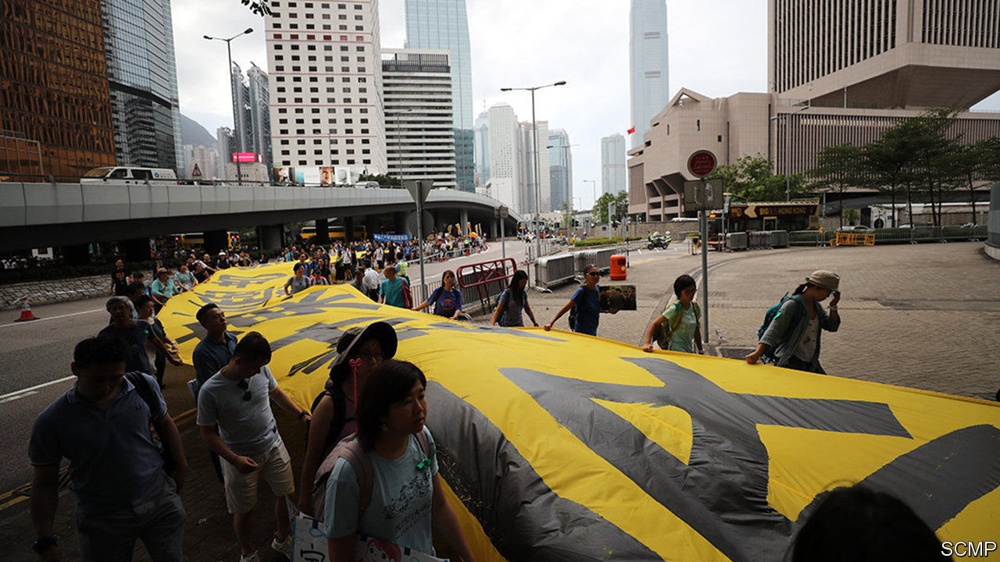

###### Lantau Tomorrow Vision

# Hong Kong’s big housing plan faces little resistance 

##### With democratic opposition silenced, the decks are clear to build homes for 1m people on artificial islands 

 

> Dec 5th 2020 


WHEN HONG KONG’S legislature was stripped last month of an opposition after the government expelled four pro-democracy lawmakers and the remaining 15 resigned in sympathy, many in the territory feared this would allow the passage of controversial bills with a minimum of critical scrutiny. In the coming weeks, one proposed law is likely to prove that such worries are justified.


The bill would permit the spending of HK$550m ($71m) on a feasibility study for the biggest infrastructure project ever proposed in the city. The scheme, Lantau Tomorrow Vision, would involve creating 17 square kilometres of artificial land off Lantau, Hong Kong’s largest island. The government says housing built on this, much of it subsidised, could accommodate up to 1.1m people—about one-seventh of the current population. The estimated price tag is at least HK$624bn. Critics say the project is unnecessary, expensive and threatens rare species, including the pink dolphin.


In her annual policy address on November 25th, Hong Kong’s leader, Carrie Lam, said the scheme would “bring enormous economic benefits to Hong Kong”. It would also please the authorities in mainland China. They see it as a catalyst for their own “Greater Bay Area” idea for building Hong Kong and nearby cities inland into a giant metropolis. Shenzhen, the mainland city closest to Hong Kong, wants a high-speed rail link with the Lantau project.


Some developers would like to go further. The Hong Kong Real Property Federation, a lobby group, has suggested that the mainland should lend Guishan, an island 5km south of Lantau, to Hong Kong to allow it to build artificial land there for 800,000 Hong Kongers. But Mrs Lam says the idea would not go down well in Beijing, given President Xi Jinping’s green proclivities. She has not explained why he does not object to the Lantau scheme on such grounds.


In September more than 40% of those surveyed by the Hong Kong Public Opinion Research Institute opposed the project. Many would prefer the building of more housing near the mainland border on old industrial sites. But pro-government politicians in that semi-rural area object. Sadly for Mrs Lam, they have an outsize voice on the 1,200-member committee that picks the winning candidate for her job. Should she decide to seek re-election in 2022 she will need all the votes she can get. ■

