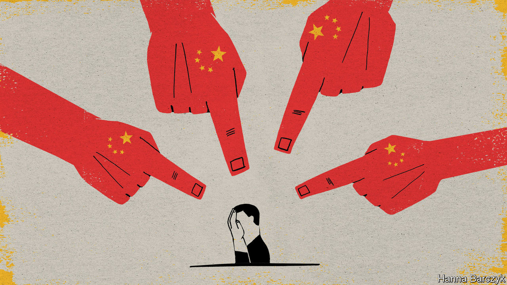

###### Chaguan

# How China’s bullying could backfire 

##### Humiliating those who defy it does not make them love China’s government 

 

> Dec 5th 2020 


CHINA BULLIES other countries because it works. Once told that they have crossed a “red line” by harming China’s interests or calling out its misdeeds, many governments crumble swiftly. Others fold after suffering months of threats, trade boycotts and cancelled official meetings. But in China’s long experience, almost all—even sometimes America—climb down eventually, sending envoys to sue for peace. True, some Western leaders pay public lip-service to their own country’s values as they land in far-off Beijing. Once the press is shooed from the room, however, the foreign visitors get down to dealmaking. They bow to China’s mix of market power, geopolitical importance and ruthlessness.


Lately, bullying others into furtive submission has not been enough for Communist Party chiefs. Increasingly, they seem bent on humiliating countries that show defiance, notably small or mid-sized allies of America. Just now, it is Australia’s turn for punishment. Its transgressions include taking a lead among American allies in banning the use of 5G network equipment from Huawei, a Chinese telecommunications giant, and calling for an independent probe into the origins of covid-19. China has imposed hefty tariffs on Australian wine and blocked imports of everything from coal to lobsters. In November Chinese diplomats made public a list of 14 ways in which Australia was “poisoning bilateral relations”. The charge-sheet rebuked Australia for allowing news outlets, members of parliament and think-tanks to criticise China. Late last month China’s foreign ministry pounced on an Australian government report into unlawful, brutal killings of prisoners and civilians in Afghanistan by Australian troops. Zhao Lijian, a ministry spokesman and licensed provocateur on social media, said the report exposed the hypocrisy of Western concerns about human rights. On November 30th Mr Zhao tweeted a crude photo-montage made to look like an Australian soldier slitting an Afghan child’s throat. Mr Zhao demanded that troops be held accountable—serenely ignoring the fact that Australia’s inquiry had already recommended that 19 soldiers face criminal investigation.


At first sight, such Chinese provocations look clumsy, indeed self-defeating. By offending lots of ordinary Australians, they complicate life for those businesspeople and politicians who want their government to placate China in hopes of restoring normal, profitable trade flows. That underestimates the calculating nature of Mr Zhao’s tweets and other Chinese attacks, which are not intended to win over Australian hearts and minds. Their aim is partly domestic: to demonstrate the foreign ministry’s fighting spirit to Chinese leaders and online nationalists. The intention is also to demonstrate China’s strength and to provoke such a sense of crisis that Australian political and business leaders are desperate to seek a truce. China’s outlandish attacks are pseudo-populism: a calculated ploy to press elites into cutting a deal.


China may yet feel vindicated in its choice of tactics. Australia may cave. If it does not, and China decides to sacrifice relations with Australia for years to come, a ghastly warning will be sent to other trade partners that imagine they can criticise China with impunity. The world is a rough place on the eve of 2021. China feels in better shape than most. While other large economies remain battered by covid-19, it has already returned to growth. When enunciating their core national interests, Chinese leaders are at least predictable. In contrast, America’s allies have spent four years absorbing hard lessons about the impermanence of American interests that once seemed carved in stone—lessons that will outlive the Trump presidency.


Yet conversations in recent weeks with more than a dozen ambassadors in Beijing reveal a striking change of mood. Westerners know that they often struggle to understand the incentives that guide Chinese officials. But envoys in Beijing increasingly suspect that China’s rulers are misreading the mood in democracies. In particular, Communist Party bosses are too disdainful of Western public opinion, which is swinging against China in ways that will constrain governments, at least somewhat, as they strive to balance economic interests and democratic values.

China prefers to be admired, but will settle for fear


Western unity is too fragile to enable many formal displays of solidarity with Australia. And multinational corporations are not about to leave China. For lots of big firms, their only profitable business unit this year is Chinese. But China’s assertiveness abroad, and its hardline ideological turn at home, are creating political uncertainties that businesses cannot ignore. The talk is of hedging now, and of diversifying future investments. There will be no binary moment when the West switches from engagement to decoupling. However, China is teaching the West to be more defensive. Over time, more individual, seemingly unconnected decisions will be a no, not a yes: whether to allow this Chinese investment, buy that sensitive technology from a Chinese firm, or sign an exchange deal with a Chinese university. That could have surprising cumulative effects. Western defensiveness will not stop China from rising, but it could alter China’s trajectory, perhaps steering it towards dominance of only part of the world: a techno-authoritarian sphere in tension with a more liberal bloc.


For decades, countries have tolerated Chinese bullying. For that, thank pragmatism, naivety and cynicism among politicians and business bosses, and broad indifference among publics. Now, however, China seems bent on changing countries that it deems hostile, so that governments, news outlets, universities and other institutions never defy China again. Some trade partners, especially in China’s backyard, will feel bound to submit. Others may prove more stubborn. China is no longer just a foreign-policy puzzle. As its confidence swells, and its technological footprint grows, it is ready to challenge how Western societies work at home. Imposing that sort of humiliation comes with costs. ■

