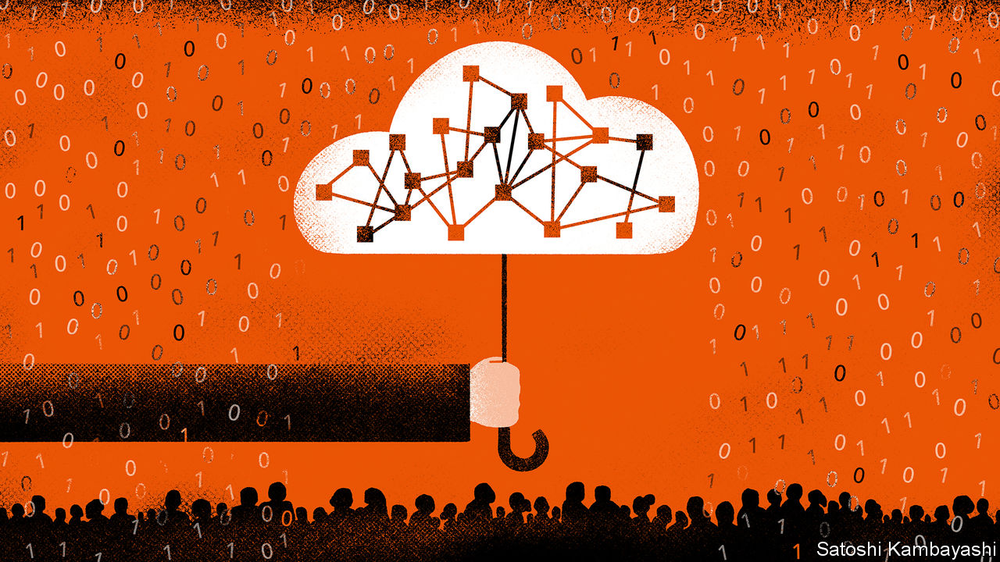
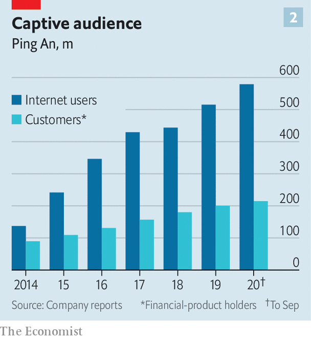

###### Metamorphosis

# How Ping An, an insurer, became a fintech super-app 

##### Could others follow the Chinese firm’s lead? 

 

> Dec 3rd 2020 


A JOB INTERVIEW at Ping An is a strange experience. To become an agent at the insurance group, the world’s largest by market capitalisation, candidates must take questions from an intelligent machine. As they respond, their voice, choice of words and gestures are scrutinised for the qualities of the most productive salespeople. After accruing data from millions of such interviews, the firm believes its artificial-intelligence (AI) system can quickly pluck talent and weed out the duds. Judged by the company’s agent-productivity scores, it is working.


Just as the recruitment tool offers a glimpse into the future of hiring, Ping An itself may offer a window on to the future of finance. The tool is just one of thousands of applications built by the group’s army of engineers. They support a sprawling array of services, from insurance and banking to health care and education, which this year alone have been used by close to 600m people. No other traditional financial-services group in the world comes close to rivalling Ping An’s ability to develop technologies and deploy them at such a scale.

 


The firm, set up by Peter Ma, began life as a small unit at a state-owned enterprise in Shenzhen, selling bosses insurance against worker-compensation claims. It was eventually spun out in 1988. By the mid-2000s it had become one of China’s largest life and property insurers, and attracted investment from HSBC, a bank. Today it is worth 1.5trn yuan ($236bn; see chart 1), and has redefined itself as a technology conglomerate built around an insurance business. It is now the largest investor in HSBC.


Three things distinguish Ping An’s operating model from that of a standard insurer: its vast platform of services; its approach towards its hundreds of millions of users and customers; and, underpinning it all, its technological prowess. Take its array of subsidiaries first. The firm sells life and health insurance, which in the first three quarters of the year accounted for 67% of net profit. It provides health care through Good Doctor, its digital-medicine group (see ). Customers can park their cash with Ping An’s bank or invest it through Lufax, its wealth-advisory arm (which listed in New York on October 30th). They can buy a car or sign up for education services, and then finance the payments through Ping An’s consumer-credit unit.


The sheer breadth of services on offer allows Ping An to treat customers more as a social-media firm would, rather than an insurer—the second distinctive feature of its business model. Unusually for a financial institution, Ping An considers the majority of people buying its products to be users instead of customers. They may buy a health service from Good Doctor or a car from Autohome, its car-purchasing app, contributing to the company’s data pool, yet remaining outside its core customer base. “You don’t have to jump through hoops. All you need to do is download our app,” says Jessica Tan, one of the group’s three co-chief executives. Only when they hold a financial product at one of the core units of the company, such as an insurance policy, do users become customers.

 


By allowing hundreds of millions of people to dip their toes in its product offering, Ping An has created a pool of users that can be targeted for sales of more sophisticated products. More than 578m people used its platform in the first nine months of the year (see chart 2). Some 214m were customers who had contractual agreements with the company. The rest were considered users. In the first half of the year, about 35% of its 18m new customers were sourced from its users. As the company has won over more users, that percentage has risen steadily in recent years.


Ping An is also becoming better at the lucrative business of “cross-selling”, or selling customers more products from other parts of the group, which increases income without incurring the cost of acquiring new clients. The share of retail customers that have contracts with more than one subsidiary rose from around 19% in 2015 to about 37% in June. That puts Ping An about 20 percentage points above the average cross-selling rate for insurers in Asia, according to Bain, a consulting firm.


None of this would be possible without Ping An’s technological prowess—the third and by far most important ingredient of its success. AI allows cross-selling pitches to customers to be made when they are most useful, for instance. “The final sale is done by an agent but the system develops the recommendation,” says Henrik Naujoks of Bain. “And it’s done at the right time.”


Large banks and insurers often sponsor “fintech incubators” that develop new technologies, or buy in applications that can be patched on to their core operations. HSBC, for instance, hired Identitii, an Australian fintech, this year to build a digital-payments tool. But for regulatory reasons such experiments tend to be ring-fenced from the financial institution.


Ping An, by contrast, has fully internalised these operations, apparently unafraid of regulatory blowback. The group has a 110,000-strong technology development team—larger than the commercial-banking divisions of all but the biggest banks—including 3,000 scientists. It submitted 4,625 technology patents in the first half of the year alone. The tools developed within the group’s technology unit are often used across the company. These include credit-risk models that use vast stores of data to make quick lending decisions at Ping An’s consumer-finance division, Puhui. Similar data crunching can track a customer’s driving habits through movements detected on a mobile-phone sensor and price car insurance accordingly. More accurate pricing on both fronts saves the company money.


When large financial firms do develop systems in-house, they jealously guard them from competitors. Mr Ma has turned that notion on its head by transforming Ping An’s technology division into a sales unit and profit centre. When the company developed its own cloud-computing tech for hosting its banking and insurance systems, it eventually turned the technology into products that now serve 630 banks and 100 insurers across China—a “software-as-a-service” model for banking that is often compared to what Amazon Web Services has done for website hosting.


Ping An’s lending algorithms facilitated 47.4bn yuan in loans at rival banks in the first half of the year. That unit, renamed OneConnect, went public last year. Another, called Smart City, builds and operates internal systems for hospitals. Local governments in 118 cities buy Ping An’s administrative technology.

 


Its technology business, which includes the sale of cloud-computing services, generated just 4.5% of group net profits in the first nine months of 2020. But making the transition from financial institution to fintech means turning tech into a profit centre, says Leonard Li at Oliver Wyman, a consultancy. That tech turns a profit at all, rather than adding to its cost base, makes Ping An unusual.


Could elements of the model be adopted elsewhere? Many of the individual technologies developed by Ping An will soon be applied by western insurers; some are already talking about how to become “the Ping An of Europe”. But wholesale fintech adoption will be harder in countries with stricter regulation on big data (and will probably become more difficult in China, too). Customers in America and Europe may also be more reluctant than those in China to buy insurance, health-care and wealth-management from one company.


Meanwhile, Ping An’s approach is being put to the test. When covid-19 first struck in January the company was a year into restructuring its life-insurance business. That involves improving its force of over 1m agents, who are still the main channel for insurance sales in China. The country’s insurers are not only battling among themselves for talent, they are also fighting off new entrants. “We are competing with the tech companies too,” says Jason Yao, another co-CEO. Companies with their own financial technologies, such as Ant Group, have launched rival insurance offerings.


The AI-powered recruitment and training tool has been one of Ping An’s top solutions. It appeared to be working in 2019, when the value of new business per agent in the company’s life-insurance division rose by a healthy 16.4% compared with the previous year. The gauge fell by almost as much in the first half of 2020. Analysts say that rivals in China have fared even worse. But the risk, says one consultant, is that the effectiveness of some of Ping An’s tech solutions may have been overestimated because of rapid growth in the insurance industry in China at the time. A prolonged downturn could show that some of its tech is less effective than first thought.


Another threat comes from leadership changes. In part, these reflect Ping An’s position on the tech frontier, which has led rivals to sniff around its executives. Ericson Chan, chief executive of Ping An Technology, was poached in September by Zurich, another insurer. Lee Yuan Siong, Ping An Insurance’s chief executive, took over as the boss of AIA, a Hong Kong-based insurer, this year. The loss of the pair has been a blow to the group. More could follow.


Questions also hang around the future of Mr Ma, who is 65 this year. He stepped down as group chief executive in July, prompting industry watchers to expect him to retire soon. But he continues to call the shots as chairman, and there is no talk of succession planning yet. Were Mr Ma to depart, some worry that Ping An’s rapid rise would come to a swift end. “There’s only one person driving innovation,” says a consultant. For all its use of machines, Ping An is still subject to key-man risk. ■

