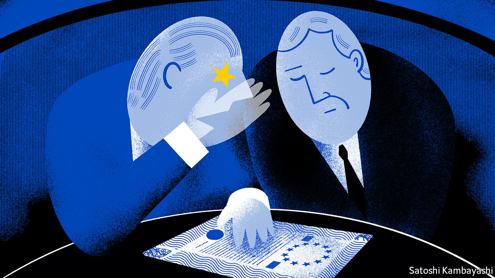

###### Buttonwood

# Should you buy European shares? 

##### The meat of the pitch is that things are not as bad as you probably think 

 

> Dec 3rd 2020 


TWO MEN are sitting in adjacent restaurant booths. One is talking at length—about train journeys, women, morality, taking chances, living one day at a time. The other is captivated. “When you die, you’re going to regret the things you don’t do,” says the speaker. After more of this, he sighs, pauses and offers his new friend a drink. He then takes out a map. “This is a piece of land,” he says. “Listen to what I’m going to tell you now.”


This is how Richard Roma, the alpha salesman in “Glengarry Glen Ross”, a play by David Mamet, seduces a stranger into buying a tract of undeveloped land. The scene comes to mind when considering the investment case for euro-zone stocks. The phrase “time to buy European equities” can elicit the same sort of alarmed response as an invitation to buy Florida swampland. An oblique sales pitch is generally advisable—even though now might be a better time than usual to make it.


How would a stockbroking Ricky Roma sell the euro-zone story? The main thing would be not to oversell it: Europe is hardly transformed. The meat of it is that things are not as bad as you probably think. The euro-zone’s weaknesses have not gone away, but are much less crippling. It is likely to do quite well in the early stages of economic recovery. That might just be enough to close the deal.


One sure-thing trade that the euro zone has spawned is in books and articles about how it is a half-finished project. It is a monetary union, but not a political one. The single market is fragmented in services and banking. Tax and spending decisions are made at the national level. But things have changed quite a bit. The European Central Bank looks a lot more like its peers than it did in, say, 2010. Like them, it is more or less committed to reflation. The hawkish German influence on its apparatus has waned. And the pandemic is curing hang-ups around fiscal stimulus. The European Union’s recovery fund is a step towards a shared fiscal policy. It is not huge. But it is not nothing either.


The euro zone’s equity market has suffered from a weakness in its make-up: too few of the digital companies of the future; too many of the industrial companies of the past. But time has whittled away at this, too. After years of under-performance, Europe’s banks and energy companies had dwindled to a 10% share of market capitalisation by the late summer, as Graham Secker of Morgan Stanley, a bank, noted at the time. Technology had become the largest single sector in the Euro Stoxx 50 benchmark index, at 14%. The public-equity market is still a more cyclical play than that in America. But it is no longer true to say that Europe is a technology desert. Venture capitalists talk excitedly about the strength of the pipeline of software startups across continental Europe.


In any event, it is its old-economy cyclical stocks that are piquing interest. If Europe has been the big loser from the pandemic, it ought to be a big beneficiary of reopening, goes one argument. The forecast for earnings-per-share growth next year is as high as 50% for the Euro Stoxx, according to Mislav Matejka of JPMorgan. A one-off bounce might not impress much. But there is a decent case that euro-zone equities might sustain interest beyond 2021—that the “runway is longer”, as Mr Secker puts it. The stimulative effect of the EU’s recovery fund will probably not be felt until 2022. As global economic recovery takes a stronger hold, investors will start to worry more about higher inflation. That might favour a more longer-lasting tilt towards cyclical stocks.


Why not simply buy emerging-market stocks instead? You still get exposure to companies that benefit from economic recovery; you also get plenty of tech stocks; and on top of all this you benefit from a weaker dollar, which is generally helpful for financing costs in developing economies. Yes, the dollar is expected by many to lose further ground. But what if it doesn’t? And what if Treasury yields start to rise quickly? That would be a tricky combination for emerging markets. Europe would be the sounder bet. (A stockbroking Ricky Roma might say that you don’t have to choose. Buy a bit of both.)


ABC—always be closing—is the mantra of Roma and his fellow salesmen. It is trickier to seal the deal when the story is not “things are great” but rather “things are a lot better than they were". Still, this counts as a more-than-decent pitch as far as the euro zone goes, even if it is an odd one to close on. After all, it is mostly about reopening.

