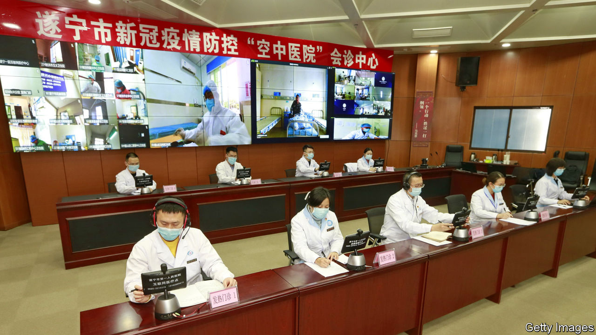
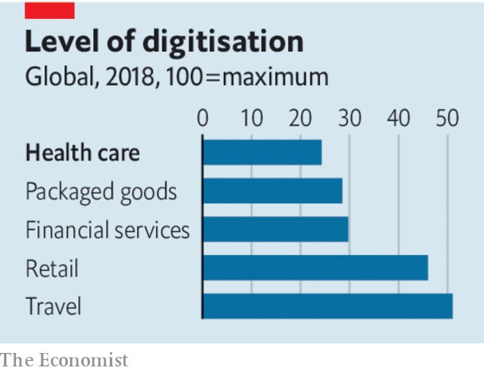

###### Alive and kicking

# The digital surge in health care 

##### How will the pandemic change health care? 

 

> Dec 5th 2020 


VAST, BUREAUCRATIC and amorphous, health care has long been cautious about change. However, the biggest emergency in decades has caused a revolution. From laboratories to operating theatres, the industry’s metabolism has soared, as medical workers have scrambled to help the sick. Hastily and often successfully, they have improvised with new technologies. Their creativity holds the promise of a new era of innovation that will lower costs, boost access for the poor and improve treatment. But to sustain it, governments must stop powerful lobbies from blocking the innovation surge when the pandemic abates.


Covid-19 has led to the spectacular development of vaccines using novel mRNA technologies. But there have also been countless smaller miracles as health workers have experimented to save lives (see ). Obsolete IT-procurement rules have been binned and video-calls and voice-transcription software adopted. Machines are being maintained remotely by their makers. With patients stuck at home, doctors have rushed to adopt digital monitoring of those recovering from heart attacks. Organisational silos have been dismantled. All this has taken place alongside a boom in venture-capital-raising for medical innovation: $8bn worldwide in the most recent quarter, double the figure from a year earlier. JD Health, a Chinese digital-medicine star, has just listed in Hong Kong (see ).


More innovation is needed. Global health spending accounts for 5% of GDP in poor countries, 9% in rich ones and 17% in America. The industry employs over 200m people and generates more than $300bn of profits a year. But as well as being risk-averse, it is insulated from change. Patients may not know which treatments are effective. The need to pool risk among many people creates administrative leviathans, typically national-health schemes in Europe, or insurers in America and some emerging economies. Complex rules enable firms to extract high profits.


The result is that productivity growth has been sluggish. High costs mean that many people in the developing world lack access to health care. Low efficiency may cause a fiscal crisis in some rich countries over the next two decades, as ageing populations force medical bills up further.

 


The pandemic helped show what is possible, partly because it got people to put aside their caution. Remote medical consultation and monitoring can lower costs and increase access. The share of remote visits at the Mayo Clinic, an American health provider, rose from 4% before the pandemic to 85% at the peak. Sehat Kahani, a Pakistani firm, has helped female remote doctors treat the poor in a socially conservative society. Ping An Good Doctor, a Chinese portal, had 1.1bn visits during the height of the pandemic there.


A surge in online pharmacy would increase competition. On November 17th Amazon announced its entry into the field, which promises to disrupt America’s industry dominated by big pharma and middlemen. That is just the start. Data-rich diagnosis could help specialists in routine analysis of, say, medical scans such as X-rays. A new generation of continuous glucose monitors for diabetics benefits from recent improvements in sensors. In time artificial intelligence will lead to drug innovations. This week DeepMind, an AI laboratory, announced a breakthrough in the analysis of proteins (see ).


Many of these trends should improve efficiency directly—with lower office rents, or the allocation of doctors in real time to rural areas where surgeries are scarce. But they are also likely to unleash a burst of competition and continuous improvement. More data will make it simpler to judge which treatments are most effective, the holy grail of medicine. Personal-health monitoring will mean that treatment becomes more preventive rather than reactive. And with more information, patients can make better decisions.


Governments can do their bit to help. Big health-care firms, such as insurers, and state-run health schemes, should be eager to recognise new digital services and pay for them. Germany and China have passed laws or new rules urging reimbursements of online services, for example. The evaluation of digital services for efficacy should be faster. America’s Food and Drug Administration has modernised its approval process for apps.


The other priority for governments is to build a system for the flow of health-care data. Individuals should have control over their records and grant permission to providers to gain access to them. India is creating national health IDs that will aim to combine privacy with mass data. Around the world hundreds of millions of medical records need to be anonymised and aggregated more efficiently so that researchers can scour data sets for patterns.


A rare chance to improve the quality of health care and lower its costs may vanish by the end of 2021. Exhausted health-care workers may prefer a rest to a revolution. Some of today’s medtech startups will flop, prompting a backlash. A few big tech firms may try to monopolise pools of data. And the industry’s powerful lobbies will try to lock out competitors. Health care is not a field where you set out to learn from your mistakes. Yet the pandemic has revealed that the industry became too used to being careful. It has redefined what is possible.■

