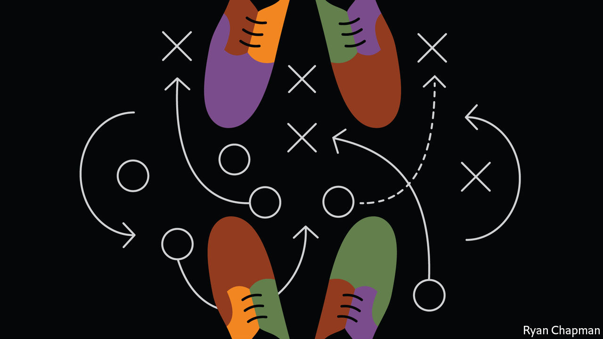

###### Bello

# Argentina’s president without a plan 

##### Alberto Fernández is muddling through 

 

> Dec 3rd 2020 


IN DEATH, as in life, Diego Armando Maradona represented his country to the full. The funeral of Argentina’s most famous footballer on November 26th was as passionate and chaotic as his country’s affairs (see Obituary). In defiance of his own government’s health rules, President Alberto Fernández ordered that Mr Maradona’s coffin lie in state in the Casa Rosada, the presidential palace. Like the president, El Diego was a lifelong supporter of Peronism, Argentina’s populist-nationalist movement. When the wake was curtailed, with thousands of fans queuing, pandemonium ensued.


Mr Fernández’s craving for popularity by association is a sign of his weakness. The funerary disorder extends to the economy, too. A social democrat, the president took office a year ago, at the head of an uneasy Peronist coalition in which much power lies with his vice-president, Cristina Fernández de Kirchner (no relation), a leftist who ruled from 2007 to 2015. Within three months, the pandemic struck. Mr Fernández was quick to impose a lockdown, which brought a surge in his approval rating, but which delayed rather than prevented a severe outbreak of covid-19. Argentina is among the top ten countries for recorded deaths as a proportion of the population. Only now is the lockdown being eased. Mr Fernández’s popularity is below its starting point.


In other matters, too, his government has little to show for its first year. Its main achievement was to renegotiate $65bn of debt with bondholders, though some economists question whether this was necessary. It has provided emergency aid to much of the population by printing money. The resulting inflation has been tempered, to 37%, by price controls. An already depressed economy will contract by around 12% this year, because of the pandemic. Now the government is negotiating, in slow motion, with the IMF, to which it owes $44bn as a result of a loan to its conservative predecessor that failed to stabilise the economy. Martín Guzmán, the finance minister, says he hopes for agreement by March or April.


The deal with the bondholders did not restore Argentina’s access to the international money markets, or confidence in the peso. The free-market exchange rate is now almost double the official rate (which has itself depreciated by around 25% since Mr Fernández took office). Critics complain that the government lacks an economic plan. It meanders between pragmatism—stressing exports and fiscal balance—and populism. It announced the expropriation of a big oilseed firm, only to change its mind. It is pushing through a swingeing wealth tax, of up to 3.5% on people with assets above $2.3m (at the official exchange rate).


“Imbalances in Argentina end either with rationality or an explosion,” notes a seasoned politician. This time the road to rationality may be slow. Mr Guzmán has chosen “a low-risk, low-reward equilibrium”, says Federico Sturzenegger, a former president of the Central Bank. The controls are buying time and may prevent an explosion. When the free-market peso plunged again in October, Mr Guzmán announced a reduction in money-printing. He has said he will cut the fiscal deficit from 11% of GDP this year to 4.5% in 2021. Pensions and public-sector wages are rising by less than inflation. The emergency aid will stop this month. “They may surprise us positively on the fiscal side,” says Mr Sturzenegger.


So far the Peronist coalition has remained united. But the Fernándezes’ political marriage is palpably loveless. The vice-president has complained of government “mistakes” and “functionaries who don’t function”. She and the president talked, briefly, for the first time in 45 days at Maradona’s wake. Her allies are trying to gain control of the judiciary. She is said to be furious that Mr Fernández has failed to halt corruption charges against her.


Economic recovery will be slow. The exchange controls and the wealth tax are discouraging investment. This year several multinationals (such as Walmart) have packed up. Much of the software industry has departed. Argentina, once Latin America’s most developed country, likes to live by its own rules, although that has engendered a long decline. In that, too, Maradona represented his nation. He had “so much football wealth that he thought he could squander it and it would not end”. That is Argentina, wrote Martin Caparrós, an Argentine author, in El País, a Spanish newspaper. “He fell, he got up, he fell again. He delighted in his past glories for lack of future ones: Argentina, perhaps.”

