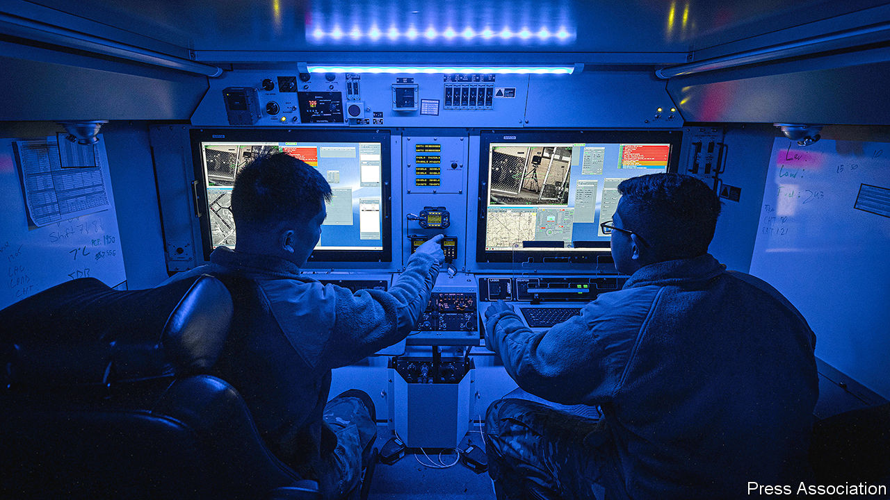

###### Shadow business

# America’s intelligence agencies prepare for life after Trump 

##### Repairing their reputation with sources and allies is not their biggest challenge 

 

> Dec 5th 2020 


“THE WHOLE job of the intelligence community (IC),” explains Angus King, a senator from Maine whom Joe Biden considered naming Director of National Intelligence, “is to seek the truth and tell the truth…[and to] provide absolutely unvarnished information without worrying what the leader wants to hear.” Most presidents value such independence. Donald Trump, less so. Over the past four years, he has compared intelligence agencies to Nazis, rubbished intelligence that displeased him and replaced professionals with unqualified sycophants. Doug Wise, a former deputy director of the Defence Intelligence Agency (DIA), calls Mr Trump “the global equivalent of an intelligence cancer”, who has damaged morale within agencies and emboldened America’s adversaries.


The Biden administration will need to undo that damage, while also responding to emerging threats with a set of institutions often deemed too tied to outdated practices. Mr Biden’s first steps are promising. He says he wants his national-security officials to “tell me what I need to know, not what I want to know”. The last two of Mr Trump’s four directors of national intelligence (DNI)—a role created in the wake of the September 11th attacks to promote better information-sharing among the 17 entities comprising America’s intelligence apparatus—were a former ambassador and a three-term congressman, both of whom had negligible intelligence experience. They were there, according to Robert Cardillo, another former DIA deputy director, “as yes-men to ensure the IC didn’t give [Mr Trump] any trouble.”


Mr Biden nominated Avril Haines as DNI on November 24th. She was Barack Obama’s deputy national security adviser and deputy CIA director; John Brennan, her boss at CIA, praises her “humility, interpersonal skills and tremendous capability,” as well as a “work ethic...beyond peer”. She vowed to “speak truth to power” if confirmed. Her priority, according to Mark Warner, the leading Democrat on the Senate intelligence committee, is “restoring morale [and] reaffirming the notion that [analysts] speak the truth, even if it’s not the administration’s position.”


Undoing the damage abroad could prove trickier. On the one hand, intelligence sharing among the Five Eyes countries—America, Australia, Britain, Canada and New Zealand—proceeded more or less as usual during Mr Trump’s tenure. The non-American intelligence agencies were occasionally more careful than usual in what they told the White House, to avoid triggering a presidential tantrum. Some worried that intelligence coming in the opposite direction may at times have been coloured by Mr Trump’s political considerations. But intercepted communications are shared almost automatically. And Mr Cardillo says that most allies expressed “relief” when he told them: “I get it, I know what’s in the headlines and what you’re seeing on Twitter, but we’re still here, we still have this relationship.”

Trust funds


On the other hand, many worry that Mr Trump’s denigration of his own spies has emboldened America’s adversaries. His carelessness with classified information—early in his presidency he offhandedly divulged some to Russia’s foreign minister—may make it harder for America to attract would-be sources. The seasoned professionalism of the national-security team that Mr Biden has already assembled may calm some nerves, but restoring America’s reputation for stability and care for its intelligence sources will take more than just words, and longer than just months.


Yet it is challenges unrelated to Mr Trump that are likely to prove trickier. After two decades of relentless focus on counter-terrorism, the agencies are shifting resources and attention to “great-power” rivals, above all China. That requires different skills and capabilities than those wielded in the militarised war against jihadists. As Mr Warner notes, “it’s not just about who has the best rocket or submarine. Who’s going to control the 5G network? What will be the ethical and legal criteria around AI?...We kind of fell asleep at the wheel, and China flooded the zone with engineers in standard-setting areas.”


If all that were not enough, intelligence agencies are also facing something akin to the problems media companies ran into when news moved from the printed page to the internet, and readers no longer needed a paper to give them information such as sports results or the next day’s weather forecast. “Seventy years ago when intelligence agencies were being set up, collecting and analysing secrets was deemed the best way to understand the world,” says Carmen Medina, a former deputy director of intelligence at the CIA. Today, she says, “a lot of the information that they stamp secret on, I can find anywhere else.”


Open-source intelligence, from commercial satellite imagery to social media, cannot substitute for the most hallowed sources—an agent in the Kremlin, say—but it offers insight without the encumbrances of classification. A new generation of officials and lawmakers have grown up in a world where they expect “answers on demand”, says Zachery Tyson, a former intelligence official at the Pentagon. “They are not going to use an IC where you have to go four floors down into the basement and log on to a secret computer with four different passwords to access a simple answer that you can approximate on Google.” ■


Dig deeper:

Read our , and then sign up for Checks and Balance, our  and  on American politics.

