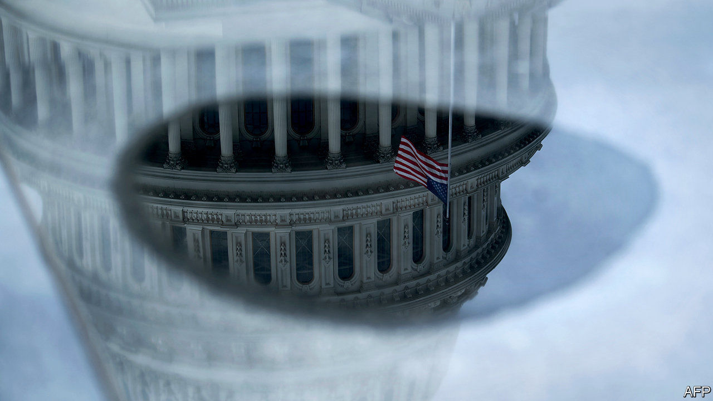

###### Shell collecting

# Congress edges closer to cracking-down on anonymous shell corporations 

##### America’s laws have made money-laundering too easy. That looks set to change 

 

> Dec 5th 2020 


OUT OF THE $4.5bn pilfered from 1MDB, a Malaysian state development fund, at least $1bn is alleged by American prosecutors to have been embezzled into the United States—spent in a Gatsby-esque frenzy on, among other things, a Manhattan penthouse, a Beverly Hills mansion and financing Hollywood films (including, naturally, “The Wolf of Wall Street”). America’s porous rules on anonymous shell companies make disguising the origins of money fairly straightforward. The Tax Justice Network, a good-government group, ranks America as the second-worst performer on its annual financial-secrecy index—ahead of famous tax havens like Switzerland and Luxembourg, and eclipsed only narrowly by the Cayman Islands. As recently as last year, American prosecutors were trying to wrest control of a 36-storey office building on Fifth Avenue in Manhattan, probably worth close to $1bn, on the grounds that it was secretly owned by the government of Iran, which is subject to some of the heaviest sanctions in the world.


Shell games such as these hide not only the penthouses of kleptocrats, but the financial networks for traffickers of arms, drugs and humans. Congress is on the cusp of making them harder to execute. The must-pass annual defence bill is slated to include legislation requiring companies to disclose to the Treasury Department’s enforcement division their beneficial owners (those who actually enjoy the proceeds rather than those who sign the paperwork). “The biggest vulnerability in our anti-money-laundering regime is the incorporation of anonymous shell companies,” says Clark Gascoigne, a senior policy adviser at the FACT Coalition, another anti-corruption outfit that has spent years pushing for the pending legislation. At present, notes Mr Gascoigne, there are more onerous disclosure requirements for obtaining a library card in all 50 states than for starting a new limited-liability company.


America’s law-enforcement agencies are keen to get such data. “The strategic use of these entities makes investigations exponentially more difficult and laborious,” a senior FBI official testified to Congress last year. In fact, there is impressively little organised opposition to the new rules, which have strong bipartisan support. The Bank Policy Institute, a lobbying group, is a firm supporter (banks not only spend a non-trivial share of operating expenses on anti-money laundering compliance, but would also rather avoid news stories about terrorism financing). So, too, is the US Chamber of Commerce, which until June had opposed such measures. The National Federation of Independent Business, a small-business lobby, is putting up a last stand of resistance, fretting that the new disclosure requirements would impose onerous paperwork requirements of 2.5 hours a year.


If it passes, the legislation would be the culmination of a long campaign. Banks were fairly quick to support the change. Realtors (estate agents to Brits) took longer to come round, as did the secretaries of state in places that make lots of money from incorporation fees. (Delaware earns almost as much from charging businesses as it does from its personal income tax.)


The bill would bring America’s rules closer to Europe’s. Britain has required disclosure of beneficial owners since 2016 (its register, unlike the one proposed by Congress, is public). The European Union required its member states to set up comparable schemes by January of this year. America has used the global heft of the dollar to go after international flows of illicit cash, while being permissive towards the ideal vehicles for money-laundering. That means “the United States is increasingly helping to facilitate the very narcotics traffickers, human smugglers, terrorist networks and kleptocrats that weaken US national security,” according to Jodi Vittori of the Carnegie Endowment for International Peace. That looks likely to change. ■

