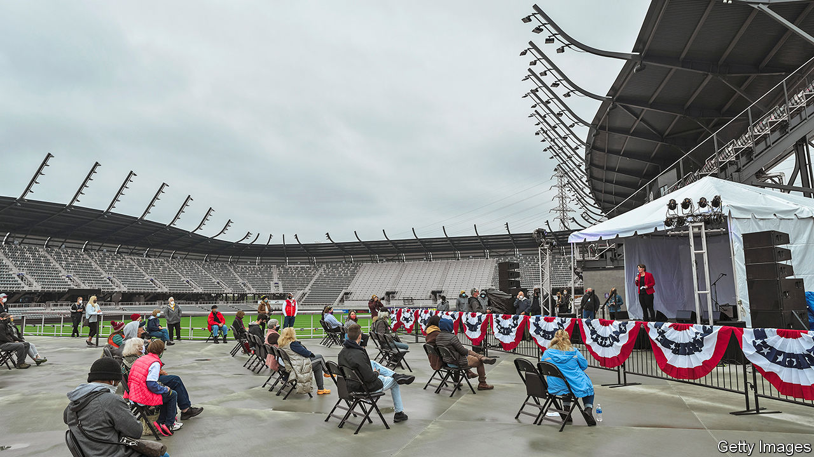

###### Not for sale

# How much does a few billion dollars get you in 2020? 

##### If you’re the Democratic Party, not much at all 

 

> Dec 5th 2020 


IN THE HEADY days before the elections on November 3rd, when Democrats dared to dream of unified control of Washington and a coming progressive remake of America, two especially optimistic indicators elicited particular giddiness. First, of course, were the horse-race polls showing Joe Biden ahead of President Donald Trump by nine or so percentage points. But there was also the money race, which Democrats were winning handily: Mr Biden’s campaign raised $952m, or nearly 60% more than Mr Trump’s campaign, described by reporters as a profligate operation limping cash-strapped into November.


The down-ballot races looked even more favourable. In an election that cost a remarkable $14bn—more than twice the price tag in 2016—Democrats were spending 80% more than Republicans, the most lopsided advantage ever according to analysis by the Centre for Responsive Politics (CRP), a research outfit. Unfortunately for them, a few extra billion seemed not to go very far in 2020. Democrats lost seats in the House of Representatives and the party faces an uphill battle to take the Senate, by the thinnest possible margin, when run-off elections are held in Georgia in January.


Whether campaign spending actually moves voters is an unsettled debate—one of special academic interest to American political scientists and of special pecuniary interest to America’s political-consulting-industrial complex. The political consultants would probably point to the robust correlation between raising the most money and winning an election: even in 2020, 89% of House candidates who spent most went on to win; the same was true of 70% of Senate candidates (albeit a two-decade low, according to the CRP).


Political scientists would counter that a correlation is just that—perhaps one driven spuriously by the fact that truly hopeless candidates generally have a difficult time raising money. Candidates who are guaranteed to win also attract a lot of campaign donations from those who want access to them. The more nuanced assessment is that campaign spending can move voters on the margins, going furthest in less prominent and less polarised races (like primaries) where more voters are uninformed and undecided.


Democrats will want a more thorough post-mortem than that, though, given not just their recent grief but also a cruel irony of history. As the Supreme Court issued ruling after ruling deregulating campaign financing, most prominently in its Citizens United decision ten years ago, Democrats fretted that free-flowing dollars from rich Republican donors would place them at a permanent disadvantage, consigning them to the minority for the foreseeable future. But when they managed to secure a serious cash advantage, through considerable investments in online fundraising and free-spending by billionaires of their own like Michael Bloomberg, they found it was not as decisive as they had hoped.


One partial explanation for the misfire is that better online fundraising enables greater hauls that are distributed inefficiently. Polls consistently showed that Amy McGrath had little chance of unseating Mitch McConnell, the Republican majority leader in the Senate, and yet she managed to raise $88m because there were thousands of Americans not in Kentucky willing to set their dollars on fire for the warm feeling of spiting Mr McConnell (and probably ignoring their local state legislative elections where Democrats were shut out). The top three employers for people donating to Ms McGrath were the University of California, Alphabet (based in Silicon Valley) and Microsoft (based in Seattle). West-coast cash helped buy a lot of television adverts for Ms McGrath ($18.6m-worth), with little chance of wooing Republican voters in the first place and diminishing marginal returns afterwards.


Alexandria Ocasio-Cortez, the prominent Democratic socialist representative, issued a two-pronged post-mortem of her own soon after the disappointing election: moderate Democrats had failed to win because they had ignored online advertising on platforms like Facebook, and had neglected the years-long organising it takes to turn out voters. The first part of her theory is suspect, but the second may be correct.


This is aptly demonstrated by what happened in Maine, where Democrats hoped that Sara Gideon would topple Susan Collins, the longtime Republican senator. Ms Gideon certainly did not neglect internet advertising—spending nearly three times as much as her opponent on Google advertising and four times as much on Facebook ads. But Mainers bristled at the out-of-state canvassers imported by Ms Gideon for her campaign. “Canvassing, phone-banking and people sending postcards is all a Band-Aid for a lack of social ties in the community,” says Eitan Hersh, a political scientist at Tufts who has written a withering denunciation of political hobbyism in America. Democrats opt for quickly constructing and then dismantling expensive get-out-the-vote operations in each cycle, Mr Hersh adds, whereas Republicans are able to tap more durable networks built around churches and gun clubs.


Ultimately, money probably matters less than voters suspect. In a provocative (and highly-cited) paper entitled “Why is there so little money in US politics?”, three political scientists pointed out that if campaign financing were really just an auction for federal spoils, then there ought to be much more of it given the colossal sums at stake. Instead, they argue persuasively that most campaign spending is driven by political dilettantes. During the Trump era, many incensed Democrats were willing to donate record sums to chasing lost causes. Campaigns (and their paid consultants) know that viral advertisements are a ticket to huge sums of internet cash. The donors, on the other hand, have little idea how effective their dollars will be.■


Dig deeper:

Read our , and then sign up for Checks and Balance, our  and  on American politics.

