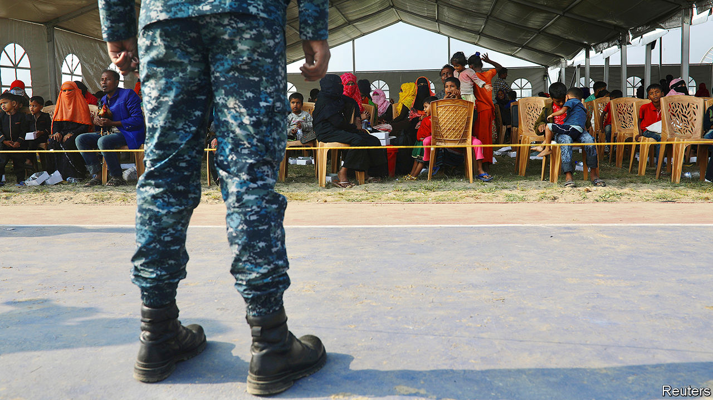
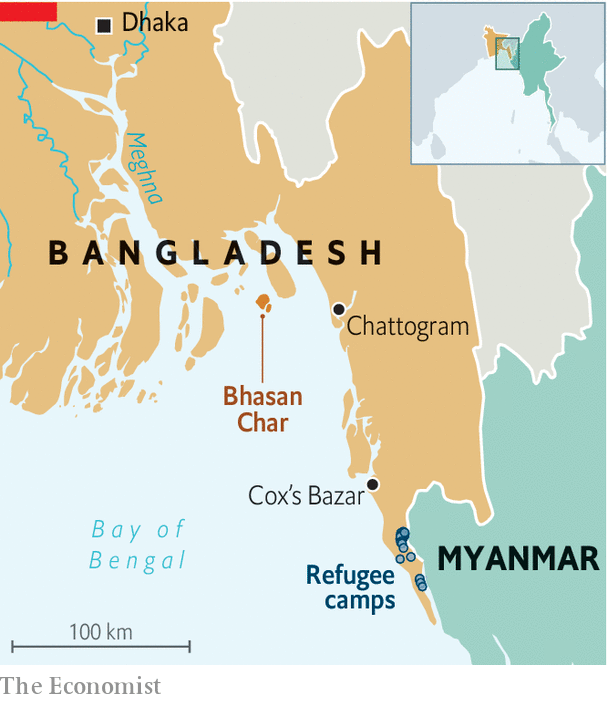

###### Club Mud

# Bangladesh is moving Rohingyas to a remote island 

##### The relocation will make them the “Palestinians of Asia”, an activist complains 

 

> Dec 12th 2020 


THE FLOTILLA that sailed from the port of Chattogram (formerly known as Chittagong) in southern Bangladesh on December 4th was carrying some 1,642 refugees to a new life across the water. But their destination was no far-off promised land. It took less than four hours’ churning through the wide, muddy estuary of the Meghna River to reach Bhasan Char, an island no bigger than a large city park, and so freshly formed it barely peeps above surrounding tidal flats (see map).


It is here, improbably, that the government of Bangladesh has built a red-roofed, grid-patterned model town, intended to house Rohingyas, an ethnic minority from neighbouring Myanmar. Some 700,000 of them were chased into Bangladesh three years ago by the Burmese army and allied militias in a horrifying bout of ethnic cleansing. Bhasan Char can house about 100,000. The hosts present the new settlement, erected at a cost of $300m by the Bangladeshi navy, as a safe, sanitary and humane alternative to the teeming and squalid refugee camps that have mushroomed along the jungly border.


Yet while some of the island’s new residents say they are happy to have pukka plumbing and cement floors, to many Rohingyas the permanence and isolation of the model town promise not relief but the institutionalisation of their misery. An island exile, they fear, would mean less hope of pricking the world’s conscience, and so less hope of ever returning to their original homes in Myanmar. “After this move to Bhasan Char, I see our people slowly dying,” warns Ambia Perveen of the European Rohingya Council, an NGO. “We are becoming the Palestinians of Asia.”

 


When Sheikh Hasina Wajed, the prime minister of Bangladesh, launched the relocation project in 2018, a chorus of similar objections erupted. Even as construction went ahead, diplomats and aid workers expressed doubt that large numbers of refugees would ever be settled on a remote island prone to cyclones and floods. Aside from the cost and negative publicity, they assumed, such a transfer would weaken the argument, strongly advanced by Bangladesh, that Myanmar itself must bear responsibility for the fate of the Rohingyas.


As time has passed, however, Sheikh Hasina’s government has faced growing internal pressure. Although proud that their own crowded country of 165m has aided and sheltered so many desperate refugees, ordinary Bangladeshis have gradually grown less welcoming. Stories of violent crime and disease in the border camps have spread, exacerbated by fears of covid-19 and by the smuggling from Myanmar of arms and of drugs such as yaba, a cheap form of methamphetamine that is ubiquitous in Bangladesh.


The police, who in addition fear jihadist radicalisation among refugees, have adopted an increasingly harsh line in the camps. Odhikar, a Bangladeshi human-rights group, claims that since 2017 perhaps 100 Rohingya men have been killed during alleged “gunfights” with security forces, in incidents that look more like executions. It has also built barbed-wire fences around the sprawling camps, the biggest of which houses nearly 600,000 people.


Restrictions on the refugees are multiplying. Last year the government banned them from owning SIM cards and ordered the telecom authority to block mobile-internet service in the camps. Though the networks were restored a few months ago, SIM cards are still forbidden. Rohingyas are also barred from holding bank accounts and from paid work. Learning is almost as hard as earning. Having resisted pressure from NGOs to grant Rohingyas access to education for nearly three years, the government had been on the verge of allowing some children to go school in April, when covid-19 intervened.


The move to Bhasan Char fits this pattern, and the growing authoritarianism of Sheikh Hasina, who has been in power without interruption since 2009. Troublemakers can be more easily controlled on the island, and it would be useful to reduce the density of mainland camps. It is perhaps no coincidence that CCTV cameras monitor all the streets of Bhasan Char, or that the government has just created a new body to oversee refugee affairs. The 15-person committee includes at least ten senior security officials, and no representatives of the Rohingyas.


Despite deep misgivings among aid workers, there is some sympathy for Bangladesh’s dilemma. If the relocation brings more attention to the Rohingyas’ plight, that might be a silver lining, speculates John Quinley of Fortify Rights, an advocacy group. “Bangladesh is right, calling out the international community for not pushing hard enough on Myanmar,” he says. The UN High Commissioner for Refugees, the main coordinator of international relief, tiptoes around criticism of Sheikh Hasina’s government. What it and smaller charitable outfits would most like is access to Bhasan Char. So far, Bangladesh has not allowed any regular visits, or any independent assessment of the model town. Without this, the UN cannot offer assistance.


Despite some individual reports of satisfaction with new homes on the island, which also boasts schools and medical facilities, the refugees on the mainland seem mostly sceptical. Many claim that the first to relocate to Bhasan Char were not volunteers, as claimed by the government, but were threatened by police, coerced or swayed by false promises of money. “They should call it jail island,” says Ro, a resident of a mainland camp, walking uphill for better telephone reception and a jumbled vista of plastic sheeting, tin roofs and bamboo walls. At least here the Rohingya are close to the border, and have some strength in numbers, he says. ■

