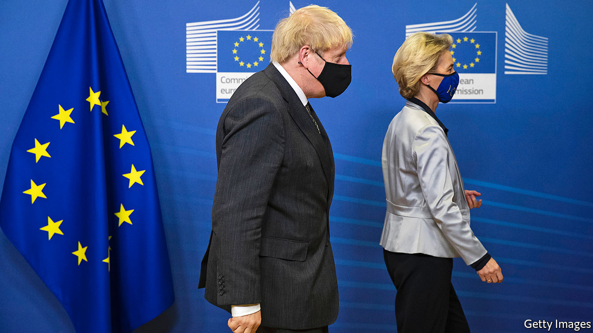

###### Last tango in Brussels

# A thin, last-minute Brexit trade deal is better than no deal at all 

##### It would at least provide a base on which later agreements could be built 

 

> Dec 12th 2020 


WITH THE Brexit trade talks deadlocked—again—Boris Johnson flew to Brussels on December 9th to meet Ursula von der Leyen. By having a fish dinner with the European Commission’s president, the prime minister hoped to replicate the last-minute deal that he struck in the Brexit withdrawal treaty in the autumn of 2019 after he went for a walk in Cheshire with his Irish counterpart, Leo Varadkar. This time it seems not to have worked. As we went to press, the two had agreed that negotiations should continue until Sunday, but the dinner failed appreciably to narrow any of the big gaps remaining.


Contrary to many reports, the most intractable of these is not over access to British fishing waters. For both sides, fisheries are politically important but economically insignificant, which should make a compromise feasible. The biggest difficulty concerns the so-called level playing field. This is the label for the European Union’s longstanding worry that post-Brexit Britain may undercut the social, labour, environmental and state-subsidy rules that underpin its single market. The EU’s wish to be allowed to retaliate promptly if this happens runs slap against Mr Johnson’s claim that Brexit must mean unfettered sovereignty and an absolute right to diverge from regulations that are set in Brussels. If no compromise proves possible on the level playing field, the outcome is likely to be that there will be no trade deal in place when the transition period comes to an end on December 31st.


The deal or no-deal argument skates over an important fact: that even agreement would represent a hard Brexit. Avoiding tariffs and quotas on goods is certainly desirable, but it still entails leaving the single market that Margaret Thatcher did so much to create. The deal does nothing for services, which make up 80% of the economy. The EU is withholding decisions to grant Britain the necessary equivalence for its financial regulation or to rule its data protection adequate so as to permit data transfers. Being out of the customs union implies not just more bureaucracy and customs controls but also checks on rules of origin for exports. A trade deal that erects rather than pulls down barriers is an unusual beast. Industries ranging from broadcasting to chemicals (see ) will suffer from being under a different regulatory regime and losing hitherto frictionless trade.


Then there is Northern Ireland. Under the withdrawal treaty, the province will stay in the single market and customs union in order to avert the risk of a hard border with the Irish Republic. But this necessitates checks on goods crossing the Irish Sea. It is welcome that, after reaching agreement with the EU this week on how these checks should be done, the government has abandoned its earlier plans unilaterally (and illegally) to rewrite the Northern Irish provisions of the withdrawal treaty. But treating the province, which voted to remain in the EU, differently from Great Britain inevitably raises questions about the future of the United Kingdom. Equally, the demand for a second independence referendum is rising in Scotland, which also voted to remain.


Yet even a thin deal would be better than no deal at all. The economic differences between the two count for something. Modelling by the independent Office of Budget Responsibility finds that a deal would make GDP some 4% lower than it otherwise would be: no deal would add a further 2 percentage point cut on top. Then there are the politics. Whereas a deal would create a base on which Britain could build other agreements with its largest and most important neighbour, the acrimonious blame game that would follow a failure in the talks would poison relations for years. Not reaching a deal would complicate co-operation on such matters as domestic security, intelligence-sharing and foreign policy. And it would stand as a globally reputation-shredding failure of statecraft by both sides. As he returns home from his Brussels dinner, Mr Johnson should reflect on what a poor outcome that would be.■

