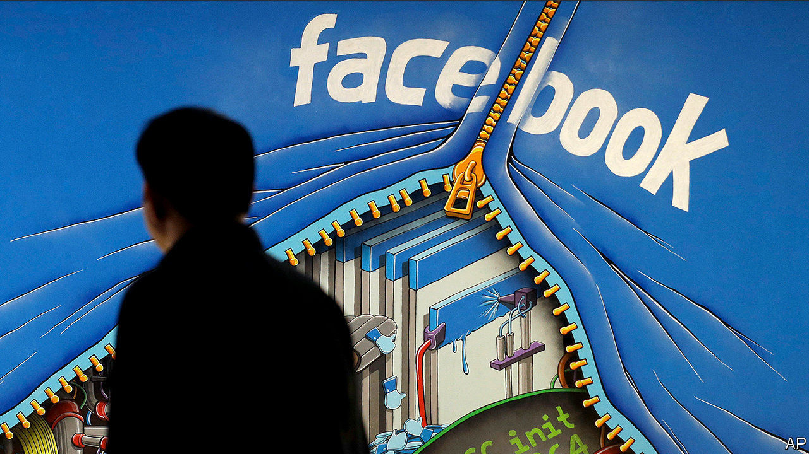

###### 

# Business this week 

#####  

 

> Dec 10th 2020 


America’s competition regulator filed an antitrust lawsuit against Facebook, alleging that it bought WhatsApp and Instagram, two social-media rivals, to suppress competition. Separately, a coalition of 46 American states, led by New York, launched a similar lawsuit against the company. Facebook argues that the legal actions are an attempt to revise history, as the takeovers were scrutinised and approved by regulators at the time. See .


Uber decided to sell its autonomous-vehicles subsidiary to Aurora, a startup that counts Amazon among its backers. Uber spent billions on self-driving cars, which it can no longer afford as the pandemic eats into its ride-hailing business (it is also selling its flying-car division, Uber Elevate, to a separate startup). The project unnerved investors in 2018 when one of its cars killed a woman in Arizona, the first fatal collision involving an autonomous car and a pedestrian. Uber is not getting out of the business entirely. It will take a stake in Aurora and may eventually integrate the technology with its platform. See .

Back in the sky


The first commercial flight of a Boeing 737 MAX took place, 20 months after the fleet was grounded worldwide following two fatal crashes. Gol airline flew passengers from São Paulo to Porto Alegre after its pilots completed training to fly the revamped jet, which has been certified as safe in Brazil and the United States. Meanwhile, Boeing delivered its first 737 MAX aircraft since the ban was lifted, to United Airlines, which will test the plane before entering it into service.


Huge investor appetite for the stockmarket debut of DoorDash, America’s leading meal-delivery app, pushed its share price up by 86% on the first day of trading, valuing it at $60bn. DoorDash raised $3.4bn from its IPO. Facing similar demand for its IPO, Airbnb priced its shares above the target range it had set out to investors, as it prepared to float on the Nasdaq exchange. See . 


JD Health’s IPO was also a success. The health-care division of JD.com, one of China’s big e-commerce companies, raised $3.5bn in Hong Kong, in the biggest flotation of shares on the city’s stockmarket this year. See .


China’s exports grew by 21% in dollar terms in November over the same month last year, the fastest pace since February 2018. Much of that came from exports to the United States, which rose by half, despite the stiff tariffs imposed by the Trump administration in the countries’ trade war.


Meanwhile, China’s official consumer price index fell by 0.5% in November from a year earlier, the country’s first month of deflation since October 2009. A drop in food prices, notably in pork, as pig stocks improved after a bout of swine fever, lay behind the fall.


In Japan the government began a fresh round of stimulus following earlier packages in April and May, and said it thinks the latest measures will boost GDP by 3.6%. As well as fighting covid-19, the money will be spent on green and digital technologies.


Société Générale became the latest big bank to recognise the pandemic’s effect on changing customer behaviour, as it set out a restructuring plan with a “fully digital banking model” at its heart. The French bank is merging its two retail-bank networks, which will result in around 600 branch closures.


Ivan Glasenberg decided to retire as chief executive of Glencore, a job he has held for almost 20 years. Under his leadership Glencore became a global powerhouse in commodities, expanding from trading into mining. Mr Glasenberg’s replacement when he steps down next year will be Gary Nagle, who runs Glencore’s coal business. He has been tasked with a new company plan to cut its emissions by 40% over the next 15 years.


The World Economic Forum changed the location of its annual meeting next year to Singapore. The event, already postponed from January to May, is normally held in Davos, Switzerland, but the WEF thinks the risk from covid-19 is too high in Europe.


In what is thought to be the most lucrative deal for a single artist’s publishing rights, Bob Dylan sold the copyright for more than 600 songs to Universal Music. The price was not revealed, but the troubadour and winner of a Nobel prize in literature is said to have wrung $300m from Universal, certainly no simple twist of fate. See .

A publishing sensation


Seventy years after it was first published, IKEA said it was “turning the page” and will no longer print a catalogue. IKEA used to distribute 200m copies of its book in 32 languages, but it has been surpassed by digital browsing. Catalogues in general are heading for the checkout. Argos, a British retailer, will stop printing its in January. A family staple at Christmas, the Argos catalogue was once Europe’s most widely printed publication, vying with the Bible for the title of most-read book in Britain.

