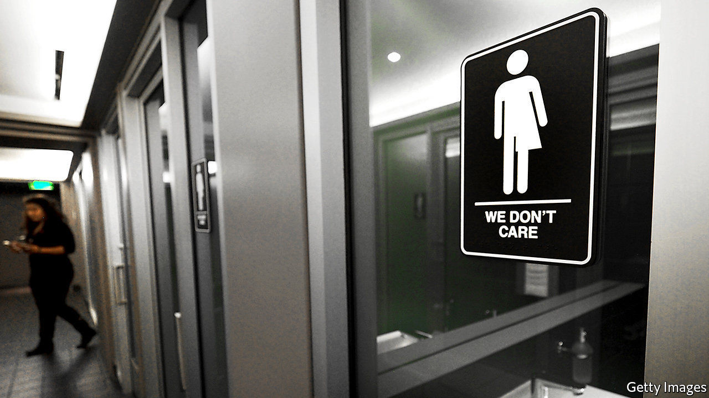

###### Public Toilets

# America is suffering from a lack of public toilets 

##### Apart from the embarrassment of getting caught short, having nowhere to go has serious political consequences 

 

> Dec 10th 2020 


YESTERDAY’S OUTRAGE often slips away quietly. In 2016 a North Carolina law requiring transgender people to use the toilet of their birth sex upset the nation’s stomach. Companies pulled out of ventures in the state, sports leagues called off games and rock stars cancelled concerts. The law was repealed and replaced with one which prevented state and local agencies from regulating who uses which toilet in public buildings, but barred local governments from passing non-discrimination laws blocking private businesses from doing the same. On December 1st that ban expired, meaning that local governments in North Carolina can enact legislation to prevent discrimination against LGBT people.


Thus closes another chapter in the politics of the toilet. The story is a long one. In the 1950s and 60s civil-rights protesters decried “whites only” latrines. An Oakland assemblywoman, Margaret Fong Eu, took a sledgehammer to a toilet wrapped in chains outside the state capitol in 1969 to protest against pay toilets in public buildings, arguing that they placed an undue burden on women because urinals were often free. Activists poured fake urine over the steps of Harvard’s Lowell Hall in 1973 demanding “potty parity”, the equitable distribution of male and female toilets. Grip bars in bathrooms were among the demands of the disability protesters who occupied a federal building in San Francisco for 26 days in 1977.


The feminist fight against pay toilets, and a campaign by a student group, the Committee to End Pay Toilets in America, led to many states banning pay toilets in the 1970s. Vandalism and the cost of upkeep shut down many public ones. Discussions about public toilets assume they are still widely available, according to Taunya Lovell Banks, of the University of Maryland, but “free or low-cost public toilets operated by government have largely disappeared”, and access to toilets in government buildings has been reduced since the Oklahoma City Bombing and 9/11.


So those caught short must duck into a local business and awkwardly ask for relief. “Restrooms are for customers only” signs mean it often takes a penny to spend a penny, creating a barrier to the poor. Where public urination is criminalised, the homeless may have no option but to risk arrest by going in public places. In some states, this can land them on the sex-offender registry. Closures of toilets during covid-19 have only added to the problem.


The lack of accessible toilets has public-health consequences. Holding water for too long can lead to urinary-tract infections, and failure to defecate can lead to constipation and haemorrhoids. This can be difficult for workers who lack easy access to toilets, such as taxi drivers, and disproportionately affects women, who need to go more frequently. No toilets also means no soap. An outbreak of hepatitis A linked to the lack of toilets led to the death of 20 and the hospitalisation of hundreds in San Diego in 2017.


Public toilets are costly to install and maintain, and can attract undesirable behaviour. But spurred on by America’s homelessness crisis, some cities are answering the call. The right to urinate might not be up there with the right to vote, but having it guaranteed would be a relief. ■

