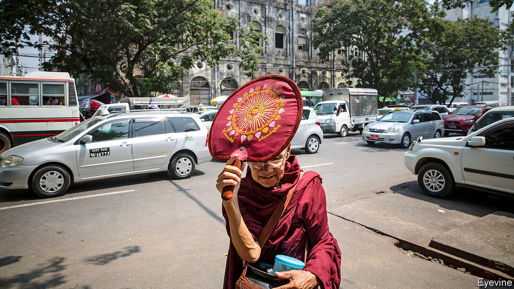

###### In with the old

# Conservationists are rushing to save Myanmar’s colonial buildings 

##### Yangon has more of them than any other city in South-East Asia 

 

> Dec 16th 2020 


SINCE MYANMAR began to reverse decades of isolationism in 2011, it has embraced modernity with a zeal befitting a country deprived of it for so long. Students tap smartphones, food-delivery jockeys zip down the streets and cash machines are everywhere. But while the people of Yangon, the country’s biggest city and commercial capital, are rushing into the present, much of the urban fabric remains firmly in the past. Most buildings in the city centre were built in the colonial era, when Rangoon, as the city was then known, was the biggest commercial hub of the British empire between Singapore and Calcutta (as it was). Indian merchants, Armenian hoteliers, Filipino barbers and Saudi tobacco-dealers set up shop or took up residence in stately Victorian, Edwardian and Art Deco buildings.


Myanmar’s subsequent economic stagnation left Yangon with more colonial buildings than any other city in South-East Asia. But the grand edifices were neglected during the long years of military rule, and most are now streaked with mould. Red signs affixed to rotting doors mark many out as unfit for habitation. They are not beyond repair: a stone’s throw from the shimmering Sule Pagoda in the centre of the city stands the Tourist Burma building, a former office and department store spattered with pediments and pilasters. Once derelict, it was renovated by Burmese and British NGOs and reopened as a community centre in 2019. 


One of the NGOs involved was the Yangon Heritage Trust (YHT), founded by Thant Myint-U in 2012. As the military regime began to reform the economy a decade ago, Mr Thant, a historian, worried that the government would raze Yangon’s architectural inheritance in the name of progress, as has happened in so many other booming Asian cities. So he began to advocate for the preservation of colonial Yangon, arguing that the spruced-up buildings would not only draw tourists but also make Yangon more appealing for its residents.


The municipal government quickly saw the light, perhaps because Mr Thant was friendly with the president. In 2012 it imposed a 50-year moratorium on the demolition of buildings more than 50 years old. Although Mr Thant worries that the city has yet to develop “a coherent vision and plan for what Yangon should be”, it does see the value in conservation, he says. Moreover, it is “in pretty much daily contact” with YHT, which has helped with some 350 conservation projects. Several other organisations also provide expertise or funding for renovations, among them Turquoise Mountain, a British charity which worked on the Tourist Burma building.


But finding wealthy foreigners to help renovate urban landmarks is one thing; fixing up crumbling private residences is quite another. Many of the 15,000 buildings in Yangon that YHT wants preserved are residential, and in serious disrepair. Moe Thida, a shopkeeper and lifelong resident of downtown Yangon, has no qualms about demolition. By all means preserve Bagan, the site of an ancient Burman kingdom and Myanmar’s most famous tourist destination, she says, but in a residential neighbourhood houses should not be “dangerous to live in”. She is far more comfortable living in her newish apartment building than she was in her parents’ 1940s wreck.


But even if new buildings are nice at first, Mr Thant argues, they do not remain so for long. In Myanmar most are poorly constructed and weather badly. Colonial stock tends to be better designed and sturdier, says Nathalie Paarlberg of Turquoise Mountain. The lime-mortar walls of the Tourism Burma building withstand tropical heat and moisture better than concrete, which is more commonly used today. 


Renovations are costly, but financing is available for home-owners. Doh Eain, a charitable enterprise, renovates homes in return for a cut of the revenue generated by renting out the refurbished property, typically for five to ten years. “Owners say to us, ‘We didn’t realise that we owned something that is valuable,’” says Emilie Röell, Doh Eain’s founder. “We help them see that.” Not everyone needs to be told. For every Moe Thida, there is a Sithu Maung. A young MP, he lives in a late 19th-century building that the government has deemed dangerous. But he hopes his house will be preserved. “Old buildings have their unique beauty”, he says, “and that makes the city also unique.” ■

