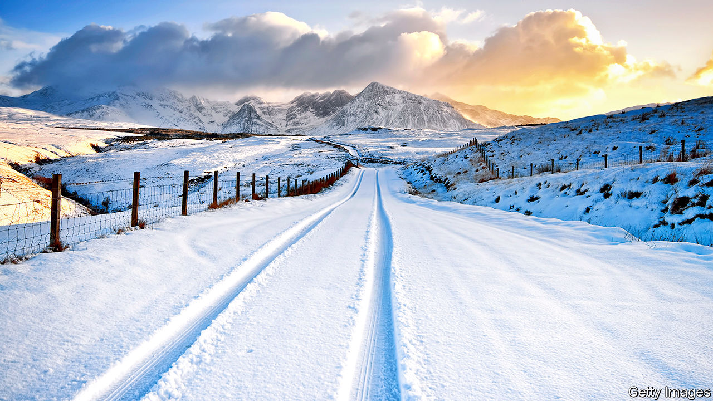

###### The white stuff

# The peculiar allure of snow 

##### Anthony Wood considers both its science and its enticements 

 

> Dec 19th 2020 


Snow. By Anthony Wood. Prometheus Books; 272 pages; $24.95 and £19.99


ANTHONY WOOD remembers sitting in the classroom one snowy morning as his teacher eyed the “saucer-size flakes” swirling outside the window. “Please boys and girls”, she implored, “pray that it stops snowing.” How little she grasped the mind of children, Mr Wood observes: “We were praying, alright—praying that it would snow until June.”


Everyone knows children love snow. Mr Wood’s new book is meant for adults who remain infatuated. It is less a systematic history than a meander through assorted snow-related subjects—beginning with the snowflake itself, which the author describes poetically as “the DNA of God”.


These miniature ice crystals were once neglected by scientists, who saw little practical benefit in studying them. Their disdain, however, was not shared by Wilson Bentley, a farm boy in Vermont who was given a microscope on his 15th birthday in 1880; later he acquired a bellows-camera, which he adapted to take the first-ever photomicrographs of snowflakes, being careful not to breathe on his evanescent subjects before tripping the shutter.


Inspired by Bentley’s ethereal images, in 1936 Nakaya Ukichiro, a Japanese nuclear physicist, became the first person to manufacture snow in the lab. His research on how the crystals form showed that snowflakes develop on the fly, during their sometimes hours-long journey to the ground. The higher the humidity that they encounter on the way, the more intricate their architecture becomes.


Monster snowstorms interest Mr Wood, too, such as the great white hurricane of 1888, during which hundreds of people in the north-eastern United States died of hypothermia. Paralysing winter storms were disasters for cities like New York and Philadelphia, which initiated their own local “arms race against nature”, experimenting with crude ploughs to clear streets and with substances from cinders to grape extract and salt to de-ice them. Snow also spurred the development of subway systems that burrowed beyond the reach of winter weather.


The atmospheric forces that created such blizzards remained unknown until Ooishi Wasaburo, another Japanese scientist, discovered chaotic eddies in the upper atmosphere, now known as the jet stream, in the 1920s. When the frigid jet stream bumps hard against humid air generated by the Gulf Stream in the Atlantic, meteorological mayhem results. Given the complexity of the atmosphere—and the spotty nature of the available data on it—snow forecasting will always remain an inexact science, Mr Wood contends.


His scattershot chapters touch on the impact of erratic snowfall on the water crisis in California and on winter fun everywhere. He offers some frustratingly disjointed speculation about how climate change will alter future snowfalls. The short answer is that there will probably be more snow in places where humidity increases, and less where temperatures become too high to sustain it.


And he reflects, if briefly, on snow’s delights and peculiar allure. Why do people either love it or hate it? Many long for it, Mr Wood proposes, because of the splendid isolation that it enforces. As with the pandemic, a white-out can be overwhelming. It can also direct attention inward, and help people return to themselves. ■

