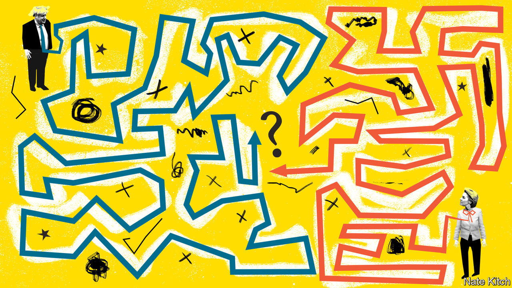

###### Brexit negotiations

# Britain and the EU edge closer to a trade deal 

##### Lying behind the most contentious issues in the Brexit trade talks is a lack of trust 

 

> Dec 19th 2020 


BORIS JOHNSON has often claimed that a story he wrote as a journalist in May 1992 entitled “Delors plan to rule Europe” helped swing Danish voters towards a narrow rejection of the European Union’s Maastricht treaty. That the article, like much that he wrote about the EU, bore little relationship to the truth has never appeared to trouble him much; yet the suspicions around his character which his coverage of Brussels engendered in the European Commission are now coming back to bite him, for they threaten to undermine his chance of doing a last-minute trade deal with the EU.


Britain’s year-long transition out of the EU ends on December 31st, and several deadlines for the two parties to complete a trade deal have already passed. On December 13th Mr Johnson marked another supposedly final deadline by agreeing with Ursula von der Leyen, the Commission’s president, that negotiations should continue for an “extra mile”. This deadline extension raised hopes that the two sides may be shifting from their entrenched positions. Michel Barnier, the EU’s chief negotiator, reportedly detected a narrow path to a deal. Yet Mr Johnson insisted that no-deal was still the most likely outcome, and both sides repeated that the gaps over the two toughest issues remained wide.


The highest-profile one is the EU’s desire to retain access to British fishing waters. This has prompted hysterical chatter about gunboat diplomacy in the channel. Yet the industry’s economic insignificance (it is worth barely 0.1% of GDP) and the fact that both sides sell much of their fish to each other means that fisheries were never likely to be a deal-breaker on their own.


The other big issue, the “level playing field” for competition, could be. Right from the start, the EU made clear that granting Britain tariff- and quota-free access to its single market (a more generous deal than Canada’s) required measures to guarantee a level playing field for social, environmental, labour and state-subsidy standards. Yet Britain insisted on its sovereign right, as a third country, to diverge from EU rules if it chose. The political declaration appended to the withdrawal treaty duly promised “robust commitments to ensure a level playing field”. But soon after its ratification, David Frost, Mr Johnson’s Brexit negotiator, declared in Brussels that the right to diverge from EU rules was the whole point of the Brexit project. In effect, Mr Johnson’s government is saying that the pain and dislocation it will entail is worthwhile in large part because of the future benefits of no longer being bound by the EU’s hidebound and inflexible regulations. On the other side the EU sees unfettered access to its single market as a prize that can safely be awarded only to those willing broadly to comply with its rules.


Despite such differences, it should be possible to find a compromise that acknowledges the trade-off that exists between full sovereignty on one side and unfettered access to the single market on the other. Early on Britain conceded the principle of “non-regression”, meaning a promise not to dilute existing regulatory standards. For its part, the EU backed away from its initial tough negotiating position that Britain must adhere strictly to any future changes to its rules against excessive state subsidies. But differences have persisted over the consequences of future divergence, over a mechanism to settle disputes and over the right of either side to retaliate swiftly if it deems the other to be stealing an unfair competitive advantage.


That’s where the trust problem comes in. An agreement over these issues depends on a degree of trust, which is essential for any comprehensive trade deal that relies not just on legal enforcement mechanisms but also on its signatories showing good faith in the commitments they have made. EU leaders believe they have every reason to distrust Mr Johnson, and not just because of his journalistic past. They think the Brexit referendum was won on the back of a campaign of untruths, and their confidence in him has been further undermined by this autumn’s saga of the internal-markets bill, in which Mr Johnson proposed unilaterally to amend the Northern Irish provisions that were part of the withdrawal treaty. Although he has now dropped this plan, the damage to the relationship lingers. It was little surprise that Mrs von der Leyen was moved recently to declare that “trust is good, but law is better”.


Britain is more vulnerable to the consequences of no-deal than is the EU, so if a deal is to be done it is Mr Johnson who will have to make concessions. But he is under pressure from hardliners in his own party not to concede anything on the principle of full sovereignty. And he knows that, even if a trade agreement is struck, disruption will be inevitable. It would be a lot easier to blame this on the malevolent EU if there were no deal than if he had acquiesced to one at the last minute.


Yet business is piling pressure on the government to avoid no-deal, which would mean not just disruption (see ) and broken supply chains but also tariffs that could bankrupt farmers and carmakers (who would be subject to tariffs of up to 40% and 10% respectively) and send unemployment rocketing. The distance between the two sides remains considerable and the path narrow. But the smart money is on Mr Johnson conceding just enough over retaliation under the level-playing-field provisions to secure a deal.■


For more coverage of matters relating to Brexit, visit our 

