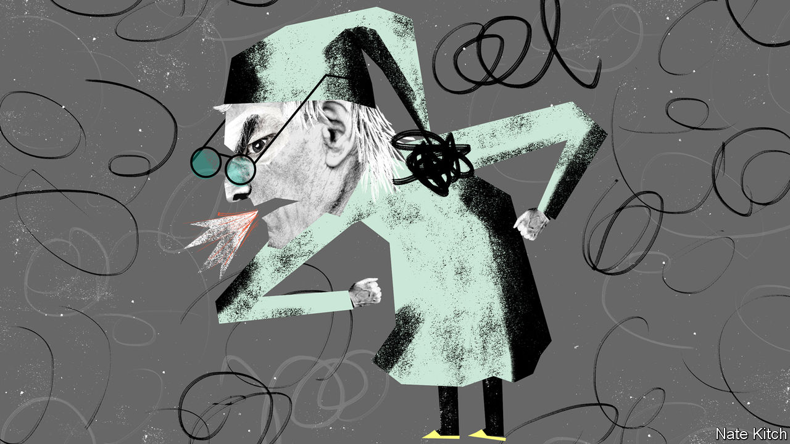

###### Bagehot

# Scrooge’s wisdom in modern Britain 

##### Dickens is not just for Christmas, but for life 

 

> Dec 19th 2020 


A BRITISH CHRISTMAS is inseparable not just from a jolly fat man in a red suit but also from a grumpy, thin “squeezing, wrenching, grasping, scraping, clutching, covetous old sinner”. Charles Dickens’s novella “A Christmas Carol” was an instant hit. Within two months of its publication in 1843 there were 12 adaptations on the London stage. Nearly two centuries on, its anti-hero retains his hold on the popular imagination. The internet offers a dancing Scrooge, a singing Scrooge, a woke Scrooge, a Scrooge with Muppets, and a Scrooge with Freudian “daddy issues”.


By all means enjoy “A Christmas Carol” in this season—better read aloud to the children, in Victorian fashion, than on the screen. William Thackeray, Dickens’s contemporary and rival, described it as a “national benefit and, to every man or woman who reads it, a personal kindness”. But don’t stop there: Dickens is an inexhaustible source of pleasure and instruction all year round. He was, after Shakespeare, Britain’s most creative generator of characters, with more than a thousand listed in Wikipedia. That they are as relevant today as they were in his time is testament not only to his ability to capture essential human traits but also to the parallels between the Victorian age and ours.


So many Dickens characters summon up the peculiar spirit of 2020 that it is hard to choose between them. In “Bleak House”, Old Krook spontaneously combusts, which feels like a fitting end to the year. In “Hard Times”, Mr Gradgrind tries to “weigh and measure any parcel of human nature”, neatly encapsulating modern officialdom’s obsession with targets and algorithms. In “Little Dorrit”, the Barnacle family controls the business of the Circumlocution Office much as well-connected Tories enjoy the benefits of government outsourcing today. But three characters tower over their rivals as embodiments of 2020.


John Podsnap, from “Our Mutual Friend”, is Brexit Britain made flesh. A pompous philistine of the narrowest kind—“particularly well satisfied with most things, and, above all other things, with himself”—he considers other countries “a mistake”, foreigners “unfortunately born”, and the British constitution the best in the world, “bestowed upon us by providence”. In sum, “no other country” is as “favoured as this country”.


Podsnap’s views reverberate around the Tory world. Gavin Williamson, the education secretary, told a radio audience that, among various nations under discussion, Britain is “a much better country than every single one of them”. Its speed in licensing the covid-19 vaccine was, he said, evidence that “we’ve got the very best people in this country and we’ve obviously got the best medical regulators”. It was Podsnappery that led Michael Gove to claim that Britain would “hold all the cards” when it left the European Union, and Podsnappery that persuaded Liam Fox that a trade deal with the EU should be “the easiest in human history”.


If Podsnap personifies nationalistic complacency, Madame Defarge in “A Tale of Two Cities” embodies revolutionary fervour, with her compelling mix of the monstrous and the mundane. She runs a wine shop while plotting against her enemies, and knits while watching one aristocrat after another going to the guillotine. Her victims’ individual humanity means nothing to her; they are mere representatives of a system that must be destroyed. “She saw not him but them,” as Dickens puts it. The knitting is more than an idle distraction from the work of vengeance. She knits the names of her victims in an act of revolutionary piety.


Today’s culture wars reprise these themes. Vengeance-obsessed revolutionaries dehumanise their opponents by hounding them off the stage in public meetings (“deplatforming”) or mobbing them on social media (“cancelling”). They get people sacked from their jobs, often rendering them unemployable, for digressions from an ever-changing orthodoxy. A veteran columnist, Suzanne Moore, left the Guardian newspaper because of a furore about an article she wrote on women and trans rights. An Oxford historian, Selina Todd, was disinvited from giving a lecture and forced to hire security guards because she offended some activists. People stay silent about newly sensitive issues because they fear the sound of today’s equivalent of Madame Defarge’s knitting needles clicking away as the professional guillotine comes down on their necks.


And what about Scrooge himself? It is unfortunate that, in portraying this upstanding citizen, Dickens allowed his most irritating vice, sentimentality, to get the better of him. “A Christmas Carol” degenerates. In its feelgood ending, a reformed Scrooge makes amends to those he has wronged and sucks up to all and sundry. Before his lamentable decline, however, he is one of the wisest figures in literature, blessed with a great insight: that the world is addicted to humbug. This powerful perception is even truer now than it was in the 1840s.


Today almost everything is the opposite of what it pretends to be. Companies claim that they are devoted to advancing gay rights, promoting multiculturalism or uniting the world in a Kumbaya sing-along, when they are in fact singlemindedly maximising profits. Chief executives claim that they are ever-so-humble “team leaders”—in homage to another great Dickens invention, the unctuous Uriah Heep—when they are actually creaming off an unprecedented share of corporate cash. Private schools such as Eton claim that they are in the business of promoting “diversity” and “inclusivity” even as they charge £42,000 a year. Future historians seeking to sum up our era may well call it “the age of humbug”.


Whether the purveyors of this sanctimonious guff actually believe it, or whether it is cynical doublespeak, is immaterial. Either way, spin doctors, sycophants and so-called thought leaders pump noxious quantities of it into the atmosphere. The nation is in desperate need of a modern-day Dickens to clear the air. Until one emerges, Britons should repeat his great creation’s Christmas mantra in every season: “Bah, humbug!” ■

