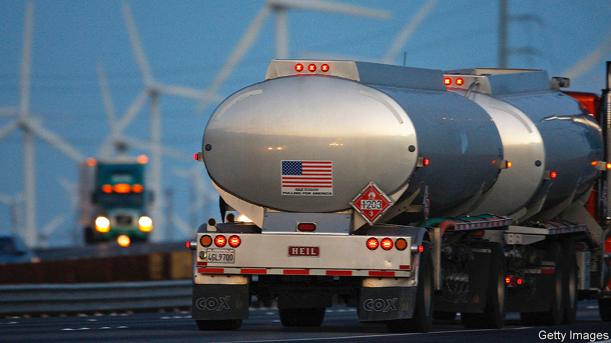
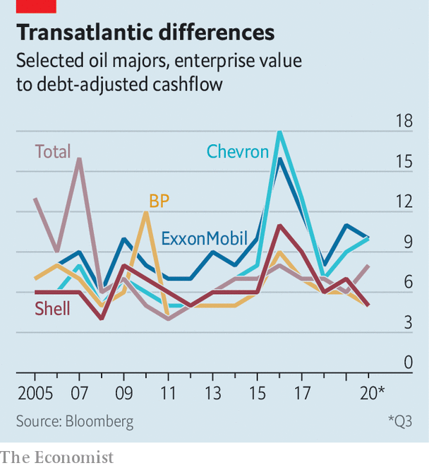

###### Brown v broad

# Big oil’s diverging bets on the future of energy 

##### No strategy is foolproof 

 

> Dec 19th 2020 


EXXONMOBIL, ONCE the world’s most valuable publicly traded oil company, is not easily swayed. As green investors urged it to develop cleaner energy, it planned instead to pump 25% more oil and gas by 2025. As rivals wrote down billions of dollars in assets, it said its own reserves were unaffected. But in the maelstrom of 2020 even mighty Exxon had to budge. On November 30th it announced a write-down of between $17bn and $20bn, and cuts to capital spending of up to a third in 2022-25, implicitly scrapping its production goal. On December 14th it pledged to cut carbon emissions from operations, if only per unit of energy produced, by as much as 20% within five years.


These declarations are a sign that pressure on ExxonMobil is mounting. It lost half its market value between January and November. Investors have gripes beyond covid-19. In May BlackRock, the world’s biggest asset manager, supported a motion to relieve Darren Woods, ExxonMobil’s chief executive, of his duties as chairman. In December D.E. Shaw, a hedge fund, sent the firm a letter demanding capital discipline to protect its dividend. New York’s state pension fund, America’s third-largest, is considering divesting from the riskiest fossil-fuel firms. California State Teachers Retirement System (CalSTRS), the second-largest public pension fund, backs a campaign to replace nearly half of ExxonMobil’s board. “It’s critical to their survival that they change,” says Christopher Ailman, CalSTRS’ chief investment officer.


Still, Mr Woods hangs on to both jobs. And, for all its latest pronouncements, his firm is betting on its old business, even as European rivals seek to reinvent themselves for a climate-friendlier era. This points to a widening transatlantic rift, as the world’s oil giants try to win back investors after a year when demand for crude collapsed and its future became murkier. Each approach is riddled with risk.


Supermajors’ returns have mostly been middling for years. In the decade to 2014 they overspent, furiously chasing production growth. As shale transformed the oil market from one of assumed scarcity to one of obvious abundance, many struggled to adapt. The return on capital employed for the top five Western firms—ExxonMobil, Royal Dutch Shell, Chevron, BP and Total—sank by an average of three-quarters between 2008 and 2019. In 2019 energy was the worst-performing sector in the S&amp;P 500 index of big American firms, as it had been in 2014, 2015 and 2018.


The past 12 months brought new indignities. All told, the big five have lost $350bn in stockmarket value. They talk of slashing jobs, by up to 15%, and capital spending. Shell cut its dividend for the first time since the second world war. BP said it would sell its posh headquarters in London’s Mayfair. In August ExxonMobil was knocked out of the Dow Jones Industrial Average, after nearly a century in the index. Energy firms’ share of the S&amp;P 500 fell below 3%, from a high-water mark of 13% in 2011.


In 2021 a covid-19 vaccine will eventually support demand for petrol and jet fuel—but no one knows how quickly. Leaders of the world’s two biggest oil markets, China and America, have made it clear they want to curb emissions, but not when or by how much. Petrostates such as Russia and the United Arab Emirates are keen to defend their market share and wary of sustained production cuts that may boost American shale by inflating prices. The Organisation of the Petroleum Exporting Countries agreed in December to raise output modestly in January, but declined to promise further price support.


Further out, expectations vary hugely. Legal &amp; General Investment Management, an asset manager, reckons that keeping global warming within 2°C of preindustrial temperatures may halve oil demand in ten years. That is unlikely, but highlights risks to oil firms. While BP thinks demand may already have peaked, ExxonMobil has expected it to climb until at least 2040, supported by rising incomes and population.

 


Given all the uncertainty and underperformance, the question is not why investors would flee big oil. It is why they wouldn’t. The answer, for now, is dividends. Morgan Stanley, a bank, reckons the ability to cover payouts explains some 80% of the variation in firms’ valuations. That is a reason why those in America, which have resisted dividend cuts, are valued more highly relative to cashflow than European ones, which succumbed (see chart).

Well-laid plans


Shareholder returns in the next 5-10 years will be determined by two factors, reckons Michele Della Vigna of Goldman Sachs, another bank: cost-cutting and the management of the old business. Take Chevron, ExxonMobil’s American rival. It has some low-carbon investments but no pretence of becoming a green giant. “We have been pretty clear that we are not going to diversify away or divest from our core business,” Pierre Breber, its finance chief, affirmed in October. Its low-cost oilfields pump out cash. A $5bn takeover of Noble Energy, a shale firm, will help it consolidate holdings in the Permian basin, which sprawls from west Texas to New Mexico. Morgan Stanley expects Chevron to generate $4.7bn of free cashflow in 2020.


This path is not risk-free. If oil demand declines more rapidly than the companies anticipate, they might struggle with a rising cost of capital and stiff competition from the likes of Saudi Aramco, Saudi Arabia’s oil colossus, or its Emirati counterparts. ExxonMobil shows the danger of spending too much on fossil fuels and losing sight of returns. Its free cashflow in 2020 is already negative. The alternative, embraced by European firms, is to increase the efficiency of the legacy business while venturing into new areas.


The challenge for that model, says Muqsit Ashraf of Accenture, a consultancy, is proving they can generate strong returns from their green businesses—and outdo incumbents. Europe’s utilities are already renewables giants. Investors have doubts. When BP vowed in September to ramp up investment in clean energy tenfold and reduce production of oil and gas by at least 40% by 2030, the market saw not a bold leap but a belly-flop. BP’s market capitalisation kept sliding, to a 26-year low in October, until successful vaccine trials pepped up the oil price—and with it energy stocks.


Even in Europe incentives remain muddled. According to CarbonTracker, a watchdog, as of 2019 Shell and BP continued to reward executives for increasing oil and gas output. Shell and Total have set emissions targets that let them increase total production of oil provided their output from renewables and cleaner (though still polluting) natural gas rises faster. Shell sees gas as crucial to efforts to reduce its products’ carbon intensity, and a complement to intermittent power from the wind and sun. In the third quarter its integrated gas business accounted for 22% of cashflow from operations. Total also views the fuel as strategic, with plans to nearly double its sales of liquefied natural gas by 2030. Goldman Sachs calculates that in 2019 low-carbon power accounted for just 3% of BP’s capital spending, 4% of Shell’s and 8% of Total’s.


These figures are rising—even in America, though at a slower clip. Mr Della Vigna predicts that renewable power might account for 43% of capital spending by 2030 for BP and generate 17% of revenues. By 2025 Total plans to increase its installed solar and wind capacity from 5 to 35 gigawatts. On December 15th Norway’s government approved funding for a big project to capture and store carbon that Shell will develop with Total and Equinor, Norway’s state oil company. The prize for gaining scale in green energy is bigger than merely maintaining it in the dirty sort, says one seasoned investor. “But”, he adds, “the risk is also bigger.” ■

