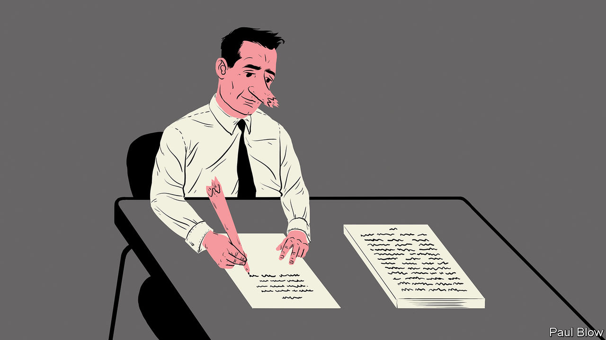

###### Bartleby

# What if CEOs’ memos were clear and honest? 

##### Straight talking 

 

> Dec 19th 2020 


Editor’s note: Some of our covid-19 coverage is free for readers of The Economist Today, our daily . For more stories and our pandemic tracker, see our 


FOLLOWING THE tragic yachting accident that killed my predecessor, Buck Passer, the board decided on a change of direction at Multinational United Subsidiary Holdings (MUSH). As the new chief executive, I would like to live up to my nickname, “Honest Harry” Hunter and tell it to you straight.


We had a dreadful 2020. To be fair, nobody could have reasonably expected the executive team to predict a global pandemic which resulted in widespread economic shutdowns. But by the same token, if managers aren’t at least partly responsible during the bad times, they shouldn’t take full credit for the good times. Most executives are riding on the backs of central bankers who have slashed the cost of capital and on technology pioneers who have made it easier to transact and communicate.


So, given that my fellow executives took bonuses in the boom years, we are slashing their salaries by half. That will give us more money to save jobs in the rest of the group. This may upset people in the C-suite and prompt some of them to leave. We will miss them—and wish them well finding a new job in the current labour market. We also know that many of you had to keep coming into our factories and warehouses during the pandemic while most of the office staff have been able to work from home. So as budgets are tight, we are making sure that the salaries of those essential workers keep pace with inflation this year. For everyone else, there will be a pay freeze.


Another cost-saving measure will be the elimination of my predecessor’s use of management consultants. I have nothing against the profession, which is full of bright people. But if my executive team needs advice on how to do their jobs, that raises the question of why they were hired in the first place.


What about 2021? There is no point in making economic predictions; the best approach is to clear up the mistakes made in the past. First of all, my predecessor bought too many companies without considering whether they would fit well with the rest of the group. Chief executives like acquisitions: to expand their empires and give them news to announce when they are talking to investors. Time the purchase right and you can boost both earnings and the share price.


But all too often these are vanity purchases, like the middle-aged man who buys a Porsche to reclaim his lost youth. When combining companies, it is possible to make savings in areas like procurement but these are often more than offset by the loss of morale that occurs when managers try to mesh organisations with completely different cultures. So we are not going to make any acquisitions in 2021. Instead, we are going to see if some of our subsidiaries can be spun off as stand-alone organisations. They can probably manage their businesses far better than we can.


Speaking of management changes, too much staff time is taken up by meetings. From now on, team leaders will have a 15-minute catch-up every morning; if there is important news, they can message employees directly. Most of the staff should not be expected to attend an internal meeting more than once a month. That should give them more time to meet the important people, our suppliers and customers, or just to get on with their jobs.


Other changes are required to end the gobbledygook that plagued the previous regime. We will no longer have a “human resources” department: our employees are people, not resources. That section has been renamed personnel. Similarly, the whole concept of a “thought leadership” division is both pretentious and Orwellian; clients are not impressed by this waffle and in order to save money I will shut our unit down.


Finally, there is a lot of talk about corporate purpose, and a lot of grandiose language tends to be used by other executives. So let me tell you the purpose of this business under my leadership. It is to create a company that provides products and services that customers are eager to buy. In turn, that depends on ensuring that our employees are both well-rewarded and committed to their tasks. If we can achieve those goals, then the returns to shareholders will look after themselves.


So enjoy your holiday break—you have earned it. I can’t promise you that things will be better in 2021. But if they aren’t, it won’t be for lack of effort from me or the rest of the management team. Thanks for all you have done this year.


Best wishes,


Harry Hunter

