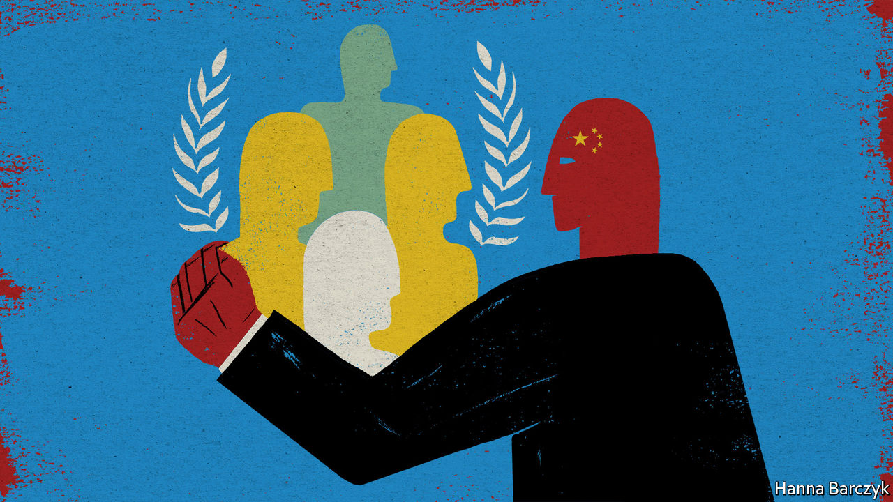

###### Proxy war

# Sensing change in Washington, China is mustering allies at the UN 

##### Joe Biden may show more interest than Donald Trump in the body’s human-rights debates 

 

> Dec 16th 2020 


WHEN AMERICA withdrew from the UN Human Rights Council in 2018, China expressed regret. No one bought it. The forum deals with a topic that is a huge potential embarrassment for China. The absence of the world’s most powerful democracy from its deliberations made it likelier that China’s abuses would escape censure. But with Joe Biden preparing to take over as America’s president, China fears trouble ahead. It is girding its loins in the council.


Evidence of this can be detected in a shadowy feud over who should lead the Geneva-based body. It involves an attempt by China—backed by Russia and Saudi Arabia—to nobble the presumed front-runner for control of the presidency, the tiny Pacific island nation of Fiji, and manoeuvre a country more to its liking into that position. (China and Russia were not on the council in 2020, but will be from January 1st.) Democratic members of the council, hoping that Mr Biden will soon send America to rejoin them, see this as an important battle. They are supporting Fiji.


The question of who leads the council may seem trifling. After all, it is the body’s 47 members, not its president, who set the agenda. And members have been loth to challenge China. The council has yet even to introduce a resolution, much less pass one, on China’s mass internment of Uyghurs in Xinjiang or its stripping of Hong Kong’s freedoms. The Trump administration pulled America out after failing to persuade the UN to impose standards for membership of the council.


But the president does have leeway in the appointment of special rapporteurs, who have much autonomy and can be thorns in the side of authoritarian regimes. In June more than 50 special rapporteurs and experts appointed by the council signed a statement chiding China for violating rights in Xinjiang, Tibet and Hong Kong. China was furious. It accused the signatories of breaching the UN charter.


The council’s next leader will also play a big role in a five-year review of its work by the UN General Assembly. This could result in reforms wanted by America, such as setting criteria for membership.


Crucially, the appointment of a president from a country with an appalling human-rights reputation could cause even greater damage to the council’s already underwhelming image in the West. In 2003 the council’s predecessor body, the UN Commission on Human Rights, elected Libya to its chairmanship. This contributed to its dissolution three years later. Were something similar to happen again, it may become difficult for Mr Biden to endorse America’s return to the council.


That would be a victory for China, which sees the organisation as a beachhead in its campaign to redefine global norms. It has used it to secure resolutions that weaken the language of human rights, emphasising state-led development over the rights of individuals, and respectful “dialogue” between states rather than holding countries to account when they commit abuses. It has also vigorously opposed resolutions against specific states, arguing that countries should not interfere in others’ affairs. China’s voice in the council, whether as an observer or a member, helps it to counter its growing band of critics. In October, 39 UN members signed a statement condemning the horrors in Xinjiang, up from 23 who did so a year earlier. The number who signed a statement defending China fell from more than 50 to 45.


In 2021 the presidency is supposed to be held by a member of the UN’s Asia-Pacific group, to which Fiji and China belong (the regions take turns). Fiji’s representative is widely respected for her stance on human rights. She had been running unopposed. But in November Bahrain formally made a bid for the job. Syria then objected to Fiji’s candidacy. Diplomats say these moves were encouraged by China and its friends. Later a third contender, also acceptable to China, emerged: Uzbekistan. Fiji and its Pacific-island neighbours felt bullied.


But Asia-Pacific countries have failed to agree on a choice. So the council’s full membership may pick a president in January. That could work in Fiji’s favour, and, Western envoys hope, to the betterment of the UN’s human-rights efforts. ■

