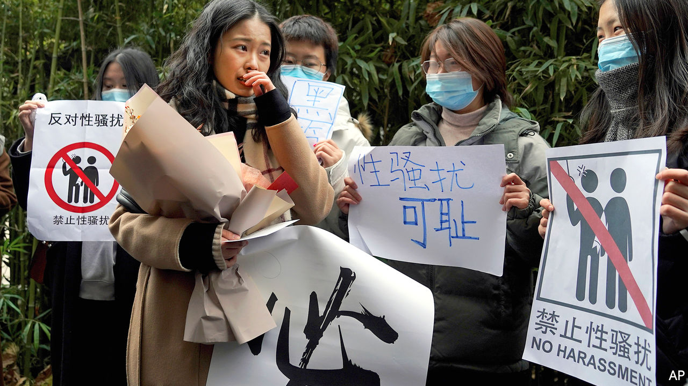

###### Refusing to be silent

# Though muffled, China’s #MeToo movement still has support 

##### Campaigners see signs that sexual harassment is being viewed more seriously 

 

> Dec 16th 2020 


XIANZI WAS an intern at China’s national television network when she visited the dressing room of Zhu Jun, a presenter, in 2014. She wanted to interview him to gather information for a project at her university. Once they were alone, she says, he groped and kissed her. When she later complained to the police, they told her not to sue him because it would reflect badly on the Communist Party. Mr Zhu is a household name. His jobs have included hosting China’s annual new-year gala, the world’s most-watched television show.


Four years later the #MeToo campaign, which had been spreading elsewhere in the world, began to inspire women in China to publicise their experiences of sexual harassment. Xianzi (a pseudonym by which she is always known in China) wrote about her alleged mistreatment and became the movement’s best-known face in the country. Mr Zhu denied the accusation and sued Xianzi for defamation. She counter-sued, demanding an apology and payment of 50,000 yuan ($7,600) in damages.


The government is wary of #MeToo activism, fearful that it might morph into political dissent. It suppressed media coverage of the dispute. On December 2nd, however, the first court hearing into Xianzi’s suit thrust her back into the limelight. It produced no new insights—Mr Zhu failed to appear and the case was adjourned, probably until 2021. But on Weibo, a social-media platform, posts with a hashtag related to the launch of the court proceedings attracted more than 17m views and thousands of comments.


That the #MeToo cause is still alive in China was also evident outside the court in Beijing. Despite the presence of numerous police, and a political climate that discourages all but the brave or foolhardy from demonstrating in public, more than 100 people gathered in support of Xianzi (a few are pictured, with the plaintiff in the foreground). Some waved pictures of rice and rabbits, the Mandarin for which sounds like the English words “me too”. A slogan displayed by one group said: “Together we demand an answer from history.”


Since Xianzi went public with her allegation, she says she has received tens of thousands of messages from women across the country sharing their own experiences of being sexually harassed and assaulted. Many women in China have also made public allegations of sexual assault against powerful men. The accused include academics, media personalities, charity bosses and religious figures (few have dared to point fingers at officials).


In 2018 China’s highest court made it clear for the first time that sexual harassment could be grounds for suing. But it is remarkable that Xianzi’s case has got this far. Women who are victims of sexual assault in China face tremendous obstacles to fighting in court. Financial costs are high. Most lawyers and NGOs in China lack expertise in this rarely explored area of law. Victims who go public are often subjected to online abuse by men who oppose feminism and #MeToo. As Xianzi puts it, they face an “extremely hostile system”.


Many aspects of the system in China are heavily skewed in favour of men, not least in employment and family matters. The World Economic Forum places China above South Korea and Japan in its ranking of countries by gender equality. But since Xi Jinping became China’s leader in 2012 his country has fallen from 69th to 106th on that list, below Malaysia and Sri Lanka. Despite this, more women than ever in China are gaining degrees. In 2009, for the first time, the number of female undergraduates surpassed those who were male. Since then women have retained this majority. Young highly educated women have been at the forefront of China’s #MeToo movement. Their demands for rights as women are “very difficult to suppress”, says Wang Zheng of the University of Michigan.


The Communist Party accuses “hostile foreign forces” of stoking such advocacy. In 2015 police arrested a group of women merely for planning to hand out stickers about sexual harassment on public transport. The “feminist five”, as they became known, were released only after weeks in prison, and after news of their plight had sparked outrage in China and abroad. When visiting the state-backed All-China Women’s Federation in 2018, President Xi said the organisation “absolutely must not become one of those organisations like they have in other countries for feminists or posh women”.


Though stifled by the government, campaigning has made some impact. “Prior to #MeToo, discussions about women and gender in mainstream media and on social media were quite limited,” says Zhang Zhiqi, the host of a podcast popular among feminists in China. “There’s now a lot more awareness about gender equality and I think that’s due to #MeToo.”


A new civil code, which will take effect on January 1st, requires employers to prevent sexual harassment at work. Many feminists call this a success for their efforts to publicise the problem. “We’ve seen some real progress made in recent years in China’s legal sphere to better protect women’s rights, although it is becoming extremely difficult for feminist NGOs to operate,” says Feng Yuan of Equality, a Beijing-based group promoting women’s rights.


Xianzi is not optimistic that she will win her case (and Mr Zhu’s against her is still pending). But she says even defeat would be “victory” because her suit has helped to raise awareness of sexual assault. As night fell outside the court and the temperature dropped below freezing, people following her case online began sending anonymous donations of bubble tea, hamburgers, fried chicken, noodles, hand sanitiser, gloves and taxi money to supporters still gathered there. When couriers arrived with the deliveries, they read out the intended recipient, asking “Who is ‘Xianzi’s friend’?” The crowd replied: “We all are.” ■

