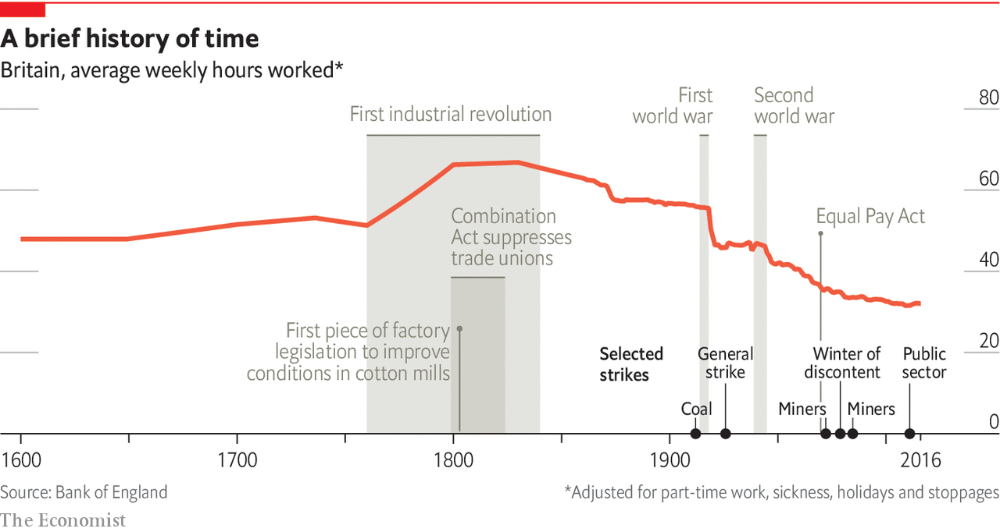

###### Economies past

# Home-working had its advantages, even in the 18th century 

##### And there exist surprising parallels with today 

 

> Dec 19th 2020 


SALLY BROWN, who was born in Vermont in the early 1800s, had a typically varied schedule for a working woman of the time. As her diary shows, one day she is finishing stockings; another she is milking a cow; another she is refining wool. All of her jobs were done from home.


The shift from offices to kitchen tables among white-collar workers in 2020 seems unprecedented, and only possible with Slack and Zoom. But it is nothing new. Indeed, the history of home-working suggests some surprising parallels with today.


The emergence of capitalism in Britain and elsewhere from the 1600s to the mid-19th century did not take place primarily in factories, but in people’s houses. Workers made everything from dresses to shoes to matchboxes in their kitchens or bedrooms. When Adam Smith wrote “The Wealth of Nations” in 1776, it was perfectly common to work from home. Smith famously described the operation of the division of labour in pin-making, but not in a dark, satanic mill. He was describing a “small manufactory” of perhaps ten people—which could well have been in or attached to somebody’s house. 


It is not easy to put exact numbers on how many people have worked from home during different historical periods. Even in Britain, where economic data reach farther back than in any other country, little reliable labour-force data exist until the mid-1800s. Other sources left clues, however. One relates to the meaning of the word “house”. Today it connotes domesticity. But up until the 19th century it had a much broader definition, with the suffix “-house” encompassing economic production, too. In “A Christmas Carol”, Scrooge works in a “counting-house”. Architecture offers other hints. In Britain, many 18th-century houses still have unusually large upstairs windows; cloth-weavers, who worked there, needed as much light as they could get. 


Around 1900 French administrators took the lead in asking people about their place of work, not only what they did. They found that one-third of France’s manufacturing workforce worked from home. Danish surveys around the same time found that a tenth of the total workforce did so full-time at home. These research efforts took place at the high point of the factory-based system of production; in previous decades the share of home-working would have been far higher. According to one estimate for America, using official data, in the early 1800s more than 40% of the total workforce laboured from home. Only by 1914 did the majority of the labour force work in an office or factory.


The emergence of an at-home industrial workforce had two main causes. The growth of global trade and the rise in per-person income from the 1600s onwards raised demand for manufactured goods such as woollens and watches. But the emerging new technology was more suited to small-scale working than large-scale factories (the spinning jenny, the machine which kickstarted the industrial revolution, was not invented until the 1760s). Homes were the obvious place to be. 


What emerged was called the “putting-out system”. Workers would collect raw materials, and sometimes equipment, from a central depot. They would return home and make the goods for a few days, before giving back the finished articles and getting paid. Workers were independent contractors: they were paid by the piece, not by the hour, and they had little if any guarantee of work week to week. 


Accounts of what it was actually like to work from home in the 18th and 19th centuries are few and far between. Many putting-out workers were women, who were less likely to write autobiographies (women’s dominance in the putting-out system also explains why generations of historians have not paid it much attention). Some characteristics nonetheless emerge from the archives. Average working hours were longer (see chart). Unlike today, where most people have one job, people flitted from one task to another, depending on where money could be made, like Sally Brown. 

With fingers weary and worn


Some economic historians suggest that workers were mercilessly exploited under the putting-out system. Those who owned the machines and raw materials enjoyed enormous power over those they employed. With workers dispersed across a county, it was difficult for them to team up against exploitative bosses to demand better pay, let alone form trade unions. Bosses “could easily gang up against the rural spinner who faced a take-it-or-leave-it offer of work,” argue Jane Humphries and Ben Schneider of Oxford University, in a paper from 2019. Some workers truly struggled. Thomas Hood’s poem “The Song of the Shirt” evokes a home-working woman labouring in poverty.


As a result, some historians welcome the development of the factory system from the late 18th century onwards. Workers moved from a place where domestic life intermingled freely with economic production to a place solely dedicated to the pursuit of efficiency. It is hardly surprising that labour productivity was higher in the factory, nor that the factory system gradually outperformed the putting-out system and came to replace it. Crammed together in a factory, workers could more easily club together to ask for higher wages; trade unions started to grow from the 1850s onwards. According to English data, factory workers were paid 10-20% more than home-workers. 

 


But is that the whole story? Some home-workers resisted the shift to the factory system—most notably by joining the Luddites, a society of English textile workers in the 19th century who smashed up machines which they perceived were putting them out of a job. Another explanation is that factory owners, at least in the short term, had little option but to offer higher wages in order to entice workers from their homes. That suggests that home-working had its advantages. 


One such advantage was economic. Home-workers may have been poorly paid relative to factory folk, but they could earn income by other means. Wool-industry home-workers would receive a given quantity of material and were then supposed to return the same weight of material fashioned into stockings. But by exposing the wool to steam, it would weigh more, allowing the workers to keep some of the raw materials. 


That was not the only advantage. Home-workers in rural or semi-rural areas could forage for fuel and food, and so boost their meagre incomes. One observer in 1813 noted sniffily that women in Surrey, a county close to London, were making three shillings a week from cutting down heath to make brooms—“miserable productions and trifling employments”, in his view. But three shillings a week was not far off average female earnings at the time. 


Home-workers also had more control over their time. So long as the work was done to the required standard and on time, they were not told exactly when or how to do it. That was in sharp contrast to the factory, where every aspect of life was planned in advance and workers were closely monitored. And home-workers could decide on the exact mix between work and leisure—in contrast to factory workers, who either worked the 12- or 14-hour days stipulated by the factory owner or none at all. Average working hours in the 18th century were shorter than they became in the 19th. After drinking heavily on Sunday evening, home-workers often took the day off before they went “reluctantly back to work Tuesday, warmed to the task Wednesday, and laboured furiously Thursday and Friday”, as David Landes, an economic historian at Harvard University, put it. People also got more sleep. 


This greater autonomy was especially important for mothers. In a world where men did little by way of family work, women could combine child care with contributing to the family income. It was far from easy. Sometimes women would give their infants “Godfrey’s Cordial”, a mixture of sugar syrup and laudanum, to knock them out for a while. But home-working allowed for the combination of paid work and family work in a way that the factory system did not. As factories spread, female labour-force participation fell. 


In 1920 Max Weber, a German sociologist, argued that the separation of the worker’s place of work from their home had “extraordinarily far-reaching” consequences. The factory was more efficient than the home-based system which had preceded it—but it was also a space in which workers had less control over their lives, and where they had much less fun. Depending on how permanent it proves to be, today’s pandemic-induced shift back to the home could have similarly far-reaching effects. ■


Editor’s note: Some of our covid-19 coverage is free for readers of The Economist Today, our daily . For more stories and our pandemic tracker, see our 

