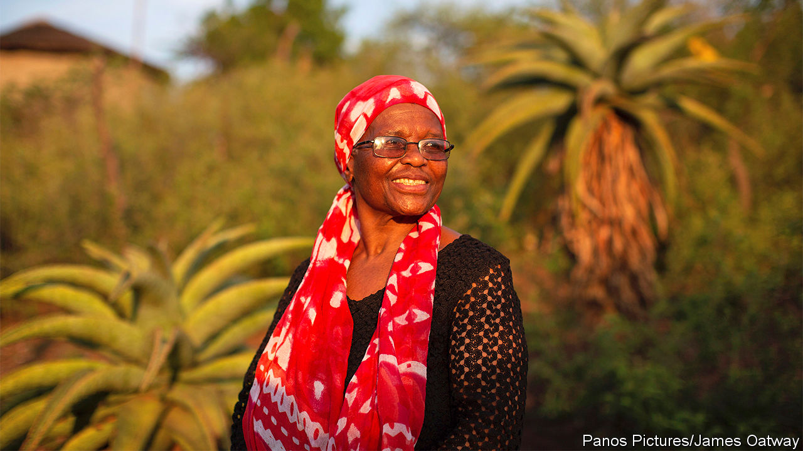
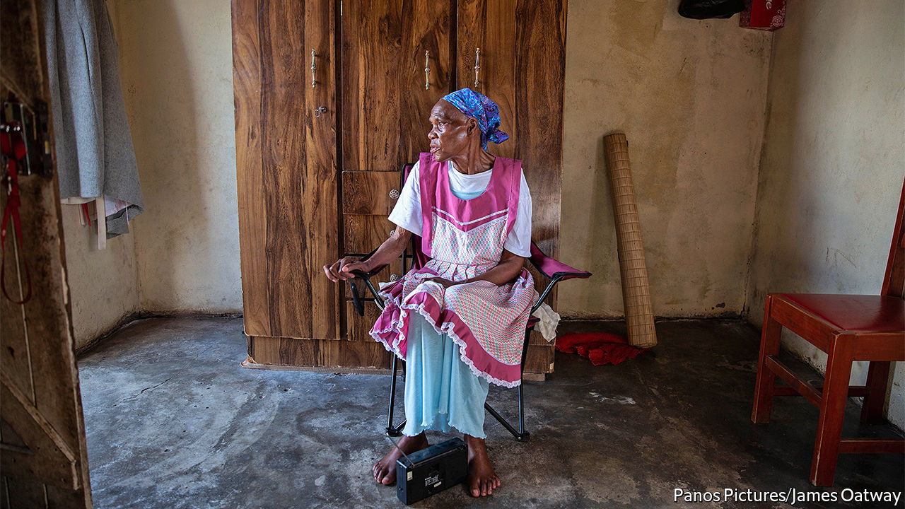
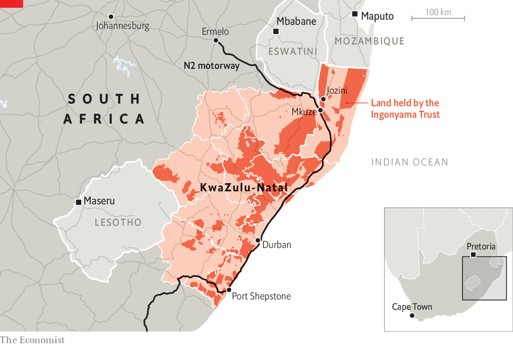

###### Travels in Zululand

# How an apartheid-era deal still afflicts the land of the Zulus 

##### Sizani Ngubane hopes to bring an end to one of the most controversial institutions in South Africa 

 

> Dec 19th 2020 


AT THE AGE of 74, with barely enough feet and inches to peer over the steering wheel, Sizani Ngubane makes for an unlikely racer. Yet one afternoon in October she hurtles up the N2 motorway, which hugs the east coast of South Africa before heading inland through the heart of the former Zulu kingdom, swerving past trucks and errant cattle.


Not for the first time, Ms Ngubane (pictured above) is on a mission. She and your frazzled correspondent arrive in the town of Jozini as the sun wanes behind hills dotted with fever trees. We are just in time to meet applicants in a court case co-led by Ms Ngubane’s organisation, the Rural Women’s Movement, that could strike a blow against one of the most controversial institutions in South Africa.


The Ingonyama Trust Act was enacted three days before the election in April 1994 that brought apartheid to a close and Nelson Mandela to power. The act made a special case out of the ancestral lands of the Zulus, the largest ethnic group in South Africa. The law vested trusteeship of the land in the Zulu king, currently Goodwill Zwelithini, and established the Ingonyama Trust to manage it. According to the act the trust must serve the people who live on the land—a population of more than 5m across an area about the size of Belgium. But its critics allege that the trust acts more like a punitive feudal landlord.


In the case brought by Ms Ngubane, which was heard on December 9th and 10th, lawyers for the applicants argued that the trust acted unconstitutionally by undermining residents’ property rights. During apartheid many black South Africans in rural areas were given “permission to occupy” (PTO) certificates: an informal right less secure than a freehold but that a post-apartheid law said could not be withdrawn without the holder’s consent. By allegedly cancelling PTOs and requiring residents to sign leases instead, the trust acted unlawfully, according to the applicants’ lawyers. They want the leases of their clients—and anyone else affected—cancelled and PTOs reinstated.


The trust denies that it coerced anyone into signing leases, which it claims are entirely lawful. It says they are in fact more secure than PTOs. But if the judges disagree with the trust when they return a verdict early in 2021, the decision could change the lives of some of South Africa’s poorest people for the better. It could also provoke a fierce backlash among powerful figures who benefit from the status quo.

All around me a voice was sounding


The unlikely epicentre for this potential upheaval is a sparsely populated settlement a few minutes’ drive from the centre of Jozini. Getting out of her car, Ms Ngubane shuffles into a one-room concrete house to greet the applicants in the case. At the threshold a young boy spritzes hand-sanitiser into our hands; behind him an older girl squeezes past with a few coins to buy electricity credit to illuminate the room.


Ms Ngubane introduces the grandmother of the children, Hluphekile Mabuyakhulu, who is recovering from a stroke (pictured below). She sits upright in bed, framed by a red velour headboard. She explains that her family moved to the plot in the mid-1980s, when the induna, or headman, allocated them the land. Though water is scarce she has done her best to make do, planting fruit and vegetables in her yard.

 


According to her affidavit, in 2011 she was summoned to a meeting at which residents were told they must sign leases for their properties “or we would not be recognised by the king as being part of this community”. The contracts were in English, which she cannot speak fluently. Only afterwards did she discover that she had to pay 1,500 rand ($95) per month, more than her monthly pension, to live in a house she considers hers. “I feel like I was scammed by the trust,” she says.


By her bedside is Linah Nkosi, a neighbour and fellow applicant. She has lived in the same house in Jozini since 1974. In 2012 she was informed that she, too, would have to sign a 40-year lease and pay rent. And the lease had to be in her then-boyfriend’s name, as he was deemed the head of the household. (The trust insists that no applicant was duped.) “In Zulu culture women are kept down, down, down,” she says.


That reality has gnawed at Ms Ngubane since she was a girl. In 1956, when she was nine years old, her mother was evicted by her uncle. The incident led her to dedicate her life to campaigning for the rights of poor rural Zulus, especially women. It is a job that has not got easier since apartheid ended. “It’s very sad,” she says. “We’ve really dropped the ball as a country.”

 


In the early 1800s the Zulus were one of many cattle-herding clans in the south-east corner of the continent. But under King Shaka they conquered surrounding groups to form a political entity unusual in its size, sophistication and military prowess. By the time of his death at the hands of his half-brothers in 1828, the Zulu kingdom encompassed around 30,000 square km (12,000 square miles). During the rest of the 19th century fratricidal rivalries weakened the empire from within. The expansion of the Boers and the British destroyed it from without. After many battles the kingdom became part of Natal, one of the two British colonies that in 1910 joined with two Boer-run territories to form the basis of modern South Africa.


As in other parts of Africa the British colonists introduced a system of indirect rule, in this case by the Zulu king and his inkozi, or chiefs. This provided the foundation for later policies, including the apartheid-era “homelands”: ten ethnically homogenous pseudostates used to confine, disenfranchise and impoverish black South Africans. When KwaZulu, the semi-autonomous homeland of the Zulus, was formally hewn from Natal in 1977, it drew on deep institutional roots.


In KwaZulu the government was effectively a one-party state, sponsored by the apartheid regime and led by the Inkatha Freedom Party (IFP). Under Prince Mangosuthu Buthelezi, the uncle of the current king, the IFP promoted a conservative Zulu nationalism with the monarch as a figurehead. As apartheid neared its end in 1993, Human Rights Watch, an NGO, described KwaZulu’s political arrangements as “dictatorial”.


Growing up, Ms Ngubane felt under a double layer of oppression—that of apartheid and the petty chiefly dictatorships. Over coffee she recalls how she was shaped by these experiences. “I was a bad child,” she says, with a grin. During the day she would eavesdrop on elders’ conversations about village iniquities. At night she would clutch a radio to her ear and hear about the atrocities of white rule.


When she was 16 she took a job as an assistant in a dress-material shop, where she had to hide behind the changing-room curtain until any Zulu-speakers entered. Other aspects of apartheid were less farcical. The proximate cause of her father’s suicide, in 1959, was the breakdown of his marriage. But Ms Ngubane cannot shake the idea that apartheid contributed indirectly. Like millions of black South Africans, in order to find work, he spent most of his time far from his family.

This land was made for you and me


“I knew something had to be done to stop the oppression of black people,” says Ms Ngubane. She grew up in a family affiliated with the African National Congress (ANC), ultimately becoming a recruiter for the party. Since the ANC was banned until 1990, she had to operate stealthily. IFP saw the ANC as an existential threat to its hold on KwaZulu—a state of affairs that suited the apartheid regime, which gave it money and guns. In the decade after 1985 the ANC and IFP fought a low-intensity civil war. Approximately 15,000 people, including one of Ms Ngubane’s brothers, were killed. The spectre of further violence, and Mr Buthelezi’s threat to boycott the 1994 elections, led to the last-minute deal that created the Ingonyama Trust. (The national government became the custodian of the land of the nine other homelands.)


Since 1994, to stay on the right side of rural power-brokers, ANC-led governments have strengthened “traditional leadership” in the former homelands, including KwaZulu. Several laws have underscored the old systems of indirect rule, for example by creating “Traditional Councils”. These institutions, which have roles in allocating land and delivering services, have 60% of their members appointed by chiefs.


The arrangement seems out of place in democratic South Africa. But defenders of such laws argue that they are necessary to protect traditional cultures, such as that of the Zulus. To explain what that means, in an area a couple of hours from Jozini, Bonga Mdletshe, the local chief, has convened a meeting of his headmen.


Those with an imperial imagination may imagine Mr Mdletshe in traditional garb—cow-hide shield, spear, headband, and so on. But that is like expecting the leader of Edinburgh City Council to go to work everyday in a kilt. Instead Mr Mdletshe has the get-up of a beleaguered provincial civil servant. He is dressed in jeans, a checked shirt—and drives a lurid orange pick-up truck. After one of his induna says a prayer, he begins to describe his role.


“I’m an extension of his majesty, the king”, he says. “I administer the tribe on his behalf and protect the Zulu culture.” That means keeping track of the family trees that make up the canopy of surrounding clans and telling stories of battles won and lost. Military culture is central to much of Zulu culture. Indlamu, a warrior dance, is performed at weddings. Rural boys still learn the art of stick-fighting. Also important is “protecting the structure of our community”—the hierarchy that descends from the king to chiefs and headmen to the paterfamilias. For critics this is a smokescreen behind which women are kept second-class citizens, for instance in polygamous marriages.


No data exist on how many Zulu men still marry multiple wives but it remains relatively common among chiefs. One induna argues that it is part of Zulu history: when many men died in battle it ensured women could still get hitched. Another says it reflects a belief that when a woman has her period she is “dirty” and should refrain from work. Rather than chip in, goes the logic, a man needs another wife to fill the gap.


Travelling around the former homeland it is possible to find women who are happy with such arrangements. Boneni Maphanga was one of six wives of a local businessman; he gave each spouse her own grocery shop. There was no jealousy, she says, or at least no more than in a monogamous marriage. “We were like sisters.” Mr Mdletshe insists that women are “greatly respected” in Zulu culture. “Anyone who visits my mother”, he adds, “will crawl across the floor to greet her.” Ms Ngubane scoffs at such talk. She points to enduring customs such as virginity testing, and the annual reed-dance where thousands of bare-breasted girls parade before the king in a celebration of chastity.


It would strengthen the case of traditional authorities if they were any good at administration. But the former homelands are among the worst-run parts of the country, with devastating effects for the one-third of South Africans who live there. South Africa’s ten poorest municipalities are all in former homelands. Analysis published in January 2020 estimated that 62% of working-age adults in ex-homelands have no job, versus 38% in the rest of the country.


A paper published in 2019 by Dieter von Fintel and Johan Fourie explains why destitution has persisted. The economists from Stellenbosch University argue that after the arrival of Europeans, Africans “were at the mercy of two extractive regimes”. The first were systems of white rule culminating in apartheid. The second were the homelands and their antecedents. Both had narrow elites—one white, the other black. The pillars of apartheid have crumbled but those of the homelands remain.


In KwaZulu, the trust must administer the land “for the benefit, material welfare and social well-being of the members of the tribes and communities” of the former homeland. Yet in village after village there is little sign of it doing that. Conditions are often squalid. This is not all the fault of traditional institutions—municipalities are failing, too—but they share the blame.


An hour from Jozini, near the town of Mkuze, B.F. Mgwenya, another chief, shelters inside his makeshift headquarters: a dilapidated farm long abandoned by a white landowner. He says that the main challenge is getting clean water. Droughts have worsened, but neither the local municipality nor the trust has offered any help, he says. “We used to rely on God,” he says, recalling when nearby mountain streams gushed. “Now we rely on government.”


Mr Malinga argues that chiefs can be suspicious of development. An induna in his village, he says, once claimed that the arrival of electricity would damage cows’ eyes. “If you want to resist change it makes sense to pretend it undermines your culture.” These views are not universal, however. On more than one occasion your correspondent was asked by chiefs or headmen whether he could help bring investment to the area. They wanted the best for their kith and kin, but they did not know how to go about it. “We’re the poorest of the poor,” says one of Mr Mdletshe’s aides.


It would help if the trust lived up to its mandate. Under statute 10% of its proceeds can go to its board for administration, but the rest should benefit local communities. Yet the public does not know what it owns, spends and earns. It is unclear whether any of this money goes to the king himself. He receives a taxpayer-funded stipend of more than 70m rand. Occasionally there are glimpses of the trust’s finances via reports of the trust board to parliament. In 2018 the board reported that, in the latter half of the previous year, 96% of the board’s budget went on “administration”, versus 0.16% for “rural development”.


Yet, according to the court papers lodged by the applicants’s lawyers, the trust’s rental income soared from 8m rand in 2008-09 to 107m rand in 2016-17. Meanwhile the national government is investigating the trust board amid allegations of bribing chiefs and Mr Ngwenya for alleged self-enrichment, and is conducting an audit of the board’s finances. (Mr Ngwenya says the probe “lacks the necessary legal foundation”.)


Reformists worry, though, that the ANC will not take on the trust. In a major review of the nation’s ills published in 2017, Kgalema Motlanthe, a former president, concluded that the trust should be repealed or amended. He later called chiefs “village tin-pot dictators”. But when he became president a year later, Cyril Ramaphosa swiftly visited the king to assure him that KwaZulu would not be touched.


Because of Ms Ngubane’s campaigning work, she has faced multiple death threats and has had to go into hiding on several occasions. “Don’t be surprised if you come back in more than one piece,” she recalls an induna telling her when she visited his community in the 2000s. Not that such words scare her. Since she was a child she had a preternatural sense that taking on injustice is her life’s mission. She has been told countless times that her work undermines the culture of the Zulus. To that argument, she has a bracing reply: “What they’re doing is not our culture—it’s greed.” ■

