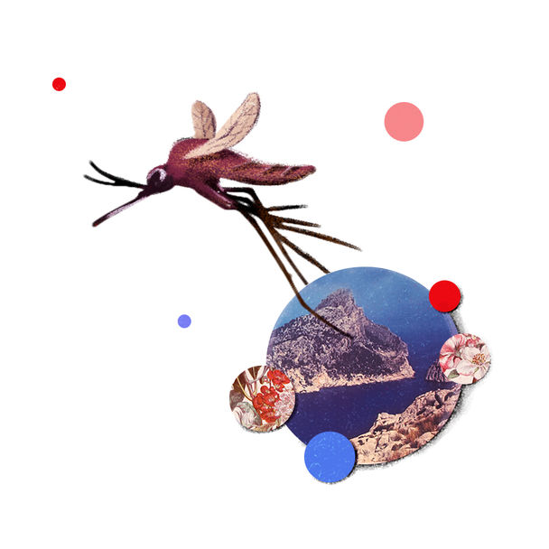
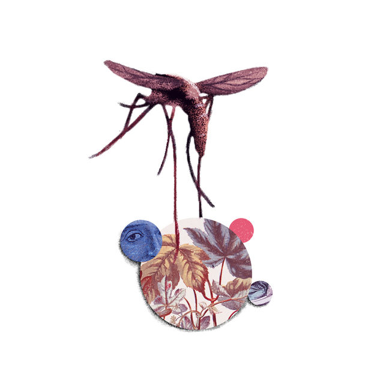
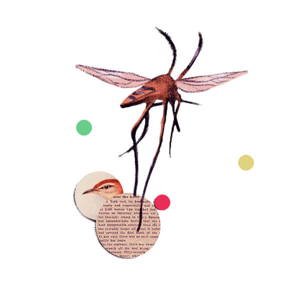

###### Bloodsuckers

# How malaria has shaped humanity 

##### The parasite shows how history is partly created by non-human forces 

 

> Dec 19th 2020 


TWO CENTURIES ago, at Anna Pépin’s house on Gorée Island, off the coast of Senegal, ladies with fashionably pointed hats sashayed up the stairs to sip fine wines in an airy salon with a stupendous view of the Atlantic. Under the staircase was a windowless punishment cell for recalcitrant slaves. Young, fertile women were separated from the other slaves, for reasons as obvious as they are odious.


Pépin, an Afro-French trafficker, must have heard her captives rattling their shackles as she shared canapés with her guests. If she looked down from her balcony, she must have seen them being pushed through a narrow opening—the “door of no return”—and loaded onto ships bound for the Americas.


History is partly shaped by human choices. An evil institution cannot exist without evildoers. But history is also shaped by non-human forces. Why did plantation owners in the New World specifically want African slaves, rather than, say, Native Americans? One reason is malaria, notes Eloi Coly, the curator of the museum of slavery that Pépin’s house has become.


Malaria was introduced to the Americas as part of the 16th-century Columbian exchange. Parasites crossed the ocean in the blood of slaves and settlers. Local Anopheles mosquitoes spread them. Soon, natives and Europeans were dying in huge numbers. But Africans tended to survive, even when forced to work in mosquito-infested sugar plantations, because of an inherited resistance to malaria. Planters in the West Indies would pay three times more for an African than for an indentured European, notes Sonia Shah in “The Fever”. The mosquito, which also transmits other diseases, “has played a greater role in shaping our story than any other animal,” writes Timothy Winegard in “The Mosquito”.

 


Stand again on Gorée Island and look in a different direction. Look past the children cooling in the surf, and the masked shopkeepers waiting for the covid-deterred tourists to come back. Stare towards the African mainland. Today the view is of skyscrapers and container ships—Dakar, Senegal’s capital, is a thriving port. Back in 1805, when Mungo Park, a Scottish explorer, looked across this same narrow strait, he would have seen a small settlement and a vast expanse of forest. He spent a few weeks on Gorée before setting off for the continent’s interior. It is not known whether he met Pépin, who would have been around 18 at the time.


He trekked inland, with tons of baggage loaded on donkeys, and then down the Niger River. Of the 40-odd men on his expedition, all but one died, many of fever. Park himself avoided death by malaria by leaping out of a canoe to escape a hail of arrows and drowning in rapids in what is now Nigeria.


Park’s troubles illustrate a crucial fact about colonial history. Africa was—and remains—the continent where malaria is most virulent. European settlers tended to die of it. So they settled in large numbers only in the least malarial places: South Africa, with its cold winter nights that kill mosquitoes; the highlands of Kenya and Zimbabwe; and the Mediterranean coast of North Africa. In parts of west Africa, by contrast, settlers had a 50-50 chance of dying each year.


In the highly malarial parts of Africa, imperialists ruled indirectly, through local potentates, who were persuaded with threats and bribes to throw in their lot with the French or British empires. In non-malarial zones Europeans settled en masse, creating institutions, many of which last to this day, along with racial injustices that caused centuries of grievances. Malaria helps explain why modern South Africa, with 4.7m white citizens, is so different from Nigeria, which has only a handful of white expatriates. South Africa gave the world a universally recognisable euphemism for white supremacy. A quarter-century after apartheid ended, its scars still linger. Nigerian politics has different faultlines: Muslim versus Christian, and so on.


Malaria has shaped other continents, too. It was once widespread in Europe. One reason why ancient Rome was so hard to conquer was that it was protected by the Pontine marshes. The Romans thought the fevers people caught there were caused by noxious fumes. Hence the name mal’aria, from “bad air”.


In 218BC Hannibal crossed the Alps. He routed the Romans at the Trebia, Trasimene and Cannae, but full conquest eluded him because of malaria, which cost the Carthaginian general his right eye, his wife, his son and much of his army. Later invasions by assorted barbarians met a similar doom. “The world still lives among the mosquito-haunted shadows of the Roman Empire,” notes Mr Winegard—many countries speak a Latin-based language, while several political systems have adapted Roman law. Indeed “the Roman Empire first martyred and then eased the passage of Christianity across Europe”.


Malaria shielded Rome for centuries. But nature does not stand still. Some time around the fifth century, a new breed of mosquito brought a new and deadlier parasite to Rome: Plasmodium falciparum, the malarial strain that blights Africa today. Unlike P. vivax, to which the Romans were inured, P. falciparum could have demoralised and destabilised an empire that was already under barbarian siege, speculates Ms Shah. The theory that it contributed to Rome’s decline and fall, as well as its rise, is unproven, but plausible.

Parasites and people


A millennium later, malaria buffeted and then empowered another Roman institution: the Catholic church. Five popes probably died of it between 1492 and 1623. After it killed Pope Gregory XV, cardinals came to Rome to choose his successor. Six died of malaria. Eventually, the ailing head of one faction, Cardinal Scipione Borghese, was so desperate to go home that he backed a compromise candidate just to end the conclave. Thus, a mosquito helped elect Pope Urban VIII, as Fiammetta Rocco, an Economist writer, describes in “The Miraculous Fever-Tree”.


Then, around 1630, Jesuit missionaries found a cure. In the mountains of Peru, they noticed that natives ingested the powdered bark of the cinchona tree when they were shivering with cold. They wondered if it might also treat malarial shivers. It did. The active ingredient was quinine. Soon it was known that the Jesuits could treat malaria—for a price. They jealously guarded their secret, and parlayed it into influence by healing kings and lords whose favour they desired.

 


In Britain, malaria may have ended a Protestant dictatorship. Oliver Cromwell, the man who had King Charles I beheaded, ruled as Lord Protector from 1653-1658. His puritanical decrees sucked the joy out of life as surely as mosquitoes suck blood. He closed theatres and banned make-up and Christmas decorations. He hated Catholics, which may be why he angrily refused an offer of “Jesuits’ powder” to cure his malaria. The fever killed him, and merriment was re-legalised.


For centuries, there was never enough cinchona bark. Gradually, however, technology improved. In 1820 French chemists discovered how to extract quinine from cinchona. In 1865 a native braved execution to slip Bolivian cinchona seeds to a British trader. The Dutch government got hold of them and, after 30 years, figured out how to grow them in what is now Indonesia. By 1900 the Dutch were producing more than 5,000 tonnes of quinine a year.


When the second world war broke out, the Germans invaded the Netherlands and seized the Dutch stockpiles of quinine. The Japanese invaded Indonesia and seized the cinchona plantations. Suddenly the Axis powers had 95% of the world’s quinine. This gave them a huge military advantage. Japanese forces occupied China, their much larger, mosquito-ridden neighbour, armed with malaria pills. (They also hired old ladies to tuck in sleeping soldiers’ bednets.) Allied troops had far less protection. Malaria afflicted 60% of them in South-East Asia. On the island of Bataan, 85% of American and Filipino troops were malaria-struck when they surrendered to the Japanese. It was the largest surrender to a foreign power in American history. The New York Times noted that the battle was lost not for want of bullets, “but because the quinine tablets gave out”.


Wartime demand spurred a race to invent a good substitute. German scientists got there first, with chloroquine. After the war, chloroquine was so widely used that parasites grew resistant to it. The race between science and evolution continues today.


The post-war period saw a big push to exterminate the Anopheles mosquito itself, by spraying its habitat with DDT, an insecticide so effective that America’s Centres for Disease Control called it “the atomic bomb of the insect world”. Prolific spraying caused mosquito populations to crash. By 1951 malaria had vanished from the United States. By 1964 the number of cases in India had fallen from 75m a year to fewer than 100,000.


But DDT also had side-effects. It persisted in the environment, and moved up the food chain. In America DDT was found in milk, after cows munched insecticide-laced grass. And mosquitoes evolved that could resist the chemical. In 1962 Rachel Carson published “Silent Spring”, a book on the dangers of using pesticides without understanding their long-term effects. It led to a ban on DDT and helped kick-start the modern environmental movement.

 


It is intriguing to speculate how the world might look, had malaria never existed. If Hannibal had conquered Rome, would Europeans today speak languages derived from Punic instead of Latin? If the transatlantic slave trade had not been so lucrative, would America have avoided civil war and segregation? If the quinine-fortified Japanese army had not battered the Chinese nationalists so badly, would Mao Zedong’s communists have been able to seize power?


Such questions are unanswerable. But humankind may one day discover what a world without malaria is like. The annual global death toll has roughly halved since 2000, to around 400,000. Rich countries have eliminated the disease: by draining swamps, spraying insecticide and sleeping in air-conditioned rooms.


In Africa malaria still kills multitudes of children and sickens adults, making it harder for them to work and obstructing the continent’s path to prosperity. Yet it can be beaten. Senegal has all but conquered the disease in some regions and hopes to wipe it out nationwide by 2030. Despite the disruption of covid-19, that is feasible, thanks to a combination of bednets, pills and genomic technology.


An short drive from Dakar, in a district called Madina Fall, wide puddles fester on an unpaved road. Malaria has ravaged the area for thousands of years, but now it has all but gone. “My older brother died of it. My younger sister died of it. I nearly died of it, too,” says Bada Niang, a local worthy. “Now, we have bednets, and it practically doesn’t exist here any more.” ■

