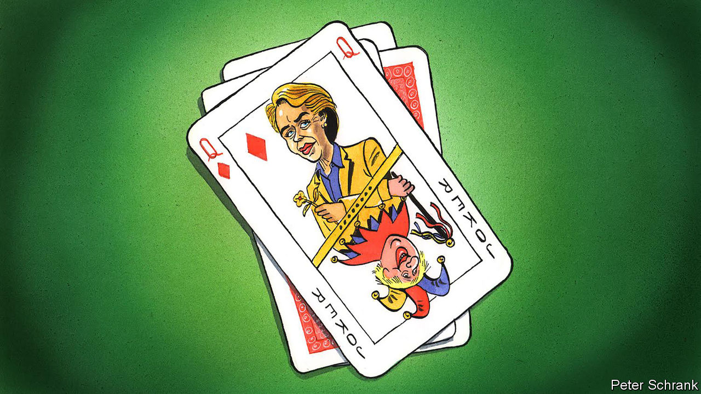

###### Charlemagne

# Sprechen Sie Tory? 

##### British Tories and European Christian Democrats don’t get each other. Hence the Brexit shambles 

 

> Dec 19th 2020 


SQUINT A LITTLE, and Boris Johnson and Ursula von der Leyen look rather alike. The British prime minister and the president of the European Commission were both children of Eurocrats, partly brought up in Brussels. Both were written off in domestic politics, only to be catapulted into the biggest jobs of their lives. Both have enough children to fill a minibus.


Open your eyes fully, however, and the differences become clear. Whereas Mrs von der Leyen speaks like a technocrat, Mr Johnson speaks like a bloke telling jokes in a pub. Mrs von der Leyen is overseeing a much-needed deepening of the EU. Under Mr Johnson, Britain has left it. Mrs von der Leyen boasts of her seven children; Mr Johnson refuses to specify how many he has (Wikipedia opts for “at least six”).


The political traditions from which the two leaders come are also less alike than you might expect. Mr Johnson is a Conservative; Mrs von der Leyen is a Christian Democrat. These two philosophies have much in common. They both sit on the centre-right as natural parties of government, with reputations for fiscal prudence. Their ideologies are mushy. Each abhors big thinkers: there is no equivalent of Marx or Mill when it comes to either outlook. Pragmatism is a point of pride for both; generally, keeping lefties out of power—or at least constrained—is enough of a purpose. But it is their differences that help explain why Britain never sat easily in the bloc.


After all, the EU was a Christian Democratic invention. Its founding fathers—Alcide De Gasperi of Italy, Konrad Adenauer of Germany and Robert Schuman of France—were Christian Democrats, as were all six foreign ministers who signed its original treaties. Although no longer hegemonic, Christian Democratic parties still shape the EU. They bestride the European People’s Party (EPP), the group of centre-right parties, which carves up EU jobs, such as Mrs von der Leyen’s. Angela Merkel, Germany’s Christian Democratic Union chancellor, is comfortably the continent’s most powerful politician. Christian Democrats built Europe and they still, more or less, run it. To understand Europe, one must understand Christian Democracy. Unfortunately for Britain, the Conservatives—their closest cousins across the Channel—never have.


Sometimes these misunderstandings resulted in strategic errors. When running for the leadership of the Conservatives, David Cameron pledged to leave the EPP, the club of the mainstream right. For Mr Cameron, it was a simple decision. In general, the Christian Democrats who dominated the group wanted more European integration, whereas Mr Cameron and his Conservative party did not. The promise was meat for a hungry Eurosceptic membership, and helped Mr Cameron win. But to Mrs Merkel, it was an insult. The EPP was a broad church with a deeper purpose that has dominated Christian Democracy: to stop the socialists from running the show. Quitting was akin to desertion.


Individualism is either a goal or a horror, depending on whether one is speaking to a Conservative or a Christian Democrat. Margaret Thatcher once declared that there is “no such thing as society”, only individuals and families. Jacques Maritain, one of the few examples of a Christian Democratic political philosopher, put rampant individualism in the same breath as totalitarianism, suggesting that any form of Christian Democracy must be “opposed to both the idea of the totalitarian state and the sovereignty of the individual”. In this view, there is nothing but society.


Even the preferred methods of politics clash. The slow, grinding consensus-building at the heart of Christian Democracy and consequently the EU itself is anathema to Conservatives, for whom the term sounds too much like capitulation. Compared with the winner-takes-all system of British politics, the workings of the EU seem slow and unresponsive to Conservative eyes and just the ticket to Christian Democrat ones. “Merkel is not a Thatcher,” wrote Mr Cameron in his autobiography, not altogether approvingly. “Her favourite expression is ‘step by step’.” By contrast, the Conservative Party has a distinctly unconservative lust for creative destruction. Brexit, a project that radically overhauls the state, is simply the latest example. Rather than proceeding step by step, Brexit means taking a giant leap. Even the presentation of these policies is different. Dullness is a virtue for Christian Democrats. For Conservatives, it is a sin. Angela Merkel is far from the first Christian Democrat leader to revel in anti-charisma. For Mr Johnson, charisma is his main weapon.

Not just the narcissism of small differences


The fundamental split in the Christian Democratic and Conservative worldview has dogged Brexit negotiations. Ultimately, Brexit is a project that puts the nation-state back at the centre of politics. By contrast, Christian Democracy is built on deep suspicion of it. Partly this stems from an analysis of the 20th century as either the triumph of the nation-state (the British view) or its tragedy (that of much of western Europe). In the Christian Democratic worldview, power should be diffuse, spread across local, regional and national levels. Adding another layer in the form of Europe was no big deal. “It was easy to give up parts of what was feared in the first place,” writes Jan-Werner Mueller of Princeton University. To Conservatives, however, a supranational layer of authority was an affront.


Arguments over “level playing-field” arrangements in Brexit may seem like technical wrangling. In fact, they are a clash between the Conservative and Christian Democratic view of the state. Conservatives want power yanked back; Christian Democrats struggle to understand why. Mutual incomprehension is a poor basis for a relationship. Yet that was the foundation of Britain’s relationship with the EU: the dominant ideology of both polities was unable to understand the other side. Like Mr Johnson and Mrs von der Leyen, Britain and its EU peers may look similar, but they are far from the same. Unless you squint. ■


For more coverage of matters relating to Brexit, visit our 

