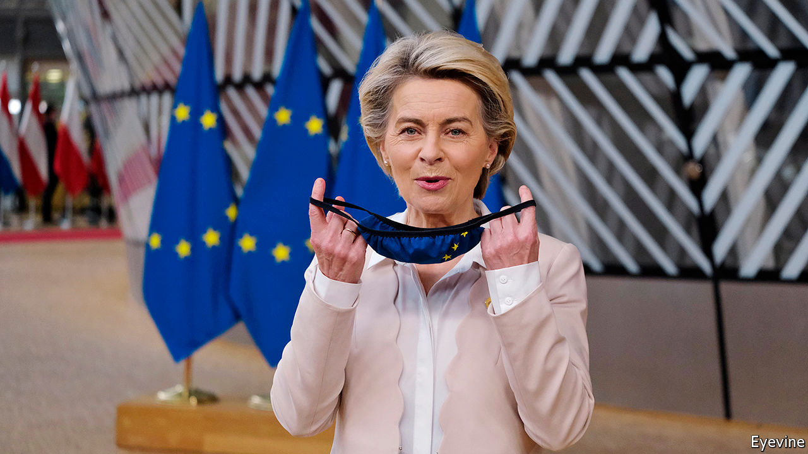

###### Locked and loaded

# The EU gives itself a weapon to battle against rule-of-law violations 

##### But will it use it? 

 

> Dec 19th 2020 


ANGELA MERKEL, Germany’s chancellor, has long applied two operating principles in Europe: to keep the club united, and to postpone resolving crises until the last possible moment. Both were evident in an eleventh-hour deal struck on December 10th in Brussels between the European Union’s 27 heads of government. With a fiscal crunch looming, the leaders at last gave the green light to a seven-year EU budget worth €1.1trn ($1.3trn) as well as a one-off €750bn fund, financed by joint borrowing, to speed recovery from the covid-19 crisis.


The sticking-point was a problem that has long bedevilled the EU: how to tackle corruption and other skulduggery in countries that benefit from EU transfers. At a gruelling four-day summit in July, the leaders backed the principle of attaching rule-of-law conditions to the vast EU spending they had approved. But Hungary and Poland, unhappy with the proposed legal regulations that followed in November, threatened to veto both the budget and the recovery fund. (Both countries are already facing EU rule-of-law probes over their government’s interference with national judiciaries and other matters.)


Faced with drastic cuts that would have applied had the EU begun 2021 without a budget in place, the European Commission considered the radical step of rebuilding the recovery fund outside EU structures, excluding the hold-outs. That threat, say diplomats, concentrated minds in Warsaw and Budapest. In a late flurry of diplomacy the German government, which holds the rotating presidency of the EU Council, issued a supplementary proposal. Viktor Orban, Hungary’s prime minister, flew to Poland to persuade his allies to sign on. Satisfied with Mrs Merkel’s work, the rest of the EU assented in Brussels.


Under the German proposal, the text of the rule-of-law regulation remains untouched. That enables the European Commission to block disbursements of EU money, including from the recovery fund, if it suspects recipient governments of corruption or other foul play, so long as a qualified majority of EU governments agree. That could pose a threat to the system of authoritarian cronyism Mr Orban has assembled on the back of EU funds amounting to around 3% of annual GDP. Poland’s system is cleaner but, notes Piotr Buras at the European Council on Foreign Relations in Warsaw, the government’s court-stacking could fall foul of the regulation’s references to judicial independence, if the commission thinks it interferes with the management of EU funds.


The biggest concession to the hold-outs was an agreement that no action would be taken under the mechanism until the EU’s top court had ruled on its legality, a process that could take up to two years (but which is likely to be accelerated). Critics, such as George Soros, a financier and Mr Orban’s bête noire, see this and smaller concessions as a sell-out to the rogues. Indeed, after the summit Mr Orban declared victory with typical bombast. But both his and Poland’s government had vowed to see off the regulation. Their failure even to water it down shows where the burden of compromise really fell. Poland’s hardline justice minister, who said the deal violated the constitution, even threatened to bring down his government, before backing down.


The EU’s previous attempts to tackle rule-of-law abuses in member states have signally failed. This one may have teeth—should the EU decide to apply them. That remains an open question: wary of shunting governments into an outer orbit, Mrs Merkel has long proved tolerant of Hungarian and, more recently, Polish excesses. (Mr Orban’s Fidesz party sits with the chancellor’s in the European Parliament.) That instinct remains intact, as her scramble to conclude Germany’s presidency with a budget deal demonstrates. Yet other politicians who have built careers opposing chicanery and money-grubbing are cautiously optimistic. Slovakia’s president, Zuzana Caputova, who was elected on a rule-of-law ticket in 2019, says she is glad that the principle is now legally binding at EU level. But, she adds, “having the mechanism to defend the rule of law in place is just the first step. Now we need to make it work.” ■

