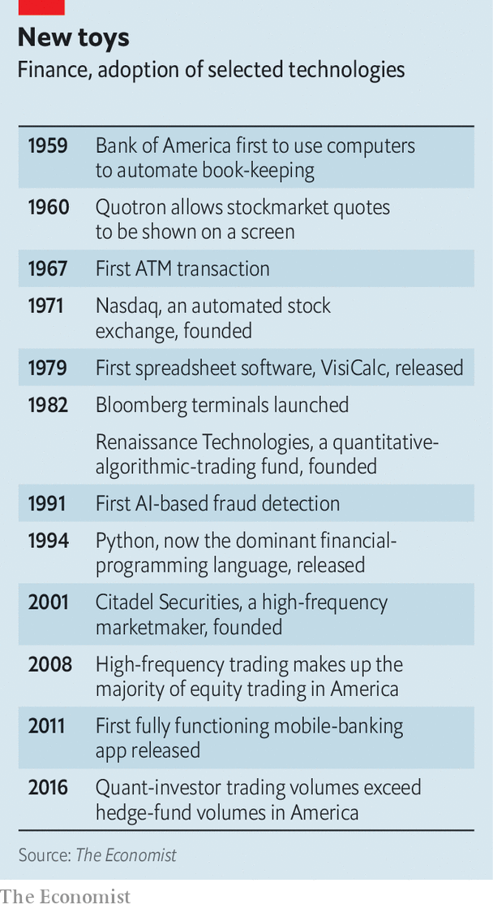

###### Quantum for quants

# Wall Street’s latest shiny new thing: quantum computing 

##### A fundamentally new kind of computing will shake up finance—the question is when 

 

> Dec 19th 2020 


THE FINANCE industry has had a long and profitable relationship with computing. It was an early adopter of everything from mainframe computers to artificial intelligence (see timeline). For most of the past decade more trades have been done at high frequency by complex algorithms than by humans. Now big banks have their eyes on quantum computing, another cutting-edge technology.


This is the idea, developed by physicists in the 1980s, that the counter-intuitive properties of quantum mechanics might allow for the construction of computers that could perform mathematical feats that no non-quantum machine would ever be capable of. The promise is now starting to be realised. Computing giants like Google and IBM, as well as a flock of smaller competitors, are building and refining quantum hardware.

 


Quantum computers will not beat their classical counterparts at everything. But much of the maths at which they will excel is of interest to bankers. At a conference on December 10th William Zeng, head of quantum research at Goldman Sachs told the audience that quantum computing could have a “revolutionary” impact on the bank, and on finance more broadly.


Many financial calculations boil down to optimisation problems, a known strength of quantum computers, says Marco Pistoia, the head of a research unit at JPMorgan Chase, who spent many years at IBM before that. Quantum quants hope their machines will boost profits by speeding up asset pricing, digging up better-performing portfolios and making machine-learning algorithms more accurate. A study by BBVA, a Spanish bank, concluded in July that quantum computers could boost credit-scoring, spot arbitrage opportunities and accelerate so-called “Monte Carlo” simulations, which are commonly used in finance to try to model the likely behaviour of markets.


Finance is not the only industry looking for a way to profit from even the small, unstable quantum computers that mark the current state of the art; sectors from aerospace to pharmaceuticals are also hunting for a “quantum advantage”. But there are reasons to think finance may be among the first to find it. Mike Biercuk of Q-CTRL, a startup that makes control software for quantum computers, points out that a new financial algorithm can be deployed faster than a new industrial process. The size of financial markets means that even a small advance would be worth a lot of money.


Banks are also buying in expertise. Firms including BBVA, Citigroup, JPMorgan and Standard Chartered have set up research teams and signed deals with computing firms. The Boston Consulting Group reckons that, as of June, banks and insurers in America and Europe had hired more than 115 experts—a big number for what remains, even in academia, a small specialism. “We have more physics and maths PhDs than some big universities,” jokes Alexei Kondratyev, head of data analytics at Standard Chartered.


Startups are exploring possibilities too. Enrique Lizaso of Multiverse Computing reckons his firm’s quantum-enhanced algorithms can spot fraud more effectively, and around a hundred times faster, than existing ones. The firm has also experimented with portfolio optimisation, in which analysts seek well-performing investment strategies. Multiverse re-ran decisions made by real traders at a bank. The job was to choose, over the course of a year, the most profitable mix from a group of 50 assets, subject to restrictions, such as how often trades could be made.


The result was a problem with around 10 possible solutions, a number that far outstrips the number of atoms in the visible universe. In reality, the bank’s traders, assisted by models running on classical computers, managed an annual return of 19%. Depending on the amount of volatility investors were prepared to put up with, Multiverse’s algorithm generated returns of 20-80%—though it stops short of claiming a definitive quantum advantage.


Not all potential uses are so glamorous. Monte Carlo simulations are often used in regulatory stress tests. Christopher Savoie of Zapata, a quantum-computing firm based in Boston, recalls one bank executive telling him: “Don’t bring me trading algorithms, bring me a solution to CCAR [an American stress-test regulation]. That stuff eats up half my computing budget.”


All this is promising. But quantum financiers acknowledge that, for now, hardware is a limitation. “We’re not yet able to perform these calculations at a scale where a quantum machine offers a real-world advantage over a classical one,” says Mr Biercuk. One rough way to measure a quantum computer’s capability is its number of “qubits”, the analogue of classical computing’s 1-or-0 bits. For many problems a quantum computer with thousands of stable qubits is provably far faster than any non-quantum machine that could ever be built—it just does not exist yet.


For now, the field must make do with small, unstable devices, which can perform calculations for only tiny fractions of a second before their delicate quantum states break down. John Preskill of the California Institute of Technology has dubbed these “NISQs”—“Noisy, Intermediate-Scale Quantum computers”.


Bankers are working on ways to conduct computations on such machines. Mr Zeng of Goldman pointed out that the computational resources needed to run quantum algorithms have fallen as programmers have tweaked their methods. Mr Pistoia points to papers his team has written exploring ways to scale useful financial calculations into even small machines.


And at some point those programmers will meet hardware-makers coming the other way. In 2019 Google was the first to demonstrate “quantum supremacy”, using a 53-qubit NISQ machine to perform in minutes a calculation that would have taken the world’s fastest supercomputer more than 10,000 years. IBM, which has invested heavily in quantum computing, reckons it can build a 1,000-qubit machine by 2023. Both it and Google have talked of a million qubits by the end of the decade.


When might the financial revolution come? Mr Savoie thinks simple algorithms could be in use within 18 months, with credit-scoring a plausible early application. Mr Kondratyev says three to five years is more realistic. But the crucial point, says one observer, is that no one wants to be late to the party. One common worry is that whoever makes a breakthrough first may choose to reap the rewards in obscurity, rather than broadcast the fact to the world. After all, says Mr Biercuk, “that is how high-frequency trading got started”. ■

