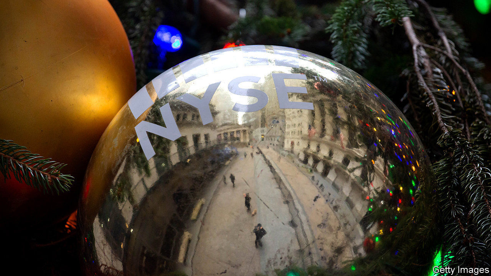
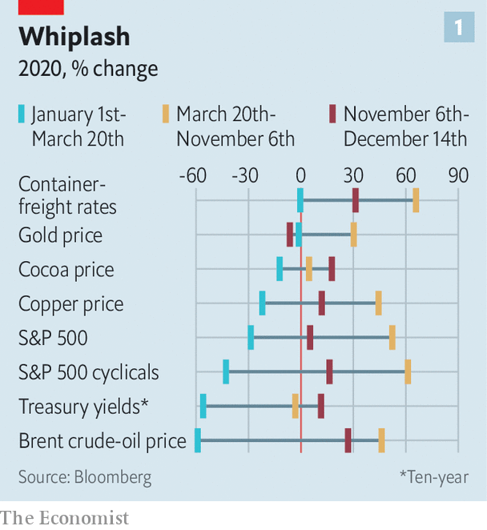
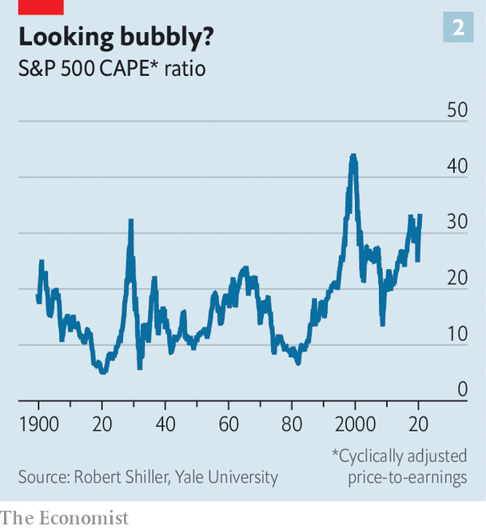
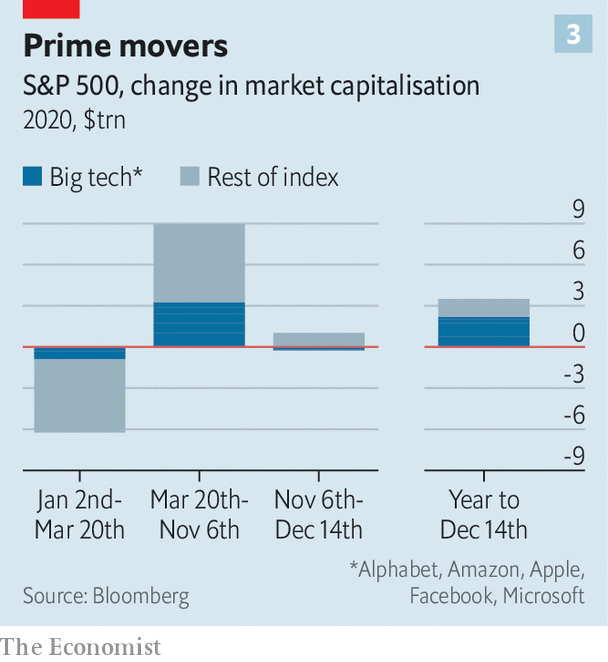
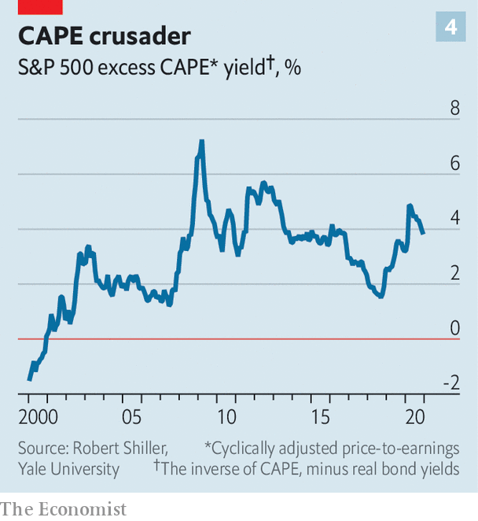

###### Froth or fundamentals?

# What explains investors’ enthusiasm for risky assets? 

##### There may be more sense to recent market movements than you think 

 

> Dec 19th 2020 


EVEN IN NORMAL times, there is an element of drama to the markets. The oil price may spike or slump in reaction to a geopolitical wobble; bond yields may leap on strong jobs figures; and shareholders may pump up a stock that posted juicy profits. But 2020 has taken the drama to an extreme (see chart 1). The equity sell-off in March was unmatched in its swiftness: stocks lost 30% of their value in a month. The yield on ten-year American Treasuries, the most important asset worldwide, fell by half between January and the middle of March and then by half again in a matter of days, before seizing up and yo-yoing. The contract for imminently delivered barrels of American oil briefly went negative. Over the course of 2020 timber prices have fallen by half, doubled, doubled again, fallen by half once more and then doubled again (overall, they have doubled in 2020).

 


If the plunge in asset prices as countries locked down terrified asset managers, then recovery—led by a fierce bull run in tech stocks over the summer—has made them uneasy. It was only in 2018 that a public company, Apple, first became valued at more than $1trn. In net terms, Apple has gained around $750bn this year. Tesla has increased in value six-fold this year, to a market capitalisation of more than $600bn, roughly the value of the other seven most valuable carmakers combined. Even stocks that were unloved earlier in the year, like banks and energy firms, have rebounded of late, on a spate of good news—of an effective vaccine, and of a clear victory for Joe Biden in America’s presidential elections. When Airbnb, a platform for booking overnight stays, made its public debut on December 10th—after a year in which no-one travelled anywhere—its share price leapt by 115%. On December 5th the value of global stocks crossed $100trn for the first time.


Financial markets reflect investors’ expectations about the future, so it is hardly surprising that they have been chaotic in 2020. But the rebound in risky assets amid fragile economic conditions prompts the question of whether bubbles have formed in certain assets, or whether the ups and downs can be explained by rapidly shifting fundamental factors.

 


Consider first the evidence for froth. Even as profits slumped, investors in the S&amp;P 500 benchmark index earned 14.3% (excluding dividends) in 2020, about double the typical return over the past 20 years. The gains have pumped up measures of stockmarket valuations. One such gauge is the cyclically adjusted price-to-earnings, or “CAPE”, ratio, devised by Robert Shiller, a Nobel-prizewinning economist. This looks at inflation-adjusted share prices relative to the ten-year average of real earnings per share. When the ratio is high, stocks are dear relative to their earnings; such periods have tended to be followed by low long-term returns over the next decade. In America the ratio in November 2020 was 33, above its level earlier in the year (see chart 2). Only twice before has the ratio exceeded 30 in America—the late 1920s and the early 2000s.

 


The big tech firms, many of which were expected to benefit from online shopping and home working, have played a disproportionate role in the broader rally. They account for two-thirds of the total returns from holding the S&amp;P 500. At the start of 2020 Alphabet, Amazon, Apple, Facebook and Microsoft were worth around $5trn and made up 17.5% of the value of the index. The five are now worth more than $7trn, and their share has risen to 22% (see chart 3).


Further evidence of froth is the frenzy around initial public offerings of firms such as Airbnb, and the revival in retail trading. Retail investors accounted for 20% of the volume of stock trading, up from 15% in 2019. In the summer small buyers of call options—bets on share prices rising—were responsible for more derivatives trading than large ones.


The circumstantial evidence, then, looks bubbly. But a cross-examination of fundamental factors suggests that these can explain more than a fair chunk of what is going on. Cyclical assets, like stocks in restaurants and retailers, or commodities, like oil and copper, tend to rally as business booms. These fell quickly in value in February and March, followed by slow recoveries as the world reopened. But since November 9th, when news of an effective vaccine broke, they have surged. Container-freight rates have risen to all-time highs. Brent crude oil rose above $50 a barrel for the first time since March on December 10th.

 


Moreover, the move in interest rates appears to more than explain the behaviour of equity prices. In isolation, the CAPE ratio ignores the impact of discount rates on valuations. The value of a firm, to its shareholders, is the present value of a firm’s future profits—meaning share prices tend to be sensitive to changing expectations of future profits, but also to the discount rate used to calculate what those are worth today. There have been enormous changes in this discount rate for stocks. At the start of 2020 the yield on ten-year Treasuries was 1.8%; by the middle of March it was just 0.6%. Since the vaccine news yields have risen once more, to around 0.9%.

 


To account for this, on November 30th Mr Shiller published “excess CAPE yield” numbers, which are calculated by inverting the CAPE ratio, to give an indication of the expected yield on equities, and then subtracting the expected real returns on holding bonds (which, thanks to low rates and modest inflation expectations over the next decade, are negative). The excess yield is actually higher than in January (see chart 4). In other words, equities have become more attractive than bonds—at first probably because bond yields fell so quickly, boosting the relative appeal of stocks, but lately thanks to the vaccine heralding the return of growth and profits, which a modest increase in yields has not offset.


The rise in share prices alone, then, is probably not enough to indicate a mania, given the shift in discount rates. This may not dispel investors’ disquiet, in part because they are surrounded by evidence of exuberance. But the case for a bubble, at the very least, is not open and shut. ■


Editor’s note: Some of our covid-19 coverage is free for readers of The Economist Today, our daily . For more stories and our pandemic tracker, see our 

