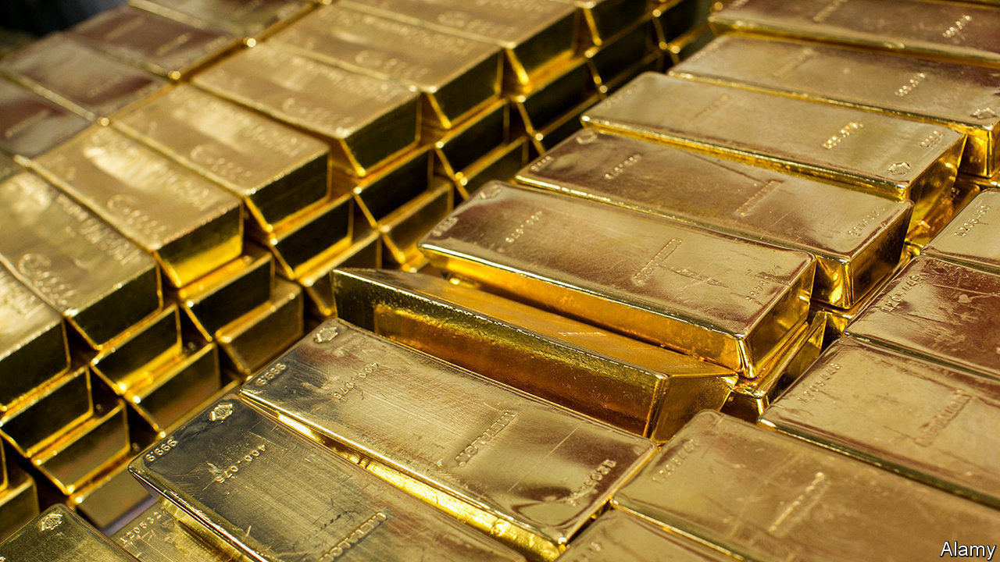

###### Panned

# What if a gold standard were still in use? 

##### A new study shows that the economy would be worse off 

 

> Dec 19th 2020 


IN THE AFTERMATH of the first world war, the gold standard inspired nearly religious fervour from central bankers. European officials dutifully re-pegged their war-battered currencies to gold at great cost to their citizens. A hundred years on, it has lost its lustre. Judy Shelton’s past support for it may have derailed her nomination to the Federal Reserve’s board. A recent paper* shows why the gold standard’s tarnished reputation is well deserved.


The authors calculate the impact of a gold standard, had it been in place in 2000-20. This would have required the Fed to set interest rates to maintain a fixed dollar price of gold, rather than to target inflation. The central bank’s policy rate would have become a function of gold supply—the amount of metal mined—and gold demand from investors and households.


Fluctuating gold demand can make monetary policy procyclical. In bad times, people stop spending and increase their demand for gold, so central banks must raise interest rates to make other assets more attractive and stabilise gold’s price. In good times the reverse happens, and central banks have to cut rates. The pace at which gold is mined also introduces some randomness to monetary policy. Whenever gold floods the market, interest rates must fall to keep its price stable. Gold shortages force interest rates up. It is up to fate whether or not the movements in rates are good for the economy.


It requires Herculean assumptions for the gold standard to beat today’s regime, judged by gauges such as the volatility of inflation. The authors show this would be so if the only forces buffeting the economy were fluctuations in productivity growth and in labour supply, and if the supply of gold tracked productivity.


Those assumptions, though, do not survive contact with reality. To adhere to the gold standard the Fed would have had to maintain high interest rates even during the global financial crisis, and beyond, with disastrous effects; in the first quarter of 2020, output would have been 10% lower than otherwise. Gold’s lost shine is no bad thing.


