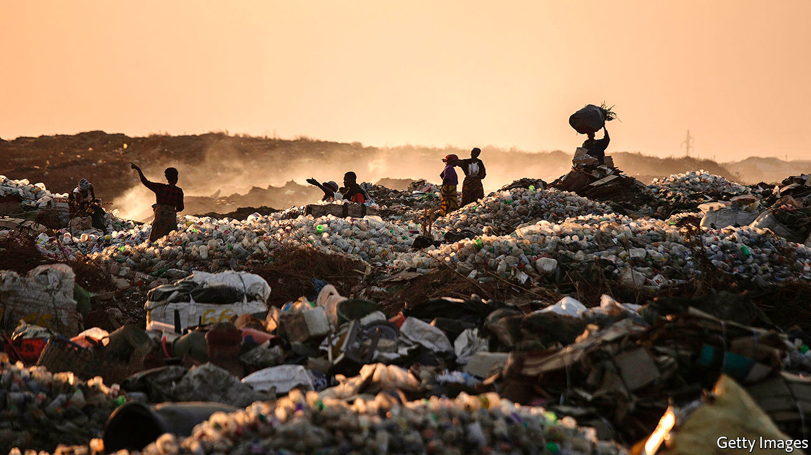
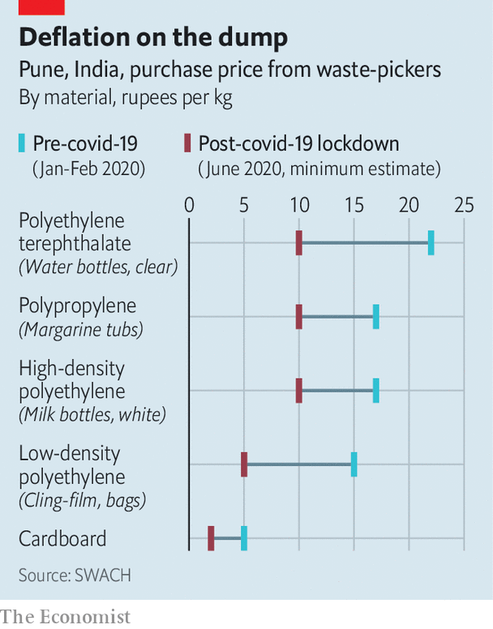
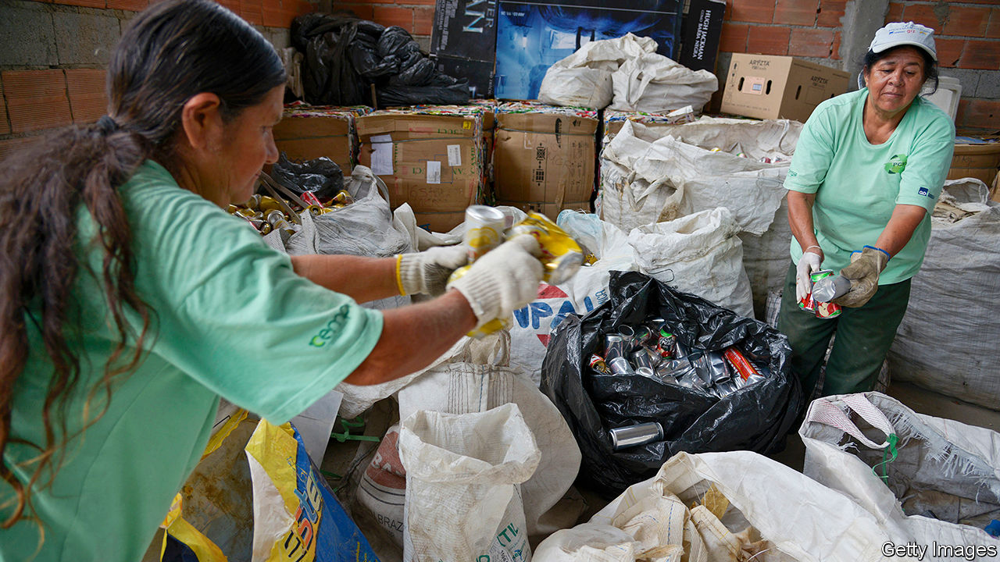

###### Down in the dumps

# Covid-19 has posed new challenges to the world’s waste-pickers 

##### Those who are better organised have prospered more 

 

> Dec 19th 2020 


Editor’s note: Some of our covid-19 coverage is free for readers of The Economist Today, our daily . For more stories and our pandemic tracker, see our 


AT THE NORTHERN edge of Lusaka, in Zambia, the 24-hectare Chunga landfill smoulders in the midday sun, its sour smoke scalding the nose and throat. Wesley Kambizi works nine-hour days on the dump with just a beanie and mismatched sneakers for protection: one slip-on, one lace-up, both caked in mud. Local authorities intermittently threaten to bar waste-pickers like him from the site. Worsening poverty in the city means both that more people are scavenging at the landfill and that fewer valuable scraps make it there in the first place.


The world’s cities produce over 2bn tonnes of solid waste every year. Even before the covid-19 pandemic local governments in poor countries struggled to keep their streets clean, clearing less than half the rubbish in urban areas and around a quarter in the countryside. Informal workers, who make up around 80% of the 19m-24m workers in the waste industry, have helped plug that gap. They both haul rubbish and scour municipal dumps and public spaces for things which can be re-used or sold, normally through middlemen, to recycling companies. In India waste-pickers divert over 40m tonnes of refuse away from landfills and into recycling every year, a task that would cost municipalities 15-20% of their annual budget. In South Africa they are responsible for recovering 80-90% of packaging.


Some, like Mr Kambizi, do the job full-time; others resort to waste-picking only when times are hard. The pandemic has enlarged their ranks. Birungi Hidaya lost her job as a teacher in Kampala, the capital of Uganda, soon after the pandemic struck. Now she works the Kiteezi landfill. She turns her nose up at the other scavengers on the dump, labelling them “ignorant” and “not civilised at all”.


The lay-offs that have come with the pandemic have seen more people like Ms Birungi eking out a living by collecting, sorting and selling rubbish. But the pandemic has also created new problems for waste-pickers.


The first is getting to the waste. South Africa failed to classify waste-picking as an essential service during this year’s lockdowns, leaving thousands stuck at home at risk of starvation. In Accra and Kumasi, cities in Ghana, those who live off the landfills worry that local governments will use the pandemic as an excuse to decommission the dumps, something they have long aspired to do.


Panicked citizens make matters worse. In Yangon, Myanmar’s commercial capital, Thiha used to make 500,000 kyat ($370) every month as an independent waste-collector in a working-class area. When a second wave of covid-19 hit in early September people began erecting makeshift barricades around their neighbourhoods, denying him access. His earnings fell by a third.


It is not just the people who are keeping Mr Thiha from the rubbish. The pandemic is producing a lot more medical waste. The amount of it produced in China’s Hubei province increased by 370% after the outbreak began. Manila and Jakarta are expected to produce an extra 280 and 210 tonnes every day, respectively. The Yangon City Development Committee (YCDC) is struggling to keep this sort of dangerous refuse away from the public in general and people like Mr Thiha in particular. It has been tasked with collecting, separating and burning the 50 tonnes of rubbish produced by hospitals and quarantine centres every day. (The sad duty of cremating victims of covid-19 has also fallen to the YCDC. “That’s a different job and also a stressful job for my people,” sighs Aung Myint Maw, deputy director of the sanitation department.)


Such care reflects a genuine concern. Some of the proliferation of pandemic-associated waste has been a benefit to litterpickers—think of all those tiddly little bottles of hand sanitiser. But in poor cities that lack the infrastructure to segregate medical waste it can be a real problem.


Scientists believe covid-19 is transmitted via tiny droplets that people exhale as they breathe, talk and cough. These virus particles can remain infective after a day spent on cardboard, at least two days on steel and three on plastic. Rifling through rubbish is never particularly safe from a health point of view; this year’s influx of infected material makes the business even riskier, particularly for those without personal protective equipment (PPE) and little understanding of how the disease spreads.

 


The falling price of recyclables presents a third problem. The formal recycling industry ground to a halt when countries closed their borders, making it impossible to ferry waste to the big plants which process it. There are fewer end-buyers for the plastic, paper and metal that scavengers collect. Data from the city of Pune in India show the price of polyethylene terephthalate, the plastic used to make water bottles, has dropped to as little as 10 rupees ($0.01) per kilogram from 22 rupees before the pandemic (see chart). Cardboard is two rupees per kilogram, half what it was.


That has been devastating for Rani Shivsharan, who has been collecting waste in Pune for over 25 years. Despite Prime Minister Narendra Modi’s signature Swacch Bharat, or Clean India, mission, the local authority does not recognise her work. Ms Shivsharan has not received any cash transfers or food rations since covid struck. There are days when she survives on tea. “I am scared, but what can I do?” she asks.

Brothers and sisters


Organised waste-pickers are better off on all three counts. A survey of 140 waste-picking associations in Brazil found that after serious disruption in the first weeks and months of the pandemic, three-quarters were back in operation by May. Almost all of them were using PPE, almost 80% had sent vulnerable members into isolation and 45% were quarantining scrap before sorting it. In Belo Horizonte, in south-eastern Brazil, a waste-pickers’ co-operative successfully lobbied the mayor’s office for food baskets and hygiene kits to see them through the pandemic.


The Belo Horizonte association had learned to fight for its members well before the pandemic. It has been almost 20 years since a group of single mothers in the city started collecting plastic bottles. The co-operative has since won a contract with the local authorities, which pays 265 reais ($52) for each tonne of material they sort. Similar stories can be told all round the continent. Waste-workers in Latin American cities like Buenos Aires, Bogotá and São Paulo often operate in co-operatives. The fact that Latin America’s litter-pickers are better organised and better treated is not just a by-product of increased regional prosperity. It is also the result of pressure brought by the waste-pickers themselves and a strong social-justice movement supported by the Roman Catholic church.

 


This has seen waste-pickers achieve a formal recognition they lack in many cities in Africa. Brazil has been gathering data on the sector for almost 20 years, from the time when waste-picking became an occupation listed in the national registry. Argentina legalised waste-picking in 2002 and has since created a government agency dedicated to the sector: it has a multimillion-dollar budget. Working together, waste-pickers can lobby for contracts or invest in sheds where they sort the day’s harvest and store it until traders offer a good price. The many local names for collectors reflect a sometimes sophisticated division of labour. Cirujas, cartoneros, recicladores and chatarreros may each differ in responsibility and status city by city. By no means all of those who work on the dumps are in associations. But the successes of those who are often help those who are not, too.


None of this has been easy, says Martha Chen, a Harvard lecturer who advises Wiego, a non-profit focused on women in informal work. “Someone from the public or the government doesn’t wake up one morning and think: ‘Let’s think about the waste-pickers’,” she says. “These gains come from years and years of struggle.”


Other regions aren’t going to integrate informal workers into their waste-management systems overnight. But there is one way in which covid-19 might help them do their work and do it safely. In the midst of a public-health emergency, city folk across the globe have begun to appreciate those who put themselves at risk to keep the streets clean. India, with its entrenched caste system, has treated its waste-workers particularly badly in the past. But this year households in Pune have been handing out food packages and cash bonuses to the people who collect their rubbish. It is the same story on the streets of London, where children have adorned their windows with notes of thanks. Rainbows, hearts and smiley faces are dedicated to doctors, postal workers and binmen. ■

