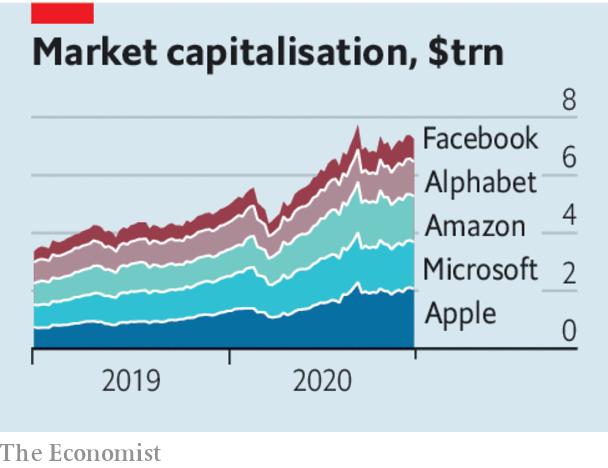

###### Taming big tech

# America and Europe clamp down on big tech 

##### Trustbusters say they are going after the tech giants. Markets don’t take them seriously 

 

> Dec 19th 2020 


FIVE YEARS ago antitrust was a backwater. In America complacent trustbusters had failed to spot the rise of big tech firms. In the European Union they noticed it, but didn’t do much. But the competition cops have at last sprung. On December 15th the EU unveiled two draft digital-services laws that would create a sweeping supervisory apparatus to control Silicon Valley. In America the federal government has just launched antitrust cases against Google and Facebook. These moves mark the biggest shift in competition policy in a generation, so you might expect investors to be worried that big tech firms are under serious threat. Instead, their reaction has been Olympian indifference. The market value of the five biggest Silicon Valley firms has risen by 46% in 2020, to reach $7.2trn. Antitrust’s credibility deficit reflects a lack of transatlantic unity and the flaws of two very different strategies.


In America the chances of new laws being passed are low because of a gridlocked Congress and because some politicians think that having dominant American tech firms is a strategic advantage in the contest with China. Instead, trustbusters have to demonstrate in court that the tech firms have broken existing laws. The case against Google is more likely to succeed—it focuses on a web of $10bn or more in annual payments made by Google to Apple and manufacturing firms to ensure that its services got prominence on device screens. The case against Facebook argues that it illegally acquired WhatsApp and Instagram to kill off competition; this is more of a stretch, because both were small firms at the time. Do not expect any decisions soon. Microsoft’s antitrust case began in 1998 and took six years to resolve. Recently the courts have been sceptical of big antitrust suits, including those against American Express and AT&amp;T Time Warner.

 


If America’s strategy is narrow and backward-looking, the EU’s is broad and forward-looking. It tends to put more faith in regulation—and does not have any home-grown tech giants to worry about. Big tech firms will be designated as systemically important, and in some cases as “gatekeepers” too, and face obligations over data, content and the treatment of other firms which use their platforms. The danger is that an ill-defined and sprawling regime muffles dynamism and entrenches incumbents. Yet even if the EU eventually passes new laws, it may have problems enforcing them. The five biggest tech firms make 25% of their sales in Europe, versus 51% in America, and may prefer to run their European arms under local rules, rather than adopt EU policy globally. The maximum fine the EU is contemplating is just 1% of big tech’s market value. It is hard to imagine how the EU could break up an American company on its own.


On paper it is possible to pick the best of both approaches. The goal should be to catalyse competition, rather than accept monopolies and mitigate their cost through regulation. Prising open closed markets should be the priority: America’s trustbusters are right to focus on the ways in which Google and others have locked out competitors. Taking a sceptical line on future acquisitions by big tech firms is essential, too. America should copy the EU’s effort to give individuals power over their data, which could also help unlock competition. Last, both sides should agree that policing content—for example, fake news—is a matter for media policy, not trustbusters.


Yet transatlantic agreement is far off. And, complicating things further, parts of the industry are getting more competitive even amid the howls to tame “big tech”. Trustbusters should worry about products where market shares are high, profits are suspiciously plump and new entrants are thin on the ground. Search and online advertising fit this description, but large areas of tech look increasingly contested, including streaming, e-commerce and the cloud—and often the competition is coming from other big tech firms. They, not the transatlantic trustbusters, are more likely to change the weather. ■

