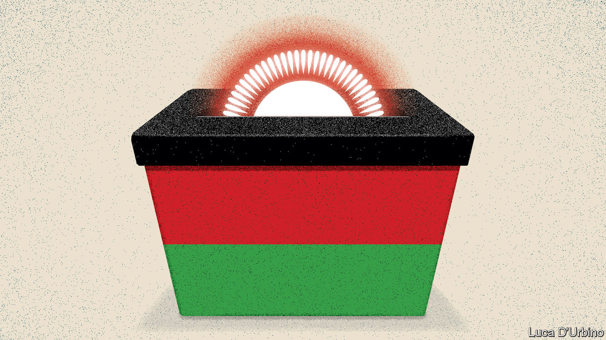

###### Admiration nation

# Which is The Economist’s country of the year? 

##### The most-improved country is one where people stood up for democracy 

 

> Dec 19th 2020 


IN MOST YEARS most countries improve in various ways. In 2020, however, premature death and economic contraction became the new normal, and most countries aspired only to dodge the worst of it. Inevitably, our shortlist of most-improved countries includes some that merely avoided regressing much.


Few people would argue that life in New Zealand was better in 2020 than in 2019. But the virus has been contained. When only 100 cases had been detected, the prime minister, Jacinda Ardern, closed the borders, locked down the country and urged its “team of 5m” (ie, the whole population) to be kind to each other. Only 25 Kiwis have died and life has more or less returned to normal. Rugby stadiums finished the season packed with fans. The amiable Ms Ardern was re-elected with a majority in a country where such things are almost unheard of.


Taiwan has done even better, with only seven deaths and a far stronger economic performance. Leave aside whether Taiwan is a country or merely a contender for “de facto self-governing territory of the year”. It kept the virus at bay without closing schools, shops or restaurants, much less imposing lockdowns. Its economy is one of the few expected to have grown in 2020. It also showed courage, refusing to back down despite relentless threats from Beijing. China’s government often says that Taiwan must be reunited with the mainland. It has been sending warships and fighter jets ever closer to the island, ever more often. Yet in January Taiwanese voters spurned a presidential candidate who favoured warmer ties with China and re-elected Tsai Ing-wen, whose government has been sheltering democracy activists from Hong Kong. Taiwan is a constant reminder that Chinese culture is perfectly compatible with liberal democracy.


These achievements are impressive. However, the pandemic is not yet over and to judge a country on its covid-fighting record is to focus on specific forms of good governance when circumstances of geography and genes make comparisons hard. Being an island helps. Some populations may have immunity to coronaviruses. So it is worth considering other candidates.


The United States did almost as badly as Britain, Italy and Spain in its response to covid-19, but its Operation Warp Speed was central to bringing about a vaccine in record time. And by rejecting President Donald Trump in November, American voters did their bit to curb the spread of populism—another global scourge. Mr Trump’s efforts to overturn the will of those voters were unprecedented for a sitting president, but the judges he appointed were loyal to the law, not the man who picked them.


Voters in Bolivia, too, restored a measure of normality. After a fraud-tainted election, the overthrow of a socialist president, violent protests and the vengeful, incompetent rule of an interim president, the Andean nation held a peaceful re-run ballot in October and picked a technocrat, Luis Arce.


But this year’s prize goes to a country in southern Africa. Democracy and respect for human rights regressed in 80 countries between the start of the pandemic and September, reckons Freedom House, a think-tank. The only place where they improved was Malawi.


To appreciate its progress, consider what came before. In 2012 a president died, his death was covered up and his corpse flown to South Africa for “medical treatment”, to buy time so that his brother could take over. That brother, Peter Mutharika, failed to grab power then but was elected two years later and ran for re-election. The vote-count was rigged with correction fluid on the tally sheets. Foreign observers cynically approved it anyway. Malawians launched mass protests against the “Tipp-Ex election”. Malawian judges turned down suitcases of bribes and annulled it. A fair re-run in June booted out Mr Mutharika and installed the people’s choice, Lazarus Chakwera. Malawi is still poor, but its people are citizens, not subjects. For reviving democracy in an authoritarian region, it is our country of the year. ■

