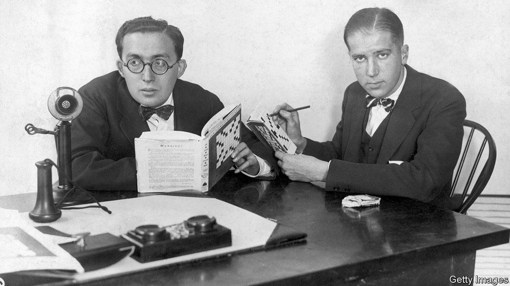
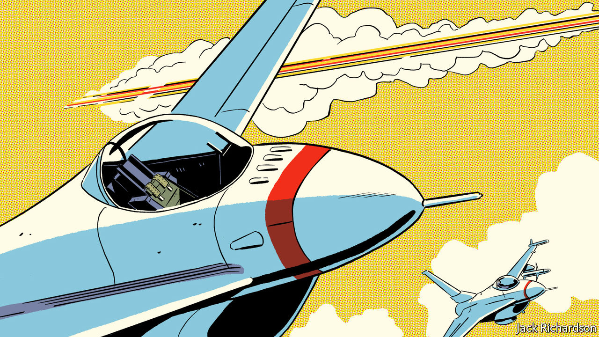
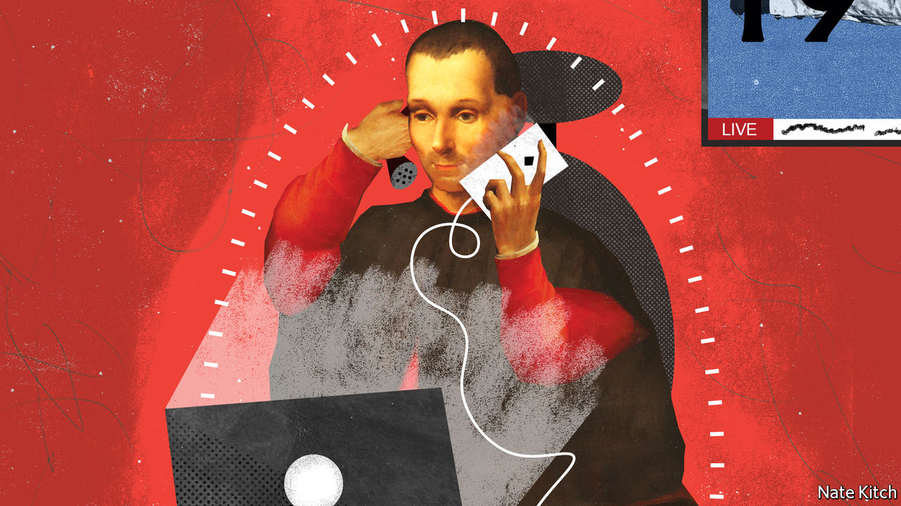
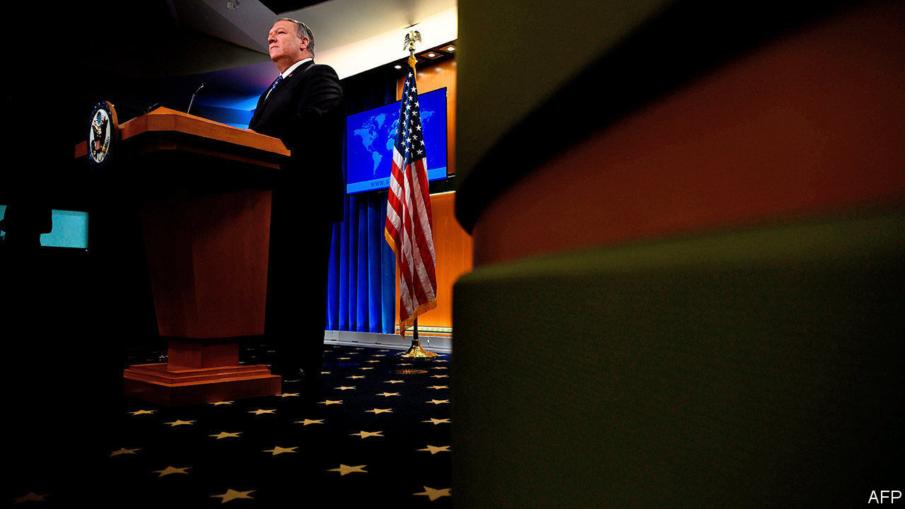

###### On farming, books, aerial combat, Latin, Machiavelli, diversity, Ireland, the turkey

# Letters to the editor 

##### A selection of correspondence 

> Dec 19th 2020 


 


Brexit lays an egg


Your leader on British farming and food standards after Brexit underplayed the role of international agritrade policy (“Ploughing its own furrow”, ). Take your example of free-range eggs. British consumers can buy them in confidence now because of high EU and British standards. A tariff on eggs and egg products protects the market from imports that are marked as free range but are of a lower standard. In America, for example, an egg can be marketed as free-range as long as the hen house has one pophole; there is no definition as to what counts for a “range” or outside area for the hens, drastically reducing the cost. A British hen house will have, say, 20 popholes depending on the size of a flock. Without a tariff, lower-priced American imports would bankrupt British free-range egg farmers.


Your supposition that British consumers would prefer to buy the more expensive British free-range eggs over cheap imported ones has already been disproved in the example of pig meat. In the 1990s Britain banned sow stalls ahead of the rest of the EU, adding considerable cost to the production of domestic pig meat products. The government thought consumers would favour more expensive, higher welfare British pork, but instead they turned to cheaper pork from Denmark and the Netherlands. Half the British pig industry was exported overnight, a loss to the economy, and pig welfare.


ROBERT GOOCH

Chief executive

British Free Range Egg Producers Association

Saxmundham, Suffolk

 


The plot thickens


With all due respect, Simon &amp; Schuster (“Book-binding”, ) was not even close to representing Scott F. Fitzgerald, Ernest Hemingway, and Thomas (not Tom) Wolfe. That honour belonged to Scribner’s. Simon &amp; Schuster merely acquired Scribner’s when it bought Macmillan in 1994 (Macmillan had merged with Scribner’s). Fitzgerald, Hemingway and Wolfe died decades before.


BOB POWELL

Birmingham, Michigan

 


Life in the old dogfight yet


A dogfight in aerial combat is known as “basic fighter manoeuvring”, or BFM, within the profession (“Virtual mavericks”, ). Guns are no longer used, but a missile shot within visual range after the point at which two fighters pass each other and the manoeuvring that follows is in fact a dogfight.


Throughout the history of combat aviation many have said that the dogfight is dead, and have been proved wrong. In Vietnam it was because the missiles were unreliable. In the future it may be stealth, electronic warfare, or strict rules of engagement that prevent a shot beyond visual range against a target. America’s shooting down of a Syrian SU-22 in 2017 may not be a true dogfight to some, but it was conducted within visual range with extensive manoeuvring. The pilot, a graduate of the US navy’s TOPGUN, employed his BFM skills that day.


You also noted that an autonomous aircraft cannot explain what it did and why. The role of briefing and debriefing in combat aviation cannot be understated, and until this gap is addressed it limits what we can expect from robot wingmen.


BRIAN ROLLER

Honolulu

Latin lesson


Very clever to take Christopher Wren’s epitaph and repurpose it for the Arecibo radio telescope (“Si monumentum requiris respicite”, ), inviting us to look back, respicere, rather than around, circumspicere. And very astute to modify the imperative to address a presumed plurality of readers (respicite) instead of the original’s solitary visitor to St Paul’s (circumspice).


But perplexing that you failed to address the other verb (requiris) to all your readers as well (requiritis). The Economist’s wordplay department risks being seen as too clever by exactly half.


BOB LADD

Edinburgh

 


If you want my advice


Bagehot’s search of a modern Machiavelli for Boris Johnson is timely (). Machiavelli’s “The Prince” advises a leader how to act. Machiavelli, who suffered two turns on the rack for his guidance, compares Fortune to a violent river that causes havoc when enraged. When the river is quiet, a leader needs to protect himself by building embankments, dykes and canals. A leader who does not take these precautions is at the mercy of Fortune, but if he prepares and adapts, he prospers. Mr Johnson did not prepare for the pandemic, has not built defences against the potential havoc of Brexit, and the protections against climate change are as yet just words.


DUNCAN STEPHENSON

Leeds


Bagehot’s list of Boris Johnson’s traits inadvertently places him alongside such familiar British characters as Mr Micawber, Derek Trotter and Arthur Daley.


ANDY CHEW

Little Gaddesden, Hertfordshire


Sitting in South Asia I feel obliged to point out that Kautilya, the Indian Machiavelli, wrote “Arthashastra”, his science of politics, around 1,800 years before “The Prince”. As Roger Boesche noted in the preface to “The First Great Political Realist”, Kautilya makes Machiavelli seem mild. For example, whereas Machiavelli only cursorily examines the topic of assassination and gives no advice about spies, arrest on suspicion, and torture, Kautilya discusses all these issues at length.


JOHN CROCKER

Colombo, Sri Lanka

 


Employ more conservatives


America’s State Department has an obvious diversity problem by employing too many white males (“Altered state”, ). But the not so obvious problem is a lack of diverse political opinion. One would be hard-pressed to find any significant percentage of Republicans in its ranks, let alone a number like 48%, which more accurately represents the politics of America. This blind spot has left the department vulnerable to changing administrations and ineffective in implementing policy that is often at odds with its staff’s core beliefs.


RICHARD WALKER

Dubuque, Iowa

Spuds they like


Ireland’s cuisine is heavy on potatoes, explains Charlemagne (). That is understating it. Where else in Europe, nay, the world, can you find a theme park based on the potato chip?


ALAN FINLAYSON

Düsseldorf

Talking turkey


There is a very intriguing bit of etymological happenstance for the word “turkey” (World in a dish, 1843, ). In Arabic, a turkey, deek rumi, is the literal translation of “roman chicken”. The turkey made its way into the Arab lexicon and kitchens long after the Roman Empire had met its end. What the literal translation misses is that “Roman” throughout various Arab and Muslim empires had generally become a lexical stand in for Christian, the implication being that a turkey is a chicken from some Christian parts of the world.


TIMOTHY PATTEN

Chicago

