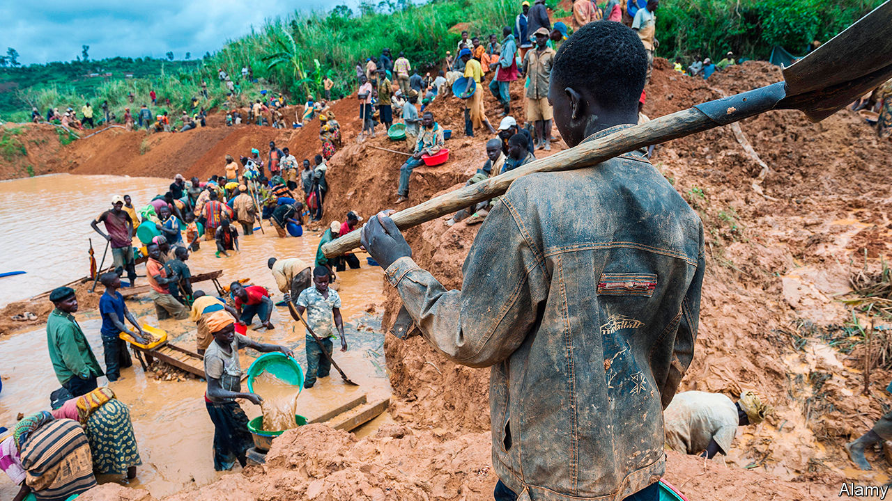

###### Gold bars

# In Congo’s gold rush, the money is in beer and brothels 

##### Pop-up entrepreneurs sell services to miners 

 

> Dec 19th 2020 


IT IS NOT yet noon but the streets of Luhihi, a tiny town in eastern Congo, are already full of revellers. Men fall about outside bars filled with prostitutes. Gamblers hover over draughtboards. Music blares from a makeshift club near the river where miners sift through mud for gold.


The precious metal was found in Luhihi in May. Artisan miners came rushing in from far and wide. A street of pop-up bars, brothels, shops and gambling dens has sprung up to cater to them. Many of the entrepreneurs running such businesses rove from mine to mine, moving on when the minerals dry up or rebels march into town. For two decades dozens of militias have fought over gold, tin and coltan mines in eastern Congo.


Bertun Mupenda, who runs a nightclub in Luhihi, first set up a bar at a gold-rush town elsewhere in South Kivu province. He left when it was plundered by rebels for a second time. “Seven of them came in the night with guns,” he says. “They beat up my workers, stole my beers and asked us for all the money we had.” Mr Mupenda had to hand over more than $2,000.


Luhihi is fairly safe, partly because it does not seem to have a huge gold deposit. The hill that looms over the town is pockmarked with tunnels. Frustrated men wearing head torches climb out of them, dragging sacks of mud and mumbling that they have not seen gold in weeks. Still, the miners seem keen to spend whatever earnings they have in town.


“The money is good,” says Jeanette Albertine, who runs a bar selling local brews made from fermented bananas and maize. “But I do not feel comfortable here.” Drunk clients try to grope her. They also get into brawls in her bar. She often has to call for help from local policemen, who then demand cash for chasing disorderly customers away. But Ms Albertine is used to such problems: she has spent the past decade moving between gold and coltan mines across North and South Kivu provinces. She earns about $10 a day, far more than she used to make as a farmer.


Luhihi also boasts a string of new hotels made from wood and tarpaulins where local gold traders stay. One miner grumbles that they do not give fair prices and that their scales are weighted to make the gold seem lighter than it really is. He adds that he does not know where the traders take the gold. Much probably goes to Uganda. Gold worth $300m-600m is smuggled out of Congo each year, estimates the Sentry, an American watchdog.


Many miners risk their lives in shaky tunnels because there are few other ways to earn a living. Most of them are still extremely poor. Luhihi’s makeshift bars may heave with clients, but many are there to drown their sorrows rather than celebrate. “Life in the mines is tough,” explains Ms Albertine, forgivingly. “People drink to help them relax.” ■

