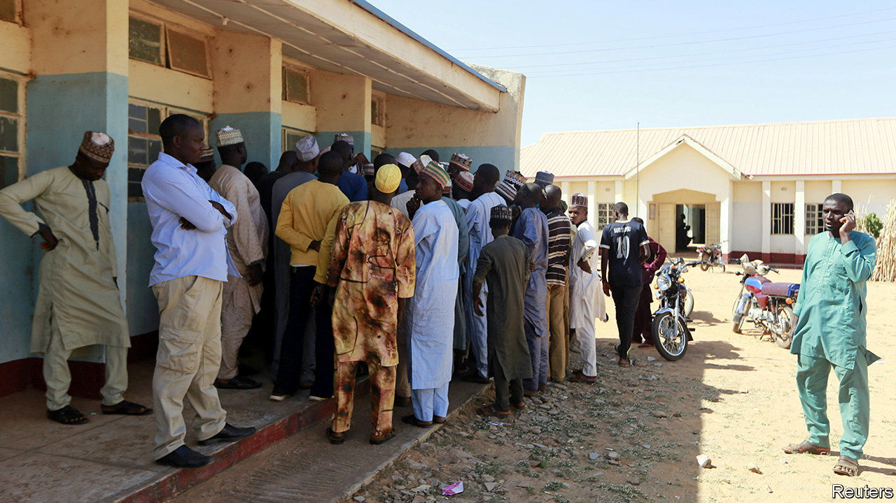
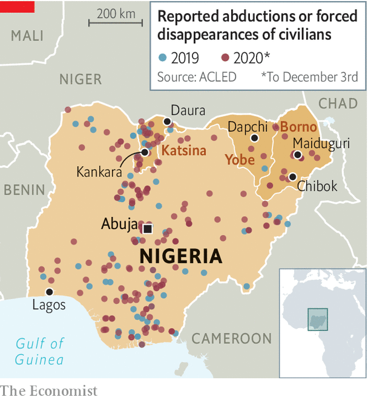

###### The lost boys of Kankara

# More than 300 schoolchildren are abducted in Nigeria 

##### President Buhari has failed to contain bandits or jihadists 

 

> Dec 19th 2020 


ON DECEMBER 11TH Nigeria’s president, Muhammadu Buhari, flew off to take a holiday at his country home in Daura, an ancient seat of Islamic learning in the northern state of Katsina. That night hundreds of gunmen riding on motorbikes stormed a boarding school in Kankara, also in Katsina state. Some schoolboys jumped over a fence and ran away when they heard gunshots. But more than 300 were rounded up and herded into the surrounding forest. One who later escaped told the BBC they were beaten, threatened and forced to walk through the night.


It was not immediately clear who the culprits were. Nigeria’s government says that the children were taken by bandits who have demanded a ransom for their release. But Boko Haram, a jihadist group, said it was behind the kidnapping. Both explanations are plausible.


Criminal gangs in Nigeria have long been experts at “express kidnaps”, in which wealthy locals and foreigners are grabbed at gunpoint and held until cash is handed over or their bank accounts are emptied through ATMS. In the past few years such gangs have become less discriminating, grabbing thousands of poor folk, including travellers on buses or people living in villages (see map). In some places they have demanded levies from farmers before they allow them to harvest their crops.

 


Moreover, this is not the first mass abduction by bandits in the president’s home state. Twenty-six girls kidnapped in October in another town in Katsina were freed after a ransom was paid. They said the kidnappers raped and beat them. Even so, the latest attack would suggest a hitherto unseen level of brazenness by bandits.


The leader of Boko Haram, Abubakar Shekau, offered no proof that his group was behind the kidnapping when he claimed responsibility on December 15th. (After earlier mass kidnappings Boko Haram provided photos or videos of the victims.) Some security experts therefore wondered if this was just a publicity stunt.


In 2014 Boko Haram gained the world’s attention by kidnapping nearly 300 schoolgirls from the town of Chibok in the north-eastern state of Borno, which is at the heart of Nigeria’s jihadist insurgency. In 2018 it snatched more than 100 girls from a boarding school in Dapchi, in neighbouring Yobe state, a move that intelligence officials said demonstrated its ability to mount sophisticated raids over long distances.


If the jihadists carried out the latest outrage, it would mark a big extension of the group’s reach and a deterioration of security across northern Nigeria, because Kankara is more than 700km by road from Maiduguri, the capital of Borno, where Boko Haram emerged. It is also just a few hours’ drive from Mr Buhari’s home in Daura. Yet days after the attack the president had not seen fit to interrupt his holiday and make the short journey to the school, where parents of the kidnapped boys have been camped, anxiously waiting for news. ■

