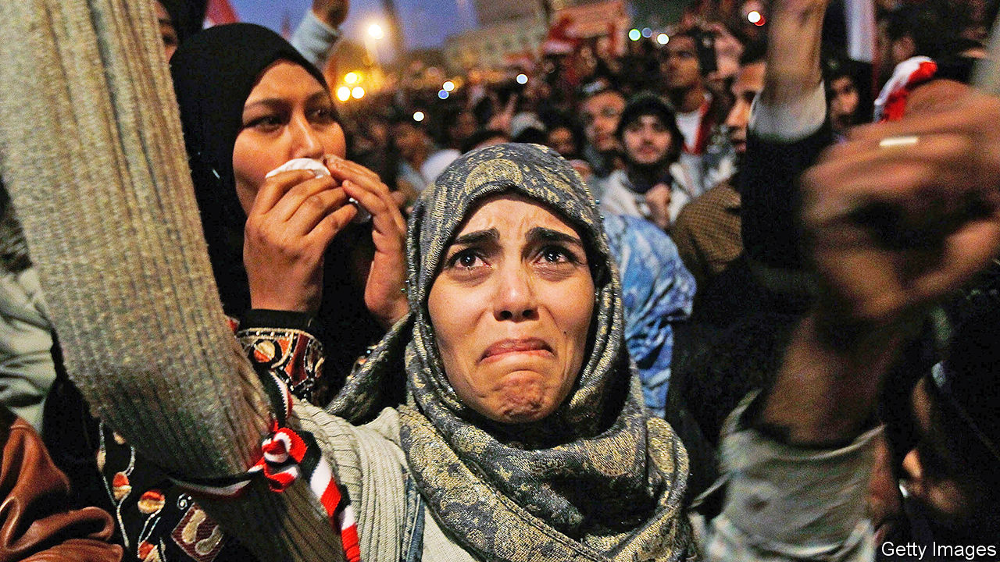
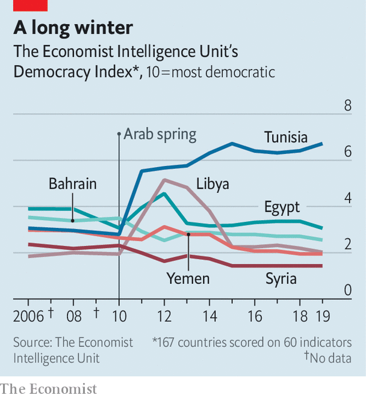
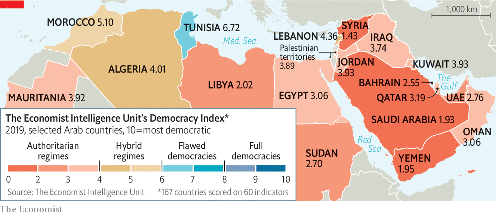

###### No cause for celebration

# The Arab spring at ten 

##### A decade ago Arabs rose up. Why haven’t things improved? 

 

> Dec 16th 2020 


IT IS AN anniversary no one is eager to mark. The numbers boggle the mind: half a million people dead; another 16m displaced from states no longer recognisable. There are the individual stories too, of dreams dashed and hopes shattered. One former activist, who long since gave up on the politics of his native Egypt, scrolls through the contacts on his phone, stopping now and then to list his friends’ fates: exiled, disappeared, dead.


Ten years have passed since Muhammad Bouazizi, a Tunisian street peddler, set himself ablaze to protest against the corrupt police who confiscated his wares. His self-immolation, on December 17th, is widely seen as the spark that ignited the Arab spring, a wave of revolutionary protest that swept across the region. Those early days were a time of unbridled optimism. Dictators who had looked invulnerable fell, one after the other—in Tunisia, Egypt and, later, Libya and Yemen.


But revolution soon gave way to a sort of Thermidorian reaction. Egypt’s brief experiment with democracy failed. Libya, Syria and Yemen plunged into civil war and became playgrounds for foreign powers. Wealthy Gulf states spent heavily to placate their own people and bolster anti-democratic forces elsewhere. The region is less free than it was in 2010—and worse off by most other measures, too.


Much has been said and written about what went wrong. In the West, pundits and policymakers tend to talk about themselves, what they could have done to help the revolutions succeed. There is a solipsism to these debates, which relegate Arabs to a secondary role in their own story. And counterfactuals are hard. It is plausible to argue that Syria would be less of a charnel house had America destroyed Bashar al-Assad’s air force in 2012; far less to claim it would have become stable or prosperous or democratic. The no-fly zone over Libya in 2011 helped overthrow Muammar Qaddafi but did not prevent his country’s ruin.


Cynics suggest that the Middle East is simply not suited for democracy. Yet Tunisia emerged from its revolt with a fragile but genuine republic, of which its citizens are justly proud.

 


There is no one answer to why things went wrong for the other countries that took part in the Arab spring. Blame foreign powers, from Iran and Russia to the impotent, incoherent West. Blame Islamists, who often stoked division in cynical bids for power. Most of all, though, blame the men who ruled Arab states after they gained independence in the 20th century. Though few were democrats, they understood something about democracy. It requires more than elections to succeed. It also needs engaged and informed citizens, a common set of rules and a shared belief that political disagreements do not pose an existential threat. Dictatorships, by design, lack these qualities—and prevent them from emerging.


Anyone who has spent time in the Middle East knows the region crackles with conspiracy theories. A non-trivial number of Egyptians believe that America put the Muslim Brotherhood in power (in fact, Egyptian voters did) or that Hillary Clinton created Islamic State. The popularity of such ideas is perhaps understandable. Schools in Egypt teach by rote; the government prefers placid subjects to engaged citizens. The media read from a script; a wayward word in a café or a Facebook post can land anyone in jail. It is hard to have a say in how you are governed in a system that tries to prevent it.


It can also seem futile in a system where governance is so poor. Arabs loathe the bribes and wasta, or connections, required to navigate daily life in much of the region. Yet to survive in such a system requires the tacit acceptance of its terms. Every act of graft, no matter how petty, undermines confidence in the state, in the very idea of a common good. Corruption makes everyone complicit. Mr Bouazizi struck a nerve because so many of his countrymen had been in his place.


Beyond futile, it can seem dangerous: people who think their countrymen wish them dead will not wish those countrymen to gain power. Mr Assad convinced many of his supporters that the Syrian uprising was the work of extremists. This was not prescience but self-fulfilling prophecy. Release enough jihadists from prison, murder enough moderates, starve the populace for long enough, and sooner or later a peaceful movement will become radical.

 


None of this is unique to the Middle East. America has an alarming level of polarisation and an outgoing president who lies reflexively. But robust institutions and centuries of democratic tradition make it virtually impossible for any American president to become a dictator. The Middle East has no such safeguards. For decades it has been ruled by visionless autocrats who promised only stability for stability’s sake.


Today’s crop of dictators, those who survived 2011 and those who emerged from it, speak a subtly different language, one that posits development, not democracy, as the region’s most dire deficit. In their telling the focus on political change is misguided. What Arabs truly need is better governance and more job opportunities. Yet even on their own terms many rulers are failing. Abdel-Fattah al-Sisi talks of developing Egypt; most Egyptians have seen their standards of living deteriorate on his watch.


And like his counterparts, Mr Sisi is eagerly salting the earth lest any other revolutionary shoots take root. The tight political space of Hosni Mubarak’s Egypt looks positively freewheeling compared with today’s. In Algeria, a new army-backed regime is less interested in stamping out corruption than in wielding corruption charges as a cudgel against its foes. Bahrain’s monarchy portrays criticism of its rule as an Iranian plot to colonise the island.


This is no era of authoritarian stability, though. With few exceptions the region is miserable, a mix of failed states and stagnant ones that offer meagre prospects for their young populations. Even in the Gulf states, which mostly dodged serious unrest in 2011, rulers are nervous about their future in the twilight of the oil age. Their old social contract offered material comfort in exchange for political quiescence. If they can no longer provide the former, they cannot long expect the latter.


History is not linear. Revolutions fail; bad guys sometimes win. There is no reason to expect that the next round of Arab uprisings will produce happier results than the previous one. Equally, though, there is no reason to believe the autocrats when they say they can prevent it. ■

