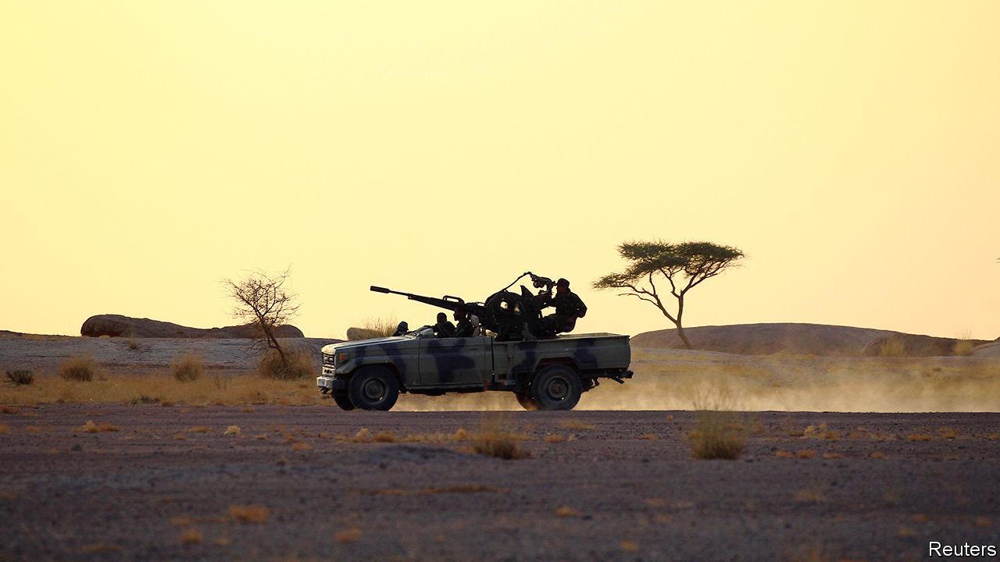
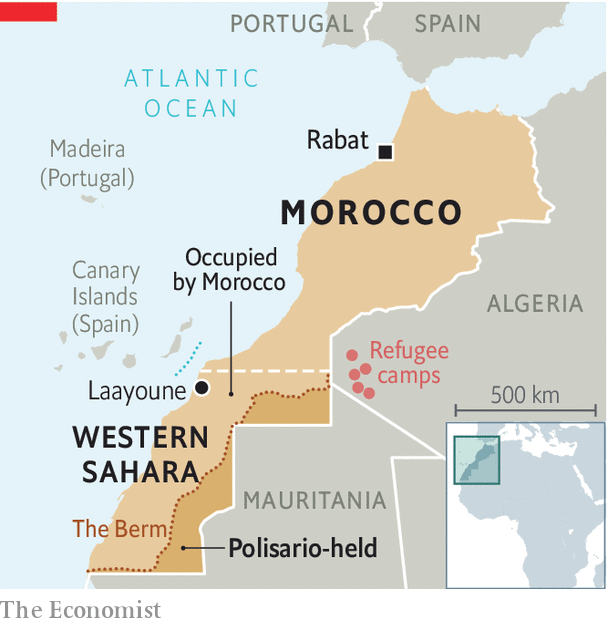

###### Heat in the desert

# The Israel-Morocco peace deal is roiling Western Sahara 

##### Tensions had already been rising in the disputed territory 

 

> Dec 16th 2020 


ISRAEL’S FORMAL ties with the Arab world now extend from the United Arab Emirates (UAE) in the east to Morocco in the west. On December 10th President Donald Trump announced the latest breakthrough in his diplomatic push on behalf of the Jewish state. Morocco, the Arab world’s oldest monarchy, will become the fourth Arab state in as many months to establish diplomatic relations with Israel (following the UAE, Bahrain and Sudan).


The agreement is a win for Israel, and also for Morocco. As part of the deal, Mr Trump recognised Morocco’s annexation of Western Sahara. The territory, slightly larger than Britain, is also claimed by the Polisario Front, a nationalist movement backed by Algeria. Mr Trump’s intervention comes amid provocations by both sides that risk restarting a war that ended three decades ago.


That old conflict kicked off in 1975, when Morocco annexed Western Sahara after Spain, the colonial power, pulled out. Polisario, which the UN considers the legitimate representative of the Sahrawi people, resisted—but was outgunned. With Morocco in control of about two-thirds of the territory, and Polisario controlling the other third, the UN brokered a ceasefire deal in 1991 that promised the Sahrawis a referendum on independence. Morocco, though, stands in the way.


Morocco’s treatment of the Sahrawis is in some ways like Israel’s treatment of the Palestinians. Over the years Morocco has used subsidies and tax breaks to convince thousands of its people to move to Western Sahara in an effort to cement its control. Sahrawi protests are suppressed; activists talk of torture by the security services. But the kingdom has also spent billions of dollars fixing up the territory.


Once of primarily symbolic value, Western Sahara’s strategic value has been growing. The side held by Polisario has little in the way of resources. But the portion controlled by Morocco is rich in phosphates and fish. Large reserves of oil may lie offshore. The kingdom also sees Western Sahara as its gateway to west Africa, which buys up Moroccan exports.


So the kingdom is working hard to transform its de facto control of Western Sahara into something more legitimate. Over the past year it has convinced around 20 African and Arab states to recognise its claim. The UN seems to have all but given up on overseeing the referendum. A UN Security Council resolution in October extending the mandate of the UN’s peacekeeping mission did not mention the vote, though it is called the UN Mission for the Referendum in Western Sahara.


“Morocco’s serious, credible and realistic autonomy proposal is the ONLY basis for a just and lasting solution for enduring peace and prosperity!” tweeted Mr Trump, referring to a proposal Polisario does not feel is serious or credible. “Morocco recognized the United States in 1777. It is thus fitting we recognize their sovereignty over the Western Sahara.” Indeed, both acts neglected the opinion of the indigenous population. President-elect Joe Biden could adopt a more even-handed approach.


Inside Morocco, the king’s decision to normalise relations with Israel is controversial. Many Islamists and leftists oppose the move. But most Moroccans seem to consider America’s recognition of the kingdom’s claim over Western Sahara more important than the kingdom’s recognition of Israel. They have long called for putting their needs before those of the Palestinians. A popular slogan, “Taza before Gaza”, refers to cities in Morocco and Palestine.

 


The Sahrawis pose a bigger risk. In October Sahrawi protesters closed the UN-patrolled border crossing at Guerguerat (see map). The area is meant to act as a buffer zone, but Morocco sent in troops to quell the unrest. That enraged Brahim Ghali, leader of Polisario. In November he abandoned the ceasefire and claimed a series of attacks around the 2,700km (1,700-mile) sand berm, built by the Moroccan army, that separates the two sides.


Whether things escalate further depends, in part, on Algeria. It competes with Morocco for access to markets and may see a benefit in the trouble around Guerguerat. But Mr Trump’s deal has it worried. American and Israeli support, warn Algerian generals, might embolden Morocco at a time when Algeria is economically weak and politically unstable. Algeria’s prime minister, Abdelaziz Djerad, warns of a “real threat on our borders, reached by the Zionist entity”.


Some of this may be an effort by Algerian leaders to divert attention from problems at home. But they have the backing of Russia, which criticised America for acting unilaterally on Western Sahara. The manoeuvring of local players and foreign powers is pushing the situation into dangerous territory. Whether or not Mr Trump’s deal lowers tensions in the Holy Land, it is raising them in the Sahara. ■

