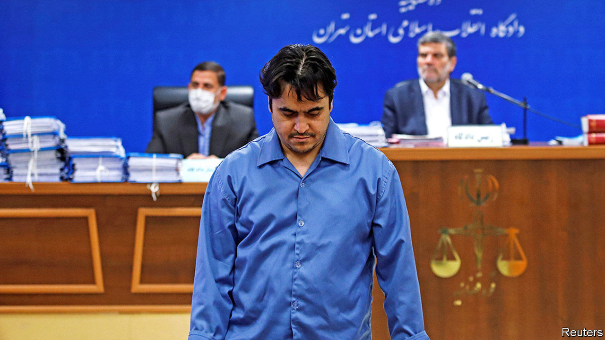

###### Death of a firebrand

# Why Iran abducted and hanged Ruhollah Zam 

##### The execution may complicate Joe Biden’s plan to re-engage 

 

> Dec 16th 2020 


EVEN BY IRAN’S standards the justice was rough. Four days after sentence was passed, Ruhollah Zam was hanged. The judge said he had spied, incited violence and “sown corruption on earth”. Most Iranians took that to mean that he had simply disagreed with the right of the ayatollahs to rule.


Mr Zam had been a remarkable dissident. In 2011 he went to Paris to escape the regime and, four years later, launched Amad, a news channel on Telegram, a messaging app. At its peak Amad had more subscribers than the BBC’s Persian service, which many Iranians rely on. He exposed the sexual and financial peccadilloes of the regime’s top turbans. The son of an influential cleric and an alumnus of a school in Tehran, the capital, favoured by the elite, he had a wide web of contacts.


When nationwide protests erupted three years ago, he posted the place and time of rallies and was often first to get videos from the scene. He issued a manual for making petrol bombs. He called for regime change: “Ruhollah began the revolution, Ruhollah will end it,” he said, referring first to Ruhollah Khomeini, father of the Islamic revolution, then to himself. The regime blocked Telegram but failed to silence him. Then last year its agents lured him to Iraq, apparently with a honey trap, kidnapped him and took him home.


Mr Zam’s treatment shows yet again that the regime will stop at nothing to crush civil society. Snipers shoot demonstrators. In September a prominent wrestler was hanged for joining a protest. The hardliners control parliament and the courts, so they can rig next year’s presidential election.


Human-rights outfits in Europe warn Iranian dissidents abroad against travelling home. “Zam is just the beginning,” read a social-media message to an anchor at the BBC’s Persian service in London. “I always look over my shoulder when leaving the office,” she says.


“Horrifying,” tweeted Jake Sullivan, Joe Biden’s choice for national security adviser. Yet the new administration’s eagerness to curb Iran’s enrichment of uranium may outweigh human rights. On December 16th the parties to the nuclear deal with Iran met on schedule. President Donald Trump pulled America out of the agreement. Mr Biden says he will rejoin it.

