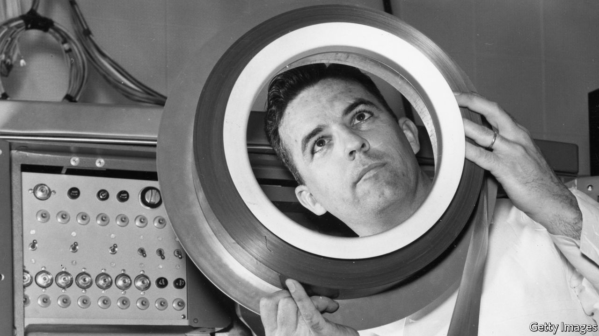

###### Data storage

# Magnetic tape has a surprisingly promising future 

##### Re-record, not fade away 

 

> Dec 15th 2020 


THE WHIRR of spooling magnetic tape is more likely to evoke feelings of nostalgia than technological awe. Yet tape remains important for data storage, with millions of kilometres of the stuff coiled up in the world’s data centres. Indirectly, says Mark Lantz of IBM, most computer users thus rely on tape every day.


Though tape may seem archaic, it is still getting better. In 2015 Dr Lantz’s team unveiled a version capable of squirrelling away 123 gigabytes per square inch (19Gb per square centimetre, but tapemakers still use Imperial units). In 2017 they reached 201Gb/in. And on December 15th they revealed a design that has a density of 317Gb/in. That rate of growth is unmatched by any of tape’s competitors.


Tape’s heyday as a data-storage medium for computers was in the 1950s. Hard disks, introduced in 1956, were quickly seen as superior because they required no time-consuming spooling. Decades of selective investment mean they now also have a better density of information storage than tape. The best can manage more than 1,000Gb/in. As a result they are in high demand—2018 saw the sale of more than 800bn gigabytes-worth, which is eight times the figure for tape. But disks have drawbacks. They are costlier than tape, have shorter lifespans and their spinning platters generate far more unwanted heat.


This leads to tape being the medium of choice for the so-called “cold” storage of data that need to be looked at only infrequently. And disks’ advantages elsewhere may be slipping. In the 1990s hard-disk storage densities doubled every year. Over the past decade that rate of growth has dropped to 7.6%, as manufacturers run out of headroom. Smaller magnetic particles need more energy to keep them in line, and the magnets which provide this are approaching the theoretical limits of their strength. The storage density of magnetic tape, by contrast, has been increasing steadily, by 34% a year for nearly three decades. As a consequence, tape may catch up with hard disks within five years.


To maintain this blistering rate of growth, Dr Lantz’s team concentrated on three matters. First, they reduced the size of the magnetic grains that form a tape’s recording surface, by substituting strontium ferrite for the current industry standard of barium ferrite. Second, they shrank the size of the read heads by a factor of 30, permitting data to be packed onto narrower tracks. Third, they developed systems able to track and correct the position of the tape with nanometre accuracy as it flowed under the smaller heads, stopping it going off-track and distorting the signal. Though it may take a decade for these technological improvements to make their way into products, this sort of progress bolsters confidence in tape’s long-term utility.


Other innovations may be coming, too. Ohkoshi Shin-ichi of the University of Tokyo, for example, advocates using particles of epsilon iron oxide. This material is particularly magnetically stable, meaning its grain-size can be reduced (and thus storage density increased) without any risk of the field flipping randomly and thus changing what is encoded.

Taped up


Demand for more storage will certainly be there. Estimates suggest that four times more data will be generated in 2025 than in 2019. In the part of the data-storage market where tape currently reigns supreme, it is likely to remain so for a while.


The biggest threat to tape comes from the flash-drive technology used in SD cards and USB sticks. Flash relies on a flow of electrons through transistors, rather than on magnetised particles read by mechanical components, so it is capable of better data densities even than hard disks. Lack of moving parts also makes such solid-state devices faster at writing and retrieving information. Flash drives are, however, more costly than magnetic storage and do not last as long. This makes them ten times more expensive per byte per year of storage than hard disks, and nearly 50 times more expensive than tape. They are therefore too dear to use for anything but the most important jewels in the data vault. Until that changes, the reel is likely to continue.■

