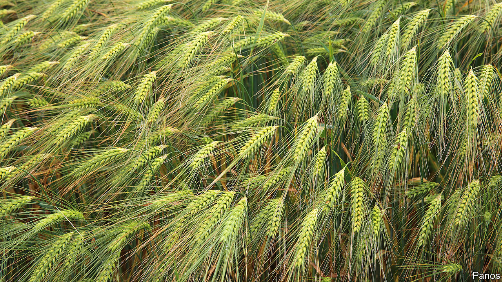

###### Agriculture and evolution

# Wheat absorbs phosphorus from desert dust 

##### After 12 millennia, a common crop still springs surprises 

 

> Dec 19th 2020 


WHEAT WAS among the first plants to be domesticated and is now the most widespread crop in the world. It thus sounds unlikely there would be much left to learn about what makes it thrive. Yet, some 12,000 years after relations between people and wheat began, a wheat plant has been caught doing something unexpected. It helped itself to a dose of much-needed phosphorus when its leaves received a coating of desert dust.


The plant (or, rather, plants) in question were in the care of Avner Gross of the Ben Gurion University of the Negev, in Israel. As Dr Gross told this year’s meeting of the American Geophysical Union, which took place online during the first half of December, his study was prompted by hikes he had taken near Neve Shalom, his home village in the Judean Hills. On these, he often noticed plant leaves completely covered in dust that had been carried there by sand storms from the Sahara desert.


It occurred to him that this dust might not be the light-blocking nuisance it appeared at first sight. It could, on the contrary, be beneficial because of the growth-enhancing elements such as phosphorus which it contained. Until then, botanists had assumed that phosphorus in dust landing on a plant was of little value, because it is locked up in an insoluble mineral called apatite. This makes it unavailable for absorption. Dr Gross, however, reasoned that plants which had evolved near deserts, the source of almost all naturally occurring dust in the atmosphere, might well have evolved a way to exploit it.


He and two colleagues, Sudeep Tiwari, also at Ben Gurion, and Ran Erel of the Gilat Research Centre, therefore started experimenting with a pair of species, wheat and chickpeas (the world’s 17th most planted crop), that both came originally from the Middle East. As a control, they also raised some maize, a plant from the Americas that evolved in far less dusty surroundings.


First, having established them as seedlings, they starved their charges of phosphorus until signs of deficiency such as yellow leaves appeared. Then they scattered desert dust on the leaves of half of the specimens of each species, while taking steps to stop any of it reaching the soil. After this, though the dust-dosed maize continued to suffer from phosphorus deficiency, the wheat and chickpea plants perked up and grew to more than double the size of their undusted lab-mates. What is more, these species were clearly ready for the dust’s arrival. As soon as a lack of phosphorus announced itself, two things happened. Their leaves became hairier, and therefore better at capturing dust. And those leaves also started secreting acid fluids that could dissolve any incoming apatite, assisting phosphorus’s absorption.


That plants can take up phosphorus through their leaves is not, of itself, news to farmers—for this was established in the 1950s. But until now the practical consequence of such knowledge has been that crops are sprayed with liquid fertiliser derived, in turn, from apatite-containing rocks which have been treated with acid. Dusting leaves could, Dr Gross suggests, be an alternative and more efficient way of providing desert-derived crop species with the phosphorus they need. And maybe not just those. His next plan is to look at avocado and cocoa trees, which evolved in tropical regions of the Americas that regularly get a helpful transatlantic dose of Saharan dust carried westward by the trade winds. It will be interesting to see if they are up to the same tricks as wheat and chickpeas.■

