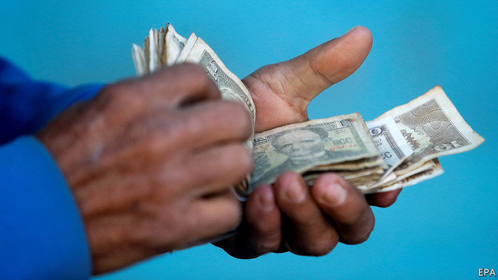

###### From distortion to disruption

# Cuba ends its dual-currency system 

##### A long-awaited reform will cause pain in the short run 

 

> Dec 16th 2020 


AFTER YEARS of dithering, Cuba is finally about to take the plunge. On December 10th the country’s president, Miguel Díaz-Canel, announced that on the first day of the new year it would abolish one of its two currencies. That is a big step towards ridding the socialist economy of distortions that thwart production, drain the treasury and keep people poor. But it leaves in place many enterprise-crushing rules and creates new problems that the government will struggle to overcome.


It set up the dual-currency system in 1994, when the country was reeling from the loss of subsidies from the Soviet Union, on which it had relied during the cold war. Alongside the Cuban peso it created the CUC, a convertible currency pegged to the dollar at one to one. It hoped this would prevent Cubans from dumping pesos in favour of dollars. Importers, which are state-owned, use CUC to obtain dollars on favourable terms, which makes imports cheap. Most Cubans, who work for the state, are paid in pesos. It takes 24 pesos to buy a CUC at the official exchange rate. Workers in the country’s growing private sector, most of whom are paid in CUC, earn seven times what state employees make.


The abolition of the CUC is meant to make the public sector behave more like the private one, and give private firms a better chance to compete. Firms and consumers will now use just pesos, initially at the official rate (though the dollar will remain important). State pensions and salaries are to rise five-fold. But inflation, already high, will increase. Subsidies for water, transport and electricity are being diminished.


To cope with these stresses, the government has introduced new distortions. Besides keeping controls on prices for some goods (many of which are scarce) at new higher levels, it has imposed them on such services as hair cuts and shoe repairs. Firms that profited from access to cheap dollars will get government help for a year to delay mass lay-offs. Cuba will enter the single-currency era with an overvalued exchange rate. On the black market the dollar sells for 35-40 pesos.


Mr Díaz-Canel’s big-bang reform does not let farmers decide what to grow or at what price to sell. Nor does it allow entrepreneurs, who create most new jobs, to incorporate. These needed changes and others may be coming. The government has said that some small firms, like restaurants, will be privatised. Cuba’s communist regime has sped up its reluctant conversion to market economics.

