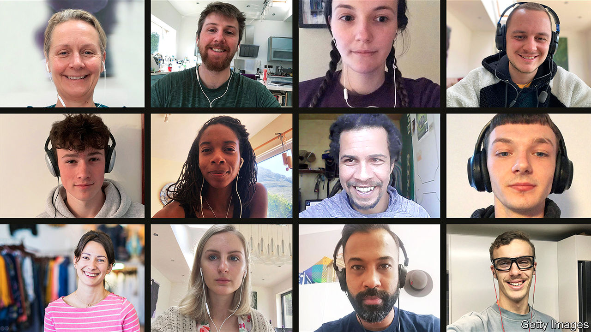
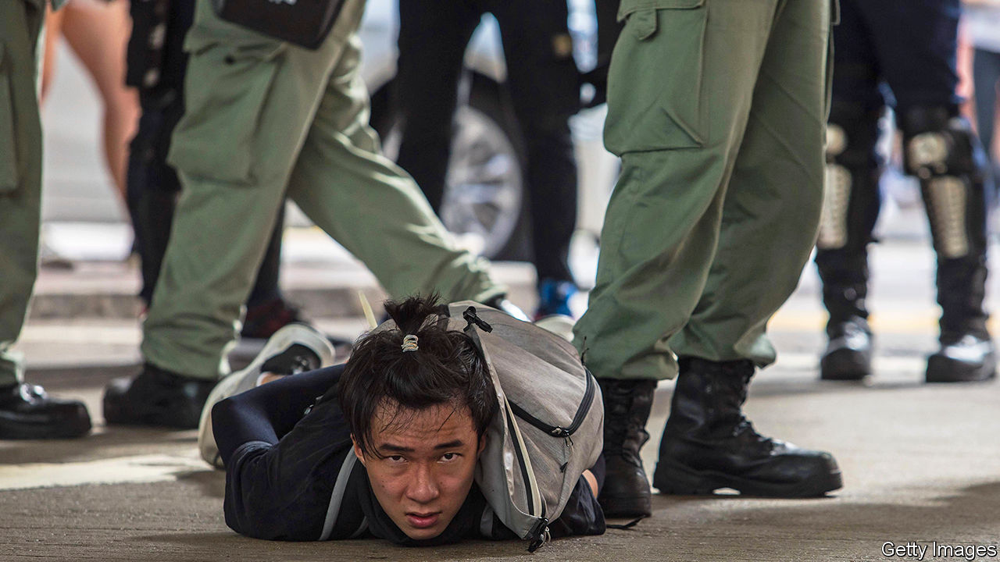
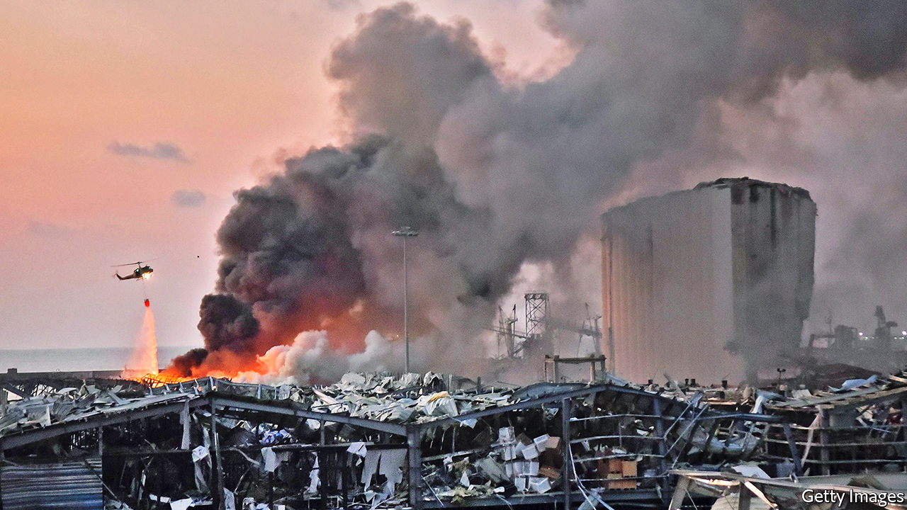

###### 

# The world this year 

#####  

 

> Dec 16th 2020 


 A novel coronavirus, possibly transmitted by animals sold at a market in the Chinese city of Wuhan, spread to create one of the worst global crises since the second world war. Covid-19 has so far caused over 73m recorded infections and more than 1.6m recorded deaths. On January 23rd the Chinese authorities imposed a quarantine in Wuhan, soon extending it to the rest of Hubei province and beyond. Variants of this “lockdown” policy were adopted by other countries as they struggled to contain the outbreak. See .

Every breath you take


By late January cases were widely reported in Germany, Japan, Taiwan and Vietnam. Markets were rattled, fearing disruption to global supply chains that run through China. By late February the World Health Organisation said that most infections were occurring outside China. Italy was the first country to be hit hard. After hospitals were overwhelmed, the country went into lockdown in early March.


The sudden imposition of lockdowns led to panic buying in some places, notably in America and Britain, where supermarket shelves were stripped bare. Shopping moved online. Internet searches rocketed for goods such as toilet paper, fitness equipment and breadmakers. In poorer countries, such as India, the human cost was higher. Left suddenly without work, many migrant labourers tried to return to their family homes; it was the country’s greatest movement of people since partition in 1947. India’s economy shrank by around 25% in April-June.


By late March China was recording fewer domestic cases. The lockdown in Wuhan ended in early April. China closed its border to foreigners as the disease spread rapidly in Europe, most menacingly in Britain, France, Italy and Spain.

Don’t stand so close to me


America was hit almost as hard by the coronavirus. Donald Trump didn’t take it seriously at first; he tried to lift federal restrictions in April, promising a return to normality by Easter. Wearing a face mask became a badge of political allegiance. Mr Trump rowed with the WHO, accusing it of being in China’s pocket, and said that America would leave it in 2021. Brazil was also led by a sceptic. Jair Bolsonaro said the disease was just a case of the “sniffles”.


The extent of the market crash in mid-March (the S&amp;P 500 lost a quarter of its value over three weeks) sparked fears of a depression. The Federal Reserve and other central banks made emergency cuts to interest rates. The Fed also propped up the corporate-bond market, action it had shied away from during the financial crisis a decade earlier.


Oil markets took a hammering. As if the pandemic were not enough of a problem, in March Saudi Arabia instigated a price war with Russia, as their deal over production levels broke down. Prices plunged in the steepest one-day decline since 1991. They eventually recovered somewhat. By the end of the year OPEC and Russia had struck a tentative agreement to increase supply.


Politicians in many countries pulled out their fiscal bazookas to defend their economies. America’s Congress passed a $2.2trn stimulus bill (the CARES act), which directed cash payments to households and topped up unemployment benefits. Some 21m people lost their jobs in April alone; unemployment soared to 14.7%, but it never hit the 20% that some had forecast. Britain guaranteed 80% of wages to workers who had been furloughed, and even subsidised restaurant meals in August.

Spirits in the material world

 


The pandemic was a boon for some. Once the shock of lockdowns faded, stockmarkets climbed towards new records, in part because of the soaring share prices of tech firms. Zoom meetings became a feature for office employees sent home to work remotely (Zoom fatigue was soon a common gripe). As online shopping flourished, Amazon recruited hundreds of thousands of extra staff. Jeff Bezos, Amazon’s boss, saw his wealth increase from $111bn in March to $185bn in December. The combined wealth of the world’s ten richest people grew by 57%, to $1.14trn.


Among industries, aviation and tourism were the biggest losers from the pandemic. Even with huge government bail-outs, airlines are reckoned to have lost $510bn in revenue, according to their international association. The UN reported that international tourism declined by 70% in January-August, causing a loss of $730bn in export revenues.


Scientists had what many thought to be a Herculean task developing a vaccine for covid-19, but drug firms made great strides and by the end of the year several jabs were ready. Britain started the first inoculation programme using a fully tested vaccine, followed soon after by America. Even with the vaccine, officials warn, the world will be battling the virus for another year.


The outbreak of civil war in Ethiopia was one of 2020’s great disappointments. Abiy Ahmed, the prime minister and winner of a Nobel peace prize, launched an attack on the Tigray region when separatist forces attacked the army.


Chinese and Indian troops clashed along their Himalayan border, the first deadly encounter between the two sides in decades. Fighting also erupted between Armenia and Azerbaijan over the long-disputed enclave of Nagorno-Karabakh. Their truce is shaky.


Abe Shinzo, Japan’s longest-serving prime minister, stood down from office because of ill health. He was replaced by Suga Yoshihide, who is determined that the Tokyo Olympics will go ahead in July 2021.

 


China imposed a draconian national-security law on Hong Kong to crush anti-government unrest. It came into force just before the 23rd anniversary of the city’s handover to China from British rule. Elections to the Legislative Council were postponed; pro-democracy candidates had been expected to do well. Opposition legislators resigned en masse in protest against the disbarring of colleagues. De do do do, de da da da

De do do do, de da da da


America’s presidential election was a rowdy affair. The Democratic primaries produced a surprise when Pete Buttigieg was declared the winner in Iowa; a delay in the count because of a technical glitch raised more questions about America’s election machinery. Joe Biden cleaned up on Super Tuesday, and went on to win the presidency. Donald Trump, who was acquitted at his impeachment trial in February, resorted to more shenanigans, falsely claiming the result was fraudulent. He will be gone from the White House on January 20th 2021.

 


The death of George Floyd, a black man, at the hands of police in Minneapolis sparked the worst unrest across America for decades. Floyd’s cry that he couldn’t breathe to the officer kneeling on his neck reverberated around the world. The incident led to a surge in global support for Black Lives Matter and a reckoning with the legacy of slavery and colonialism. Toppling statues of white men was de rigueur for woke activists in many cities. America endured a summer of protest; notable flashpoints included Kenosha and Portland.

So lonely


Britain officially left the European Union on January 31st, entering a transition period that ends on December 31st. Talks about a trade deal dragged on. Whatever the outcome, Britons were told to expect delays when visiting the continent from now on. See .


Venezuelan troops intercepted two small boatloads of men who wanted to overthrow the country’s dictator, Nicolás Maduro. “Operation Gideon” was led by two former members of America’s special forces. Six of the invaders, a group of deserters and Maduro opponents, were executed.


Western intelligence fingered the Kremlin for trying to assassinate Alexei Navalny, Russia’s main opposition leader. Poisoned by novichok, a nerve agent, Mr Navalny fell ill on a plane and was airlifted to Germany for treatment. He eventually recovered and later called on the EU to impose sanctions on high-ranking Russian oligarchs.

King of pain


Belarus was thrown into crisis when Alexander Lukashenko won a sixth term as president in another rigged election. Widespread protests were brutally suppressed by state goons, forcing opposition leaders to flee the country.


Israel’s third election in less than a year led to a power-sharing agreement, with Binyamin Netanyahu remaining as prime minister until November 2021. Israel also signed peace deals, brokered by the Trump administration, with the United Arab Emirates, Bahrain, Morocco and Sudan. Other Arab countries may follow.


In other noteworthy elections, Sinn Fein got the most votes at the polls in Ireland but came second in terms of seats. The country got its first-ever coalition government between Fianna Fail and Fine Gael. In Bolivia’s twice-postponed election Luis Arce won the presidency. He is from the left but is viewed as a technocrat.


There was talk of war in the Gulf region after America assassinated Qassem Suleimani, Iran’s foremost general, in a drone strike at Baghdad’s airport in January. Five days later a Ukrainian airliner crashed after taking off from Tehran airport, killing all 176 people on board. Iran’s armed forces later admitted that they had mistaken the plane for a missile and shot it down.

 


Parts of central Beirut were destroyed by a huge explosion, killing 200 people and injuring 6,500. A fire at the port ignited 2,750 tonnes of ammonium nitrate that had been stored and neglected for seven years. The blast, felt 240km away in Cyprus, led to the resignation of the Lebanese government.


NASA launched astronauts into space from American soil for the first time since the end of the shuttle programme in 2011. It used a SpaceX capsule, a first for a private company putting humans into orbit. China sent a spacecraft to the Moon to collect rocks, which hasn’t been done since the 1970s.


“Parasite”, a South Korean comedy thriller, was the surprise winner at the Oscars. It beat the bookies’ favourite, “1917”, to scoop best picture, the first foreign-language film to do so.

Synchronicity


The film industry was hit hard by lockdowns, as cinema closures postponed the release of many blockbusters until 2021. Some went straight to streaming. Disney+, the studio’s streaming service, ended the year with 87m subscribers. It wasn’t expecting to reach that number until 2024; it now thinks it may have 260m users in four years’ time. Disney reorganised its content delivery around streaming. See .


Africa was declared free from wild polio. The disease is now found only in Afghanistan and Pakistan. There is no cure, but there is a vaccine.

