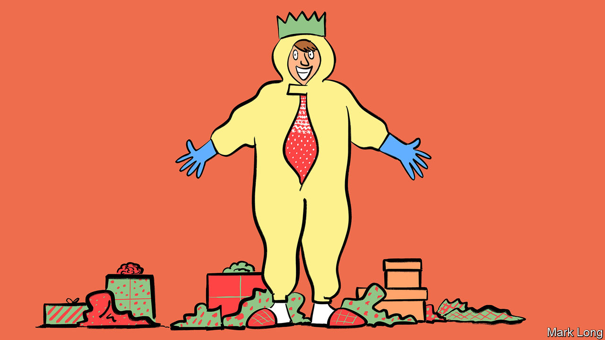

###### The Holly and the UV

# A covid-19-themed shop in New York is thriving 

##### A different sort of Christmas shopping bonanza 

 

> Dec 19th 2020 


LAST YEAR New Yorkers might have found a pair of headphones or perhaps some woolly socks in their Christmas stockings. Some lucky ducks might have found tickets to a Broadway show. This year’s most popular stocking-stuffer may be the portable ultraviolet-light sanitiser wand, which comes with a handy bag. It is one of the big sellers, says Valerie Zirema, who works in CV19 Essential, New York City’s first dedicated coronavirus-prevention shop.


The urban-survivalist shop, near Macy’s department store, looks like a cross between an Apple Store and a pharmacy. It has everything a tech-minded, fashion-conscious New Yorker could want to navigate a pandemic. Disposable masks in fun patterns and colours are especially popular. “People want fashion and function,” says Benjamin Hu, the shop’s manager. And they love the gadgets, many of them touchless technology. As well as cheaper goodies like the masks and UV wands, the shop also sells a $10,000 system which scans people’s temperature as they enter a shop. Another device can detect if someone is not wearing a mask and sound an alarm.


Midtown Manhattan is quiet now. Most office workers are working from home and tourists have disappeared. The city has seen an alarming jump in covid-19 cases, which have more than tripled since the start of November. Hospitalisations and intubations are increasing, too. Restaurants have closed their dining rooms again. On December 14th Bill de Blasio, the city’s mayor, warned New Yorkers “to be ready now for a full shutdown, a pause like we had back at the end of the spring”. But the covid-19 shop, which also provides rapid testing and PCR testing for the virus, is seeing an increase in footfall.


CV19 Essential was founded by Tony Park, the owner of Samwon Garden, a Korean BBQ restaurant. After he fitted it out with UV light systems, anti-microbial film and a facial thermal scanner, other firms came looking for advice. Seeing a business opportunity, in September Mr Park opened his first covid-19 shop in a space where he originally intended to have another restaurant. He has since opened a second branch.


Opening safety boutiques and testing centres geared towards anxious New Yorkers is clever. “I like to think people are taking [prepping] more seriously,” says Jason Charles, head of the New York City Prepper’s Network, a survivalist group, who has seen more interest in his talks. Yet with luck business may not be brisk for long. On December 14th, even as New York prepared to shut down again, health-care workers began administering the first doses of the Pfizer-BioNTech vaccine in the borough of Queens. If the roll-out goes to plan, those sanitising wands might soon end up in a drawer, along with other forgotten gifts.


Editor’s note: Some of our covid-19 coverage is free for readers of The Economist Today, our daily . For more stories and our pandemic tracker, see our 

