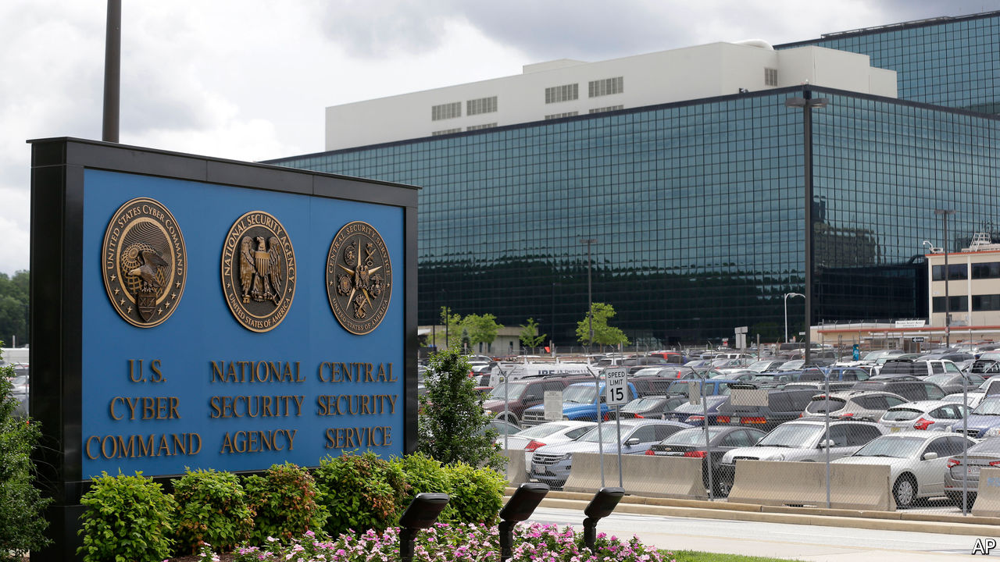

###### Bear hunt

# Hackers have vaulted into the heart of America’s government 

##### The intrusion is one of the largest cyber-espionage campaigns ever seen 

 

> Dec 14th 2020 


ON SEPTEMBER 25TH Russia’s president, Vladimir Putin, warned that a “large-scale confrontation in the digital sphere” was looming. He offered a solution. Russia and America would “exchange guarantees of non-interference in each other’s internal affairs, including electoral processes, including using ICT”—in short, a cyber-truce. Even as he spoke, his hackers were apparently deep inside some of America’s most sensitive networks.


American officials claim that a group of hackers known as APT29, or more evocatively as Cozy Bear, thought to be part of the SVR, Russia’s foreign intelligence service, penetrated several American government bodies—the list so far includes the Treasury, Commerce, State and Homeland Security Departments, along with the National Institutes of Health—where they could read emails at will. It appears to be one of the largest-ever acts of digital espionage against America.


The intrusion took a circuitous route. Between March and June, SolarWinds, a Texan company, pushed out updates to its Orion software, which is widely used to help organisations monitor their networks. The malware hitched a ride on those updates. Once downloaded, it allowed hackers to impersonate an organisation’s system administrators, who typically have the run of the entire network. It cleverly funnelled out data by disguising it as legitimate traffic while parrying anti-virus tools. Once inside, intruders can remain present even if Orion is disconnected.


The campaign showed “top-tier operational tradecraft”, says FireEye, a cyber-security firm that was itself a victim. Orion’s ubiquity explains why so many organisations were affected. SolarWinds says that “fewer than 18,000” customers may have been struck, though most would have been collateral damage.


America’s ability to muster a response is unlikely to be helped by President Donald Trump’s dismissal, on November 17th, of Chris Krebs, the head of the Cyber-security and Infrastructure Security Agency (CISA), for publicly affirming the integrity of the presidential election. CISA has struggled to cope with the onslaught.


Over the past decade, America has tended to categorise and respond to cyber-attacks according to their aims. It regarded intrusions intended to steal secrets—in other words, old-fashioned espionage—as fair game, not least because its own National Security Agency (NSA) is a prolific thief. After China stole 22m security-clearance records from America’s Office of Personnel Management (OPM) in 2015, Michael Hayden, a former NSA chief, conceded that it was “honourable espionage work”. In contrast, attacks intended to cause harm, like North Korea’s assault on Sony Pictures in 2014, or those with commercial aims, like China’s theft of industrial secrets, were thought to cross a line. America has accordingly indicted and imposed sanctions on scores of Russian, Chinese, North Korean and Iranian hackers.


Yet this effort to stamp norms onto a covert and chaotic arena of competition has been unsuccessful. For one thing, it is not always simple to define what is “honourable”, in Mr Hayden’s parlance, and what is not. If stealing a policy document is kosher, why not a vaccine? The line between espionage and subversion is also blurred: is Russia stealing emails to understand American policy, or to publish them later? It is not always clear until after the fact.


Most so-called cyber-attacks are simply espionage. But espionage conducted over computer networks has enabled intelligence gathering on a scale that was previously impossible. Though America has been as much a beneficiary of this intelligence revolution as it has been a victim, it has grown less tolerant in recent years. American views of “what’s allowed in cyberspace” have changed since the OPM breach five years ago, says Max Smeets of the Centre for Security Studies in Zurich. Such large-scale espionage “would be now at the top of the list of operations that they would deem as unacceptable,” he suggests.


Yet forbidding something is different from stopping it. “Deterrence is mostly irrelevant in an intelligence contest,” writes Joshua Rovner of the American University in Washington, a scholar-in-residence at the NSA in 2018-19. “No combination of threats and promises will stop a rival intelligence service from collecting information.” Sturdier defences are needed. ■

